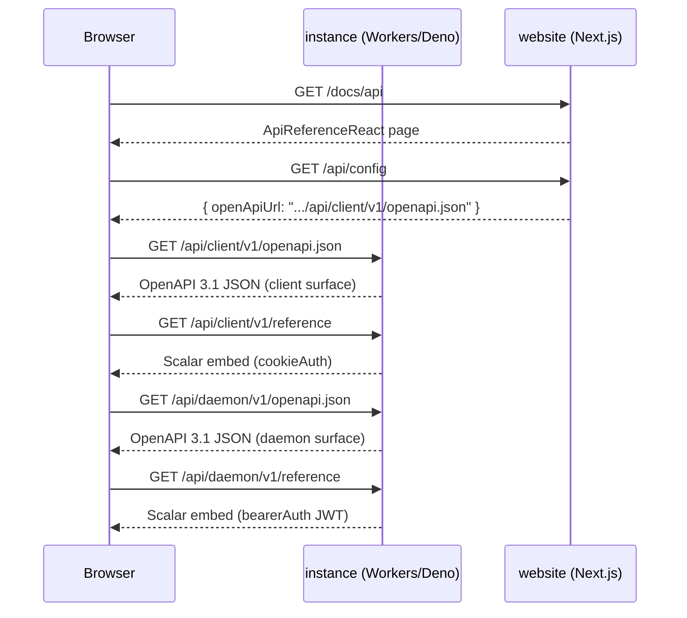

# AGENTS.md

Minimal Hono app with dual runtimes: **Cloudflare Workers** (Wrangler) and
**Deno**.

## Project metadata / public naming

| Public name              | GitHub                                                            | Internal term (this repo)              |
| ------------------------ | ----------------------------------------------------------------- | -------------------------------------- |
| TurboPanel Control Plane | [turbopanel/turbopanel](https://github.com/turbopanel/turbopanel) | `instance` (runtime/architecture only) |

- **License:** AGPL-3.0-only ([`LICENSE`](./LICENSE), `package.json` /
  `deno.json`). Trademarks are not granted by the software license
  ([`TRADEMARKS.md`](./TRADEMARKS.md)). Contributions require the
  [CLA](https://github.com/turbopanel/.github/blob/trunk/CLA.md).
- **Maturity label:** **Private alpha** (README, roadmap, site banner — keep
  identical).
- **README** is product-facing; **AGENTS.md** is maintainer-facing. Do not use
  `turbopanel/instance` as a public repo slug.

## Speed doctrine (turbo)

TurboPanel is named for speed; keep it fast on every path.

- **Cache runtimes & deps.** Deno/Node/Caddy live under
  `/opt/turbopanel/vendor/<tool>/current`; install only when the pinned version
  is missing. Don't re-download or re-`pnpm install` when nothing changed. Caddy
  follows the same `vendor/caddy/<version>/caddy` + `current` layout (no
  `versions/` subdir); `scripts/download-caddy.mjs` and the `caddy` Ansible role
  are aligned.
- **Idempotent fast-paths.** Bootstrap/install steps must short-circuit when
  already satisfied (the Ansible roles do; mirror that in scripts).
- **Avoid redundant work.** No polling loops or periodic git/`systemctl` forks
  unless essential (the version watcher and auto-update poll were removed for
  this reason).
- **Parallelize** independent I/O (e.g. `Promise.all` for per-daemon fan-out, as
  in the admin routes).
- **Push, don't poll** for cross-process signals where practical (WS messages
  over fallback timers).

## Platform model: Ansible owns installs

The **daemon is the constant** installed on every TurboPanel-managed host and is
the only party that runs Ansible to install/update everything else (runtimes,
users, the instance, UI, Caddy). The instance does not install itself. In
co-located dev the daemon runs the `instance-dev-install` playbook (see
`../turbopaneld/AGENTS.md`) when `TURBOPANEL_DEV_INSTANCE=1`. Nothing auto-updates —
updates are operator-driven (admin **Upgrade System** button or **Sync Dev
Build**).

## Users, group & socket permissions

**Development (co-located):** a **single dev user** runs everything — no `tp`,
`tpctrl`, or `tpcache` service accounts are created. Source repos live under
`$HOME` (`~/turbopaneld`, `~/turbopanel`, `~/ui`, `~/website`) and are owned by the dev
user. Mutable data (`/etc/turbopanel`, `/var/lib/turbopanel`,
`/var/log/turbopanel`, `/run/turbopanel`) is dev-user-owned. Per-service runtime
state may still live in gitignored checkout dirs (`instance/.local`,
`ui/.local`, `ui/.expo`, `.config` trees). `/run/turbopanel` is owned by the dev
user; the instance hardens its socket to **`0660`** owned by the dev user so the
co-located daemon can connect.

**Production:** dedicated service users — `tp` (daemon + Ansible), `tpctrl`
(instance, UI, website, mailer, dbstudio), `tpcache` (Redis), `tpdata`
(Postgres), `tpqueue` (RabbitMQ), `tpmetrics` (ClickHouse), `tpcaddy`
(control-plane Caddy). See `../turbopaneld/AGENTS.md` (Filesystem layout), the
allocation table below, and the systemd table for ownership, ACLs, and
`/run/turbopanel` **`2770 tp:tp`** (setgid).

### Production UID/GID allocation

| User / group | UID/GID | Runs                                                           |
| ------------ | ------- | -------------------------------------------------------------- |
| `tp`         | 9999    | daemon (`turbopaneld`) + Ansible + shared group everyone joins |
| `tpctrl`     | 9998    | instance, UI, website, mailer, dbstudio                        |
| `tpcache`    | 9997    | Redis (+ `redis.sock` access group)                            |
| `tpdata`     | 9996    | Postgres                                                       |
| `tpqueue`    | 9995    | RabbitMQ                                                       |
| `tpmetrics`  | 9994    | ClickHouse                                                     |
| `tpcaddy`    | 9993    | control-plane Caddy                                            |
| `tpnginx`    | 9992    | nginx (optional, `web-service-user`)                           |
| `tpapache`   | 9991    | Apache (optional)                                              |
| `tpols`      | 9990    | OpenLiteSpeed (optional)                                       |
| `tplsws`     | 9989    | LiteSpeed Enterprise (reserved)                                |

**Application logins are unchanged** — `postgres_user`/`postgres_db` =
`turbopanel`, RabbitMQ user = `turbopanel`, `clickhouse_app_user` =
`turbopanel_app`, `clickhouse_database` = `turbopanel_metrics`, Docker
network/volumes = `turbopanel*`.

## Documentation discipline

**Keep this file current.** When you learn something durable about how
TurboPanel works — architecture, env vars, gotchas, cross-repo contracts,
operational steps — add or update a note here in the same PR/session as the code
change. Future agents read `AGENTS.md` first.

- Prefer extending an existing section over appending orphan bullets.
- Record **why** when the reason is non-obvious (e.g. a missing Debian package
  that breaks Ansible).
- If a fact belongs in another repo (`daemon`, `ui`), put the canonical detail
  there and add a short cross-reference here when the instance is involved.
- Do not record secrets, tokens, or machine-specific credentials.
- Remove or correct notes that prove wrong.

### SonarQube (CI-based analysis)

- Analysis runs in GitHub Actions (`.github/workflows/build.yml` **SonarQube**
  job — SonarCloud wizard layout) with `SONAR_TOKEN` and
  `sonar-project.properties` (`sonar.projectKey=turbopanel_turbopanel`,
  `sonar.organization=turbopanel`). The job runs checks +
  **`pnpm test:coverage`** (`scripts/test-coverage.sh`), which merges Vitest
  Istanbul + Deno V8 LCOV into a single **`coverage/lcov.info`**
  (`sonar.javascript.lcov.reportPaths=coverage/lcov.info` in
  `sonar-project.properties` — **not** comma-separated dual paths; SonarCloud
  effectively only imported Deno hits that way, so Workers/DO files showed 0%
  despite real Istanbul coverage). Merge pairs SF records **by covered-line
  count** (higher LH is primary). Secondary may only raise shared hits or add
  **executed** lines — never zero-hit transitive rows. When Vitest only imported
  a Deno-tested module (`LH:0`), Deno unit hits become primary so Sonar no
  longer reports false 0% on `db-url` / `allocate-containers` / similar.
  Dilution of healthy Workers/DO Istanbul reports (e.g. offline-sweep →
  `do-registry.ts`) is still avoided because Deno zero-hit extras never expand
  LF when Vitest has more covered lines. Vitest `SF:` paths are normalized
  repo-relative like Deno. The script asserts non-zero Vitest hits for
  `src/daemon/cell/do.ts`, `do-registry.ts`, and `workers-ws.ts` before merge,
  and re-checks those LH floors on the **merged** `coverage/lcov.info`.
  Intermediate reports remain at `coverage/vitest/lcov.info` and
  `coverage/deno.lcov` for debugging:
  - **Vitest** (`coverage/vitest/lcov.info`) — Workers-pool suites
    (`vitest.config.ts` `test.include`), provider **`istanbul`**. The default
    `v8` provider cannot run inside workerd (no `node:inspector`), but
    `@cloudflare/vitest-pool-workers` bridges Istanbul counters back to Node, so
    `vitest run --coverage` is a real, non-zero report — **do not** assume
    Vitest coverage is unavailable. This is the _only_ LCOV source for
    Durable-Object / admin / other Workers-only code that no Deno suite imports
    (`src/daemon/cell/do.ts`, `src/daemon/workers-ws.ts`,
    `src/admin/public-urls.ts`, …).
  - **Deno** (`coverage/deno.lcov`) — host-free Deno suites listed in
    `scripts/test-coverage.sh`, via `deno coverage --lcov` (native V8). Then the
    scan runs with `sonar.qualitygate.wait=true`; if the quality gate fails, the
    workflow stops. **Coverage attribution (three independent traps — check all
    when Sonar shows 0% / low % while local Vitest is healthy):** (1) a new Deno
    `*.test.ts` file must be added to the `deno test` file list in
    `scripts/test-coverage.sh` — prefer host-free unit suites there;
    DB/Redis/integration suites stay out of LCOV. (2) a new Workers/DO test file
    must be added to `vitest.config.ts` `test.include` — that list is an
    explicit file enumeration, not a glob, because most `*.test.ts` files use
    Deno-only APIs and cannot run under the Workers pool; a file left off
    `test.include` never runs at all, coverage or not. (3) LCOV smart merge must
    stay in place — do not reintroduce full-record Vitest-wins (drops Deno hits
    for imported-but-untested modules) or naive Deno+Vitest line-union (dilutes
    Workers/DO with zero-hit transitive SF rows). Selective Workers/DO 0% with a
    healthy overall project coverage % is almost always an LCOV merge/path bug,
    not Automatic Analysis (AA being on fails the CI scanner entirely).
- **`sonar.sources` / `sonar.tests` / `sonar.test.inclusions`** must stay set in
  `sonar-project.properties` (and mirrored in vestigial
  `.sonarcloud.properties`). Tests are co-located (`**/*.test.ts` under
  `src`/`mailer`); helpers that do not match the scanner's name heuristics
  (`src/test-fixtures/**`, `*-hostfree-doubles.ts`, `server-status-test-db.ts`,
  `fake-redis-cell-client.ts`, `workers-vitest.ts`, `vitest-env.d.ts`) belong in
  `test.inclusions` + `coverage.exclusions` so they are never main-code. Leaving
  `sonar.tests` unset only yields an INFO and heuristic classification that
  mis-labels those helpers.
- **Automatic Analysis must stay off** for `turbopanel_turbopanel` (SonarCloud →
  project **Administration → Analysis Method**). CI and Automatic Analysis
  cannot run together — Automatic Analysis enabled makes the CI scanner fail.
  There is no Sonar MCP `toggle_automatic_analysis` tool; change this only in
  the SonarCloud UI.
- Sonar-way **Coverage on New Code ≥ 80%** needs LCOV on CI. After switching
  from Automatic Analysis, reset **New Code** (Administration → New Code) so the
  baseline is not months of uncovered history, or the gate will fail even with
  fresh coverage reports.
- Drizzle-generated SQL under **`migrations/`** must stay excluded
  (`**/migrations/**`) — never “fix” smells in those files.
- Hand-authored OpenAPI under `src/client/openapi/**` and
  `src/daemon/openapi/**` is excluded from **duplication (CPD)** via
  `sonar.cpd.exclusions` (keep `sonar-project.properties` and the vestigial
  `.sonarcloud.properties` in sync). Schema/path blocks are intentionally
  repetitive across resources; refactor route/runtime code instead of twisting
  OpenAPI to please CPD.
- **SonarLint Connected Mode** does **not** honor
  `sonarlint.analysisExcludesStandalone` or local `.sonarcloud.properties` /
  `sonar-project.properties`. It only applies exclusions synced from the
  SonarCloud project **Administration → General Settings → Analysis Scope →
  Source File Exclusions**. Keep `**/migrations/**` there too (then SonarLint →
  Update binding / reconnect) or IDE will still raise `plsql:*` on drizzle-kit
  SQL.

### TypeScript style (SonarQube)

- Prefer **`String#replaceAll()`** over **`String#replace()` with a global
  regex** when replacing every occurrence of a substring (`typescript:S7781`).
- Use **`String.raw`** for string literals that contain backslashes so escapes
  stay readable and correct (`typescript:S7780`).
- Prefer **optional chaining** (`obj?.prop`) over `!obj || obj.prop`
  (`typescript:S6582`).
- Use **`new TypeError()`** for type/shape assertions in tests
  (`typescript:S7786`).
- Avoid **nested ternaries** — use `if`/`switch` or helpers
  (`typescript:S3358`).
- Extract helpers when **cognitive complexity** exceeds 15 (`typescript:S3776`).
- Sort strings with **`.sort((a, b) => a.localeCompare(b))`**
  (`typescript:S2871`).
- Mark React component props **`Readonly<{…}>`** (`typescript:S6759`).
- Omit optional parameters instead of passing redundant **`undefined`**
  (`typescript:S4623`).
- Prefer **`String#codePointAt()`** over **`charCodeAt()`** when decoding byte
  strings (`typescript:S7758`).
- Use **`RegExp.exec()`** instead of `String.match()` for single-match
  extraction (`typescript:S6594`).
- Do not leave **`TODO`** in code — use `Future:` in a normal comment
  (`typescript:S1135`).
- Use **RFC 5737 TEST-NET** addresses (e.g. `203.0.113.x`) in tests, not
  arbitrary public IPs (`typescript:S1313`).
- Add **`// NOSONAR rule-key — reason`** when a semantic type alias or path
  check is intentional (`typescript:S6564`, `typescript:S5443`).
- Deno tests: Sonar `typescript:S2187` only recognizes `test()` / `it()` /
  `describe()`, not `Deno.test`. **Every `*.test.ts` file that would otherwise
  call `Deno.test(...)` MUST** either use BDD
  (`import { describe, it } from '@std/testing/bdd'`) or alias `Deno.test` —
  never leave a bare `Deno.test(` in a test file. The canonical alias (same
  pattern as `../turbopaneld`, applied to all existing Deno test files) is placed
  once, right after the imports:

  ```ts
  /**
   * Jest/Mocha-shaped alias for {@link Deno.test}.
   *
   * Sonar typescript:S2187 only recognizes `test()` / `it()` / `describe()` and
   * reports Deno suites as empty; keep this alias so analysis sees real tests.
   */
  const test = Deno.test.bind(Deno);
  ```

  Then call `test('...', () => { … })` (or the object form `test({ name, fn })`)
  instead of `Deno.test(...)`. When adding a new Deno test file, add this alias
  from the start.

### Workers-reachable imports

Modules imported (transitively) from `src/workers.ts` must bundle under
Wrangler/esbuild. **Do not** use Deno import-map-only specifiers there —
`@std/*`, bare `jsr:…`, or other Deno-only APIs — unless there is a matching
`wrangler.jsonc` `alias` (see the SMTP shims). Prefer Web Crypto and small local
helpers (e.g. hex in `src/lib/machine-key.ts` /
`src/daemon/authn/server-key.ts`). Deno-only entrypoints (`src/deno.ts`,
developer drizzle studio, Redis cell) may keep `@std/*`. Guard:
`pnpm check:workers-bundle`.

### Ansible style (SonarQube)

- Prefer **`mode: "0640"`** / **`0750"`** with explicit **`owner`** /
  **`group`** over world-readable modes (`ansible:S2612`).

`README.md` is for humans getting started; `AGENTS.md` is for agents maintaining
the system.

Unit tests use non-production secrets from `src/test-fixtures/secrets.ts`
(`TEST_ONLY_TURBOPANEL_SECRET`). Vitest Workers config uses the same naming
convention in `wrangler.vitest.jsonc`. The secret scanner allowlists only exact
fixture lines in `.secretscan-allowlist` — do not add broad exclusions.

**Where to run tests:** host VirtFS checkouts lack a usable Node/pnpm/Deno
tree. Run suites **inside the Vagrant guest** from the host `dev` checkout
(`../dev/AGENTS.md` → Testing). Do not run `pnpm test` / `pnpm test:do` /
`deno task test` on the host:

```bash
vagrant ssh -c 'export PATH="/opt/turbopanel/vendor/node/current/bin:/opt/turbopanel/vendor/deno/current:$PATH"; cd ~/turbopanel && pnpm test:do'
```

## Setup

- **Deno** — <https://docs.deno.com/runtime/getting_started/installation/>
- **pnpm** — <https://pnpm.io/installation>
- **Node.js** and **openssl** — required for cert generation (`scripts/*.mjs`);
  Node.js also used for Caddy download
- Run `./console` from the
  [TurboPanel Development Environment](https://github.com/turbopanel/dev)
  checkout. The console installs Deno, clones the daemon, and drives the full
  dev stack via `scripts/bootstrap-orchestration.ts` +
  `scripts/install-daemon-systemd.sh` (shared orchestration under
  `/opt/turbopanel/vendor/` — not `orchestration/runtime/venv`).
- Managed/co-located installs: secret-bearing runtime env lives in the instance
  config dir (`runtime.env`, `runtime.dev-vars`) — **never** in the git checkout
  root. Beside those env files, Ansible holds `.instance_secrets` (versioned
  keyring, `root:<turbopanel_group>` `0640`, ordered `<version>:<value>`, first
  entry current); it is injected into `runtime.dev-vars` as `TURBOPANEL_SECRETS`,
  and rotation is gated by the `turbopanel_instance_secret_rotate` extra-var.
  Semantics:
  `src/client/authn/AGENTS.md`. Standalone scripts
  (`scripts/generate-self-signed-cert.mjs`, `scripts/workers-serve.sh`,
  `scripts/drizzle-studio-serve.sh`) default to the FHS location
  **`/etc/turbopanel/instance/runtime.env`** when
  `TURBOPANEL_INSTANCE_RUNTIME_ENV` is unset. Both managed and co-located dev
  use **`/etc/turbopanel/instance/`** (dev-user-owned in development). The unit
  injects `TURBOPANEL_INSTANCE_RUNTIME_ENV` accordingly.
  `scripts/generate-self-signed-cert.mjs` and daemon `public-urls-apply`
  read/write `runtime.env` there. Do not reintroduce checkout-root `.env` /
  `.dev.vars` generation.
- `pnpm install` — installs Hono and Wrangler into `node_modules/` for Workers
  bundling
- Local **Tilt** Wrangler secrets still live in `dev/.env` → `sync-env.sh` →
  instance `.dev.vars`; that path is separate from managed Ansible installs
  above.
- `pnpm dev` (wrangler) still runs the **Cloudflare Workers** path for
  full-stack testing — unchanged. **`wrangler.jsonc` `dev.ip` is `0.0.0.0`** so
  Docker Caddy (`host.docker.internal`) can reach the dev server; default
  localhost-only bind causes Caddy **502**s.
- **`pnpm deploy`** — applies pending migrations (`TURBOPANEL_DATABASE_URL` or
  `DATABASE_URL` required for tooling) then deploys to Cloudflare Workers
  (`CLOUDFLARE_ENV` required, e.g. `live` or `testing`). Works from any
  environment with internet access to the database — self-hosted dev, CI, or
  production. Requires **Node** only (`pnpm migrate` runs `drizzle-kit migrate`;
  no Deno prerequisite). Equivalent to
  `pnpm migrate && wrangler deploy --env $CLOUDFLARE_ENV --minify`.
- **`pnpm check:workers-bundle`** — `wrangler deploy --dry-run` of
  `src/workers.ts` (no upload). Catches unresolved imports the Workers bundler
  cannot resolve (e.g. `@std/*` / `jsr:`). Wired into `.githooks/pre-commit`.
  **`pnpm test:do` is not enough** — vitest bundles `src/workers-vitest.ts` with
  a narrow include list and can tree-shake away modules only the full deploy
  graph pulls in.
- **`pnpm check:ca-boundary`** — Organization CA sources (`src/lib/tls/`,
  `src/client/tls/`) must not reference Platform CA paths. See
  `src/lib/tls/AGENTS.md`. Wired into `test:hook` and CI `build.yml`.
- `pnpm cf-typegen` — regenerate `worker-configuration.d.ts`. Keep the
  `Cloudflare.Env` / global `Env` aliases that extend `CloudflareBindings`
  (vitest `cloudflare:test` `env` is typed as `Cloudflare.Env`, not the
  retired `ProvidedEnv`).
- The Ansible `instance-certs` / `caddy` / `node-runtime` roles supersede the
  standalone `pnpm cert:generate` / `pnpm caddy:install` scripts for managed
  hosts (the scripts remain for manual use).

### Systemd (dev services run as the dev user; production uses dedicated users)

Installed and managed by the daemon via the `instance-launch` Ansible role:

| Unit                          | User (dev)       | User (production) | Notes                                                            |
| ----------------------------- | ---------------- | ----------------- | ---------------------------------------------------------------- |
| `turbopanel-instance.service` | current dev user | `tpctrl:tp`       | Deno instance on the Unix socket                                 |
| `turbopanel-caddy.service`    | current dev user | `tpcaddy:tp`      | TLS + reverse proxy on `:8443` (`GOMAXPROCS=1`, `CPUQuota=100%`) |
| `turbopanel-ui.service`       | current dev user | `tpctrl:tp`       | Expo web dev server (`:8081`, dev only)                          |
| `turbopaneld.service`         | current dev user | `tp:tp`           | runs Ansible; has sudo (production only)                         |

- `systemd/turbopanel-instance.service` was removed — the canonical unit is
  templated by the `instance-launch` role in `../turbopaneld`.
- Logs:
  `journalctl -u turbopanel-instance -u turbopanel-caddy -u turbopanel-ui -f`
- Co-located daemon: `../turbopaneld/scripts/install-daemon-systemd.sh`

## Unix domain sockets

In Deno mode (development and production), the Hono instance listens on a **Unix
domain socket** instead of a TCP port. Caddy terminates TLS and proxies `/api/*`
and `/ws/*` to that socket.

### Directory layout

All TurboPanel runtime sockets live under **`/run/turbopanel/`** (on Linux,
`/var/run` symlinks to `/run`). In **development** the directory is owned by the
dev user. In **production** it is **`2770 tp:tp`** (setgid) so the
`tpctrl`/`tpcaddy` users (in group `tp`) can bind:

| Socket file                              | Service                                                                   |
| ---------------------------------------- | ------------------------------------------------------------------------- |
| `/run/turbopanel/instance.sock`          | Hono instance (dev: mode `0660`, dev user; prod: mode `0660`, group `tp`) |
| `/run/turbopanel/postgres/.s.PGSQL.5432` | PostgreSQL 18 (Docker bind-mount)                                         |
| `/run/turbopanel/<name>.sock`            | Reserved for future services                                              |

### Environment variables

| Variable                    | Default                        | Purpose                                                                                                                                                                                                                                                                                                                         |
| --------------------------- | ------------------------------ | ------------------------------------------------------------------------------------------------------------------------------------------------------------------------------------------------------------------------------------------------------------------------------------------------------------------------------- |
| `TURBOPANEL_SOCKET`         | —                              | Full socket path override                                                                                                                                                                                                                                                                                                       |
| `TURBOPANEL_SOCKET_DIR`     | `/run/turbopanel`              | Directory when using the default filename                                                                                                                                                                                                                                                                                       |
| `TURBOPANEL_SOCKET_DIAL`    | `run/turbopanel/instance.sock` | Caddy `unix//` dial path (no leading slash)                                                                                                                                                                                                                                                                                     |
| `TURBOPANEL_UI_MODE`        | `static`                       | Instance/developer-surface gate (`dev` enables Expo UI unit + developer API on co-located hosts); production Caddy always serves static UI                                                                                                                                                                                      |
| `TURBOPANEL_UI_ROOT`        | `/opt/turbopanel/share/ui`     | Directory of `expo export --platform web` output (local manual dev typically sets `../ui/dist`)                                                                                                                                                                                                                                 |
| `TURBOPANEL_UI_SERVICE`     | `turbopanel-ui`                | Name of the Expo systemd unit on managed hosts (injected for orchestration; no instance API surface today)                                                                                                                                                                                                                      |
| `CADDY_PORT`                | `8443`                         | HTTPS listen port                                                                                                                                                                                                                                                                                                               |
| `CADDY_TLS_CERT`            | `./certs/self-signed.crt`      | Server leaf certificate (signed by the **Platform CA**; stays under the instance `certs/` dir)                                                                                                                                                                  |
| `CADDY_TLS_KEY`             | `./certs/self-signed.key`      | Server leaf private key                                                                                                                                                                                                                                                                                                         |
| `TURBOPANEL_TLS_CA`         | `/var/lib/turbopanel/tls/ca.crt` | Durable **Platform CA** (override; default is `${TURBOPANEL_STATE_DIR}/tls/ca.crt`)                                                                                                                                                                            |
| `TURBOPANEL_TLS_CA_KEY`     | `/var/lib/turbopanel/tls/ca.key` | Durable **Platform CA** private key                                                                                                                                                                                                                           |
| `TURBOPANEL_TLS_CA_BUNDLE`  | `/var/lib/turbopanel/tls/ca-bundle.pem` | Current+retired **Platform CA** PEM bundle served at `GET /api/daemon/v1/instance/ca`                                                                                                                                                                      |
| `TURBOPANEL_TLS_EXTRA_SANS` | —                              | Comma-separated DNS names for the server cert (e.g. `turbopanel.lan`)                                                                                                                                                                                                                                                           |
| `TURBOPANEL_PUBLIC_URLS`    | —                              | Comma-separated list of URLs/hosts this control plane is reachable at (e.g. `https://panel.example.com,https://huey.lan:8443`). Persisted in the `setting` table by the admin API; read by `generate-self-signed-cert.mjs` to derive cert SANs. Also consulted by `resolvePublicBaseUrl` as the preferred install-command host. |

Path resolution lives in `src/server-paths.ts`. It ships **FHS defaults** —
config `/etc/turbopanel`, state `/var/lib/turbopanel`, logs
`/var/log/turbopanel`, runtime `/run/turbopanel`, static UI
`/opt/turbopanel/share/ui` — and every path is env-overridable
(`TURBOPANEL_CONFIG_DIR`, `TURBOPANEL_STATE_DIR`, `TURBOPANEL_LOG_DIR`,
`TURBOPANEL_RUN_DIR`, `TURBOPANEL_UI_ROOT`, `TURBOPANEL_SOCKET(_DIR)`,
`TURBOPANEL_TLS_CA`, `TURBOPANEL_TLS_CA_KEY`, `TURBOPANEL_TLS_CA_BUNDLE`).
Co-located dev uses the same FHS mutable paths by default, all
**dev-user-owned**; source repos live under `$HOME` (`~/turbopaneld`, `~/turbopanel`,
`~/ui`, `~/website`). The module has no separate dev-mode branch — Ansible
(`instance-launch`) and manual commands may override individual paths via env
when needed. `resolveInstanceRuntimeConfigPaths` composes
`<configDir>/instance/runtime.env` (+ `runtime.dev-vars`). Managed production
installs also run the daemon as **`turbopaneld.service`** — native
`/opt/turbopanel/bin/turbopaneld`, or `turbopaneld.js` via vendored Deno on
hosts where that binary cannot load (see `../turbopaneld/AGENTS.md` → Filesystem
layout & path model). Defaults and overrides are pinned by
`src/server-paths.deno.test.ts` (`deno task test:paths`).

## Database (Drizzle + Postgres.js)

The instance uses **Drizzle ORM** over **postgres.js**. The Workers/Hyperdrive
client uses `prepare: true` (see Workers Hyperdrive below); the Deno client uses
`prepare: false` (direct Postgres, no Hyperdrive). Connection factories live in
`src/db.ts`; schema in `src/lib/db/schema.ts`; drizzle-kit config in
`drizzle.config.ts`. **Read `src/lib/db/AGENTS.md` before touching schema or the
database.** Schema changes are versioned in `migrations/`; `pnpm migrate`
applies pending SQL during Workers deploy. Applied versions are recorded in
`public.migration`.

| Runtime            | Factory                                                                      | When connected                                                                                                                                                         |
| ------------------ | ---------------------------------------------------------------------------- | ---------------------------------------------------------------------------------------------------------------------------------------------------------------------- |
| Cloudflare Workers | `createWorkersDb(env.HYPERDRIVE)` or `createWorkersDb({ connectionString })` | `HYPERDRIVE` binding in `wrangler.jsonc` (all named envs including `testing`); **`wrangler dev`** may fall back to `TURBOPANEL_DATABASE_URL` when Hyperdrive is absent |
| Deno (self-hosted) | `createDenoDb()`                                                             | `TURBOPANEL_DATABASE_URL` set by `instance-launch`                                                                                                                     |

Route handlers read the per-request client via `getDb(c)` (set by
`createApp({ db })`). **Deno boot requires `TURBOPANEL_DATABASE_URL`:**
`createDenoDb()` throws before `createApp()` when the variable is missing or
blank, so the process exits instead of serving without a database.

| Variable                  | Purpose                                                                                                                                                                                                                                                                                                                                                                                                                                                                                                                                                                                                                                                                   |
| ------------------------- | ------------------------------------------------------------------------------------------------------------------------------------------------------------------------------------------------------------------------------------------------------------------------------------------------------------------------------------------------------------------------------------------------------------------------------------------------------------------------------------------------------------------------------------------------------------------------------------------------------------------------------------------------------------------------- |
| `TURBOPANEL_DATABASE_URL` | Full postgres connection URL. **Deno mode:** required at boot — `createDenoDb()` throws immediately when missing or blank (self-hosted instance will not start). Passed directly to postgres.js (supports Unix socket URLs via libpq `?host=` / directory form, e.g. host `/var/run/turbopanel/postgres` or `/run/turbopanel/postgres`). **Workers runtime:** prefers the `HYPERDRIVE` binding; `src/workers.ts` falls back to this env var when Hyperdrive is unset (local `wrangler dev` without a binding). When the URL uses `?host=` for a Unix socket, ensure Deno has read access to that directory (`/run/turbopanel` covers the default Docker bind-mount path). |
| `DATABASE_URL`            | **Tooling only** (drizzle-kit, `pnpm migrate`, `dev/scripts/introspect.sh` / `dev/scripts/sync.sh` overrides). Accepted as a fallback when `TURBOPANEL_DATABASE_URL` is unset — common in CI and Cloudflare dashboard deploy workflows. Not read by the Deno instance or Workers runtime at request time.                                                                                                                                                                                                                                                                                                                                                                 |

### Workers Hyperdrive

`wrangler.jsonc` declares a `HYPERDRIVE` binding stub (replace the placeholder
id before deploy). Types: `worker-configuration.d.ts`
(`HYPERDRIVE?: Hyperdrive`). Regenerate with `pnpm cf-typegen` after changing
bindings.

**Local dev (`wrangler dev`):** do not commit `localConnectionString` in
`wrangler.jsonc`. Tilt `sync-env.sh` writes
`CLOUDFLARE_HYPERDRIVE_LOCAL_CONNECTION_STRING_HYPERDRIVE` to `instance/.env`
(derived from `dev/.env` `POSTGRES_*`, or override in `dev/.env`). Wrangler
loads `.env` into `process.env` before applying Hyperdrive bindings — the Worker
connects directly to local Postgres (no Hyperdrive pooling/caching in this
mode). **`TURBOPANEL_DATABASE_URL`** (or **`DATABASE_URL`** for tooling) in the
same file is for migrations/Drizzle/sync and may use different credentials than
the Hyperdrive runtime user in production.

The Workers DB client uses `prepare: true` on postgres.js. Hyperdrive has
supported named prepared statements since June 2024 and manages their lifecycle
across its internal connection pool — per-session state is not a concern.
Setting `prepare: true` is **required** for Hyperdrive to cache parameterized
`SELECT` queries on the `HYPERDRIVE_CACHED` binding; with `prepare: false`,
Hyperdrive sends every query as a simple (unprepared) query and marks all
parameterized reads as uncacheable.

#### ⛔ HARD RULE: one Hyperdrive/postgres.js client per request — NEVER cache a DB client across requests

> **This rule is non-negotiable. Violating it took production down** (redeploy
> that cached the client → every DB call after the first in an isolate threw
> `HTTP 500` on sign-in/session, causing a sign-in↔welcome redirect loop). Do
> **not** "optimize" DB client management by reusing a client across requests.
> If you think reuse saves a connection, you are wrong — Hyperdrive already
> pools connections server-side, so per-request creation has **zero**
> connection-startup cost.

**On Cloudflare Workers, a database client and its underlying socket are I/O
objects bound to the request (invocation) that created them.** A single V8
isolate serves many `fetch` / `queue` / cron invocations. If you store a
`postgres(...)` client in module/global scope or an isolate-level cache and
reuse it on a later invocation, Cloudflare throws and the request 500s:

- `Cannot perform I/O on behalf of a different request. I/O objects ... created in the context of one request handler cannot be accessed from a different request's handler.`
- postgres.js: `write CONNECTION_ENDED` / `write CONNECTION_DESTROYED` /
  `write CONNECTION_CLOSED`
- Creating the client in global scope instead throws
  `Disallowed operation called within global scope`.

Cloudflare's own fix (Hyperdrive troubleshooting → **Stale connection and I/O
context errors**): _"Create a new database client on every request instead of
caching it in a global variable. Hyperdrive's connection pooling already
eliminates the connection startup overhead."_ —
<https://developers.cloudflare.com/hyperdrive/observability/troubleshooting/>
(see also
<https://developers.cloudflare.com/hyperdrive/concepts/how-hyperdrive-works/>).

**The contract in this repo:**

- `resolveWorkersDb` / `resolveWorkersCachedDb` / `openWorkersRequestDb`
  (`src/workers-bindings.ts`) **create a fresh client per call**. `workers.ts`
  `fetch()` / `queue()` and the offline-sweep cron each resolve their own
  client(s) for that one invocation. Do **not** add a
  `Map`/`WeakMap`/module-level singleton that returns the same client on a later
  invocation.
- **Always close** those clients when the invocation finishes:
  `closeWorkersRequestDb` via `ctx.waitUntil` on `fetch`, `endDbConnection` in
  `finally` on `queue` and `runOfflineSweep`. Leaving postgres.js pools open
  stacks memory until the isolate hits the **128 MB** limit and Cloudflare
  recycles it (sawtooth memory charts). Hyperdrive still pools server-side —
  closing only releases the Worker-side client.
- Isolate/global scope is fine for **stateless** things (derived secrets,
  rate-limiter adapters, the compiled Hono app) — never for anything holding a
  socket/stream (DB clients, in-flight request/response bodies).

**Durable Objects are a different isolate with different rules — do not conflate
them.** A DO is its own long-lived object; its Postgres projection
(`src/daemon/cell/do.ts`) opens a **short-lived** client via `createWorkersDb`
and **must** `endDbConnection` it in `finally`, because an open outbound DB
socket keeps the DO awake (non-hibernatable) and bills GB-s for the entire
WebSocket lifetime (the 71-minute / ~547 GB-s incident). So: request Worker
isolate → fresh-per-request **and** close; Durable Object → fresh-per-op, always
close. Never reuse a request-path client inside a DO or vice-versa. DO/cost
rules: `src/daemon/cell/AGENTS.md`.

**Regression guard:** `src/workers-bindings.test.ts` asserts `resolveWorkersDb`
/ `resolveWorkersCachedDb` return a **new** client on each call (never the same
instance), and that `openWorkersRequestDb` / `closeWorkersRequestDb` end both
primary and cached clients. Source scans on `workers.ts` and `offline-sweep.ts`
assert the close paths stay wired. If you find yourself weakening those tests to
allow reuse or skip closes, stop — you are about to reintroduce either the
I/O-context outage or the 128 MB sawtooth.

Previously `prepare: false` was used because older Hyperdrive versions did not
support prepared statements. That restriction no longer applies.

**Unsupported PostgreSQL features** (do not rely on these on the
Workers/Hyperdrive path):

- SQL-level prepared statements: `PREPARE`, `DISCARD`, `DEALLOCATE`, `EXECUTE`
- [Advisory locks](https://www.postgresql.org/docs/current/explicit-locking.html#ADVISORY-LOCKS)
- `LISTEN` / `NOTIFY`
- Any other modification to per-session state unless Cloudflare documents it as
  supported

**Cached read models:** approved read-only `SELECT` paths may use the
`HYPERDRIVE_CACHED` binding (Workers) or Redis read-through (Deno).
Authorization, sessions, and secrets must use the primary connection. See
`src/query-cache/AGENTS.md`.

### Tooling

- `pnpm install` — pulls `drizzle-orm`, `postgres`, `drizzle-kit`
- After editing `schema.ts`, run `pnpm drizzle-kit generate` to create SQL in
  `migrations/`; apply locally with `TURBOPANEL_DATABASE_URL=… pnpm migrate` or
  `DATABASE_URL=… pnpm migrate`. Workers deploy runs `pnpm migrate`
  automatically (Node only — no Deno). Deno dev can still use
  `dev/scripts/sync.sh` (`push`) — see `src/lib/db/AGENTS.md`.

### Caddy dial format

Caddy uses `unix//<path>` where `<path>` has **no leading slash**:

```caddyfile
reverse_proxy unix//run/turbopanel/instance.sock
```

`TURBOPANEL_SOCKET_DIAL` is passed into the `Caddyfile` placeholders.

### Development

The daemon's `runtime-sockets` role (and `scripts/ensure-socket-dir.mjs` for
manual runs) ensures `/run/turbopanel` exists and is owned by the dev user in
development (**`2770 tp:tp`** in production), using passwordless `sudo` when
needed. After bind, the instance hardens the socket file to `0660` (owner+group
only) so the daemon can connect.

The instance Deno process runs with scoped permissions (see the
`instance-launch` unit template):
`--allow-env --allow-sys=networkInterfaces --allow-read=/run/turbopanel,<daemon dir>,<instance dir> --allow-write=/run/turbopanel --allow-run=git,systemctl,tar`
(`tar` is needed for the dev-sync tarball). TCP listeners and Unix-domain
connects (Postgres `.s.PGSQL.5432`, Redis `redis.sock`, instance listen sock) go
on `--allow-net` — Deno 2.9+ treats Unix-socket connect as net, not read. TCP
dev Postgres adds `--allow-net=127.0.0.1:5432`.

### Production

The daemon's orchestration bootstrap runs the `socket-dirs-setup` Ansible
playbook, which installs `/etc/tmpfiles.d/turbopanel.conf` and applies it with
`systemd-tmpfiles --create`. The directory is recreated on boot automatically.

## Caddy (production)

This repo's `Caddyfile` is **production-only**. Caddy terminates TLS and routes:

- `/api/*` and `/ws/*` → Deno instance (`unix:///run/turbopanel/instance.sock`)
- everything else → static UI export (`TURBOPANEL_UI_ROOT`, default
  `/opt/turbopanel/share/ui`)

`reverse_proxy` to the Unix socket sets `X-Real-IP {remote_host}` on `/api/*`
and `/ws/*`. The instance uses that header to deduplicate daemon WebSocket
reconnects (without it, every reconnect looked like a new fleet member behind
the proxy).

**Co-located development** does not use this file. When `turbopanel_dev_user` is
set, `turbopanel-caddy.service` loads `~/dev/orchestration/Caddyfile` instead
(Expo proxy, plaintext `:8880`, optional wrangler upstream,
`/downloads/daemon` + installer at `/run.sh`). See **`../dev/AGENTS.md`**
(Ansible overlay / Caddyfile).

### Certs and entrypoint

Caddy/cert installs are handled by the daemon's `caddy` and `instance-certs`
Ansible roles; `turbopanel-caddy.service` runs as `tpcaddy:tp` in production.

- Entrypoint: `https://<host>:8443` (this `Caddyfile`) — binds all interfaces;
  use `localhost` or the machine's LAN IP.
- Self-hosted TLS uses a **Platform CA** stored in the durable state tree
  (`/var/lib/turbopanel/tls/ca.crt` + `ca.key`, plus `ca-bundle.pem` for
  current+retired overlap). The Caddy **leaf** stays under the instance
  `certs/` dir (`self-signed.crt` + `.key`). **`auto_https off` is mandatory
  and must never be removed.** Caddy must never auto-provision certs via ACME or
  on-demand TLS. All cert issuance goes through
  `scripts/generate-self-signed-cert.mjs` (self-hosted, **Platform CA**) or an
  explicitly-configured publicly-trusted cert. The `instance-certs-apply.yml`
  playbook is the runtime **leaf-only** cert-regen path triggered by the admin
  public-URL apply action — it never passes `TURBOPANEL_TLS_CA_ROTATE`.
  `ensureCa()` validates readable existing durable **Platform CA** files,
  rotates when requested, or mints a new durable root — and refuses to mint
  over an unreadable existing **Platform CA**. Rotation is opt-in
  (`TURBOPANEL_TLS_CA_ROTATE=1`) and keeps the outgoing **Platform CA** root in
  the bundle until daemons ack `server.tls.trust.reconcile`. Daemons fetch the
  bundle from `GET /api/daemon/v1/instance/ca`. Trust the **Platform CA** in
  browsers/OS to avoid warnings. The **Organization CA** and org TLS library
  (`/api/client/v1/tls`, `/tls/ca`) are a separate per-organization store for
  managed-database / ProxySQL / replication leaves and must never write
  **Platform CA** paths — see `src/lib/tls/AGENTS.md`. **Future:** tenant
  **hosting** leaves (Caddy-fronted web services) remain operator-pinned library
  certificates or Caddy `tls internal`. They are never issued by the
  Organization CA.
- Override the resolved binary with `TURBOPANEL_CADDY` (and `TURBOPANEL_DENO`
  for Deno).

There is **no** plaintext HTTP listener in the production Caddyfile. Co-located
`:8880` lives only in the dev overlay Caddyfile.

### Daemon TLS trust model (3 paths)

The daemon validates the instance server cert on **every** connect — both chain
trust **and** hostname (SAN). There is **no** insecure/skip-verification mode at
runtime (the old `TURBOPANEL_TLS_INSECURE` daemon env was dead and was removed;
`run.sh --insecure-tls` only affects the bootstrap `curl -k` downloads). Three
valid configurations:

| Path                          | Platform CA trust                                                                                                  | SAN requirement                                                                                                                                                                                                                                                                                                                                                                                                               |
| ----------------------------- | ------------------------------------------------------------------------------------------------------------------ | ----------------------------------------------------------------------------------------------------------------------------------------------------------------------------------------------------------------------------------------------------------------------------------------------------------------------------------------------------------------------------------------------------------------------------- |
| **Self-signed (self-hosted)** | Daemon trusts the downloaded **Platform CA** bundle (`TURBOPANEL_INSTANCE_CA` → `/etc/turbopanel/instance-ca.pem`, fetched from `GET /api/daemon/v1/instance/ca`). Instance material lives under `/var/lib/turbopanel/tls/` (`ca.crt` / `ca.key` / `ca-bundle.pem`) — not the replaceable checkout. Distinct from the **Organization CA** (`src/lib/tls/AGENTS.md`). | The leaf cert **must** include the hostname the daemon dials. SANs are derived from the configured public URL(s) — `TURBOPANEL_PUBLIC_URL` / `TURBOPANEL_BASE_URL` / `TURBOPANEL_INSTANCE_URL` and `TURBOPANEL_TLS_EXTRA_SANS` (see `scripts/generate-self-signed-cert.mjs`). Never hardcode the hostname.                                                                                                                    |
| **Let's Encrypt**             | Publicly-valid → daemon uses the **system trust store** (ship **no** `TURBOPANEL_INSTANCE_CA`)                     | The real cert already covers the public hostname.                                                                                                                                                                                                                                                                                                                                                                             |
| **Cloudflare tunnel / proxy** | Cloudflare's edge cert is publicly-valid → **system trust**                                                        | Daemon dials the public Cloudflare hostname, which the edge cert already covers. **Caveat:** behind a tunnel the instance cannot auto-discover its own public hostname (cloudflared dials out), so the reachable URL(s) must be **declared by the operator** (admin surface / `TURBOPANEL_PUBLIC_URL`), not auto-detected. The self-signed origin leg (cloudflared → local Caddy) is separate from what the daemon validates. |

Note: `Deno.createHttpClient({ caCerts })` **adds** to the system roots (does
not replace them), so configuring the **Platform CA** does not break validation
of publicly-trusted certs. The daemon re-reads `instance-ca.pem` on each
reconnect (mtime+size cache) and parks TLS chain/SAN/expiry failures as
`tls-trust` instead of looping every 30 s. Control-plane rotation appends the
outgoing **Platform CA** to the bundle, then fans `server.tls.trust.reconcile`
over the existing WSS session so the new anchor lands **before** the old one is
retired.

**Install command TLS** follows the selected origin (`src/lib/install-tls.ts`),
not “we are in development”:

- HTTPS on a non-443 port, loopback, RFC1918, or reserved LAN TLDs (`.lan` /
  `.local` / …) → `curl -k` + `TURBOPANEL_INSECURE_TLS=1` (Platform CA)
- HTTPS on port 443 for a public hostname (Cloudflare/ngrok tunnel, opt-in Let’s
  Encrypt, uploaded cert) → system trust; **no** `-k`
- Plaintext `http://` (dev `:8880`) → no TLS flags

Let’s Encrypt and uploaded certificates for the **control-plane origin** are
operator opt-in. Caddy keeps `auto_https off` — the platform never obtains a
public certificate unless the operator explicitly requests it. A Cloudflare
tunnel presents a publicly-trusted cert at the edge; the origin can stay on the
**Platform CA**.

Dev overlay install commands also set
`TURBOPANEL_DL_BASE=<origin>/downloads/daemon` so remote servers fetch the
compiled daemon from this instance, never `dl.trbp.nl`.

### Static UI

Caddy serves the exported web build from `TURBOPANEL_UI_ROOT` (default
`/opt/turbopanel/share/ui`). On co-located hosts, `TURBOPANEL_UI_MODE=static`
also disables `isDeveloperSurfaceEnabled()` (see `src/dev-mode.ts`) and stops
`turbopanel-ui.service` via the `instance-launch` role — while still loading the
**dev** overlay Caddyfile when `turbopanel_dev_user` is set (plaintext `:8880`
remains available).

Build the static export locally or switch via the dev console **Switch to
production build** (runs `ui-build` → `instance-build` → `instance-launch`). For
a compiled instance binary, `deno task compile` in this repo produces
`dist/turbopanel-instance` from `src/deno.ts` with production `--allow-*` flags
baked in at compile time. Development source mode runs `src/deno-dev.ts`.

Manual export + Caddy:

```bash
cd ../ui && pnpm export
cd ../turbopanel
TURBOPANEL_UI_ROOT=../ui/dist caddy run --config Caddyfile --adapter caddyfile
```

Caddy serves files from `TURBOPANEL_UI_ROOT` (default
`/opt/turbopanel/share/ui`; the local manual example above sets `../ui/dist`)
and falls back to `/index.html` for client-side routes (SPA), matching the
Cloudflare Workers asset routing in `ui/wrangler.jsonc`.

Set `CADDY_TLS_CERT` / `CADDY_TLS_KEY` only when overriding the default server
leaf certificate paths.

## API / WS surfaces (versioned)

Four versioned surfaces each have REST + WS namespaces (where applicable).
Prefixes live in `src/surfaces.ts`; `GET /api/health` is the single
deliberately-unversioned probe.

| Surface                      | REST                  | WS                        | Notes                                                                                                                                                                                                                                                                                                                                                                        |
| ---------------------------- | --------------------- | ------------------------- | ---------------------------------------------------------------------------------------------------------------------------------------------------------------------------------------------------------------------------------------------------------------------------------------------------------------------------------------------------------------------------- |
| Client (end-user UI)         | `/api/client/v1/*`    | `/ws/client/v1`           | servers list/detail (+ ips/timeSync/docker/effective timezone, labels, effective sshPort/ntpDefaults), timezone/NTP commands, server labels (`GET`/`PUT /servers/:id/labels`), org record (`GET`/`PATCH /organizations/:id`), org default-timezone + host-defaults + default-environment + server-capacity + managed-defaults + TurboFabric (`GET`/`PUT /organizations/:id/fabric`, `PATCH /organizations/:id/fabric/relays/:serverId`, `POST /organizations/:id/fabric/apply`) + `/timezones` |
| Install (self-hosted wizard) | `/api/install/v1/*`   | —                         | Deno only for POST endpoints; PAM-gated; no session/cookie on bootstrap                                                                                                                                                                                                                                                                                                      |
| Developer (dev console)      | `/api/developer/v1/*` | `/ws/developer/v1` (stub) | fleet, diagnostics, shell, addresses, `system/upgrade`, `instance/tunnel-token`, `daemon/(:id/)sync-dev`                                                                                                                                                                                                                                                                     |
| Admin                        | `/api/admin/v1/*`     | —                         | Mounted on both Deno and Workers; `superadmin` or `admin` role required; OpenAPI/Scalar at `/api/admin/v1/openapi.json` + `/reference` in development only                                                                                                                                                                                                                   |
| Daemon                       | `/api/daemon/v1/*`    | `/ws/daemon/v1`           | `version`, `instance/ca`; daemons connect on the WS path                                                                                                                                                                                                                                                                                                                     |

- Route modules: `src/daemon/api-routes.ts`, `src/client/routes.ts`,
  `src/lib/install/routes.ts` (registered from `deno.ts` only); Deno-only routes
  `src/developer/system-routes.ts`, `src/developer/dev-sync.ts`,
  `src/developer/tunnel-routes.ts`, and the version route are registered in
  `src/deno-dev.ts`. `src/admin/routes.ts` is mounted on both Deno and Workers
  (admin/superadmin session required). Workers-safe developer REST lives in
  `src/developer/routes-core.ts` (`workers.ts`); full Deno developer surface in
  `src/developer/routes.ts`. Client bindings (`src/client/bindings/`) expose
  `GET|POST|PATCH|DELETE /api/client/v1/bindings` — managed DB principal →
  compose service materialization of binding-owned `variable` rows (no new
  command type). List filters are mutually exclusive: `serviceId`, consumer
  `environmentId`, or managed-cluster `managedEnvironmentId`. Create returns
  `{ ok, id }`; patch returns `{ ok }`.
- The TurboPanel Development Environment calls developer routes via
  `src/instance-client.ts` (Unix socket + HTTPS fallback).
- Hard cutover: daemon, UI, Caddy (`/ws/*`), and Workers routes
  (`wrangler.jsonc`) moved together. The external CDN node installer must fetch
  the CA from the new `/api/daemon/v1/instance/ca` path.
- **Server timezone / NTP (client surface):** daemon hello + change-detected
  heartbeats persist `timeSync` onto `server.timezone` /
  `is_time_sync_enabled` / `ntp_servers` / `ntp_last_synced_at`, and nest
  addresses on `server.metadata.resources.ips` (legacy top-level `ips` still
  accepted). Hello-only host inventory is `server.metadata.resources.cpus[]`
  (per-socket `vendorId` / `cores` / `threads` / `cache` / clocks) and
  `gpus[]`; leftover `resources.cpu` is lifted on read. Docker CLI / Compose plugin versions project onto
  `server.metadata.docker` the same way, but **only when Docker is installed**
  (the key is omitted otherwise). `GET /api/client/v1/servers` and
  `GET /servers/:id` return those facts plus an **effective timezone** =
  `server.options.timezone` unless
  `organization.options.enforceServerTimezone` is true (then org
  `defaultServerTimezone` wins; otherwise the daemon-reported `server.timezone`
  column). Commands: `POST /servers/:id/timezone`
  (`server.timezone.set`, also persists the server override) and
  `POST /servers/:id/ntp` (`server.ntp.set`) — manage-gated, create-then-poll.
  Org record: `GET`/`PATCH /organizations/:id` — GET is access-gated (same
  visibility as the org list: team membership, owner/manager grant, or
  platform admin; missing or inaccessible → **404**); PATCH is manage-gated
  (`{ name }` required, any characters except control characters,
  ≤255, cannot clear;
  names are not unique). Returns `{ organization }` / `{ ok, organization }`.
  Org defaults: `GET`/`PUT /organizations/:id/default-timezone`. Picker source:
  `GET /timezones` (`listTimezones()` / `isAllowedTimezone()`). Detail rows use
  the `server-detail` cached read model (mirrors `servers-list`).
- **Host defaults (client surface):** org → datacenter → server cascade stored
  in existing `options` jsonb (`src/lib/host-defaults.ts`). Most specific
  configured value wins; SSH falls back to **22**. Keys: `sshPort` (1–65535),
  `ntp` (`enabled` / `servers` / `fallbackServers` — desired config, not
  observed `timeSync`), `defaultFabricEnabled` (**organization only**; a
  preference that does **not** create or tear down the mesh). Timezone stays
  on its own enforce resolver (`resolveEffectiveServerTimezone`) — do not add
  a soft timezone default into this cascade.
  `GET`/`PUT /organizations/:id/host-defaults` is manage-gated (jsonb `||`
  merge; JSON `null` clears a key). Datacenter `PATCH` **replaces** parsed
  `options` (UI must `mergeDatacenterOptions`). Server `PATCH options.sshPort`
  / `ntp` (`null` inherits). List/detail expose effective `sshPort` /
  `sshPortSource` / `ntpDefaults` / `ntpDefaultsSource`; detail also adds
  `datacenterDefaultTimezone` / `datacenterEnforceServerTimezone`. Saving
  defaults does **not** rewrite sshd or enqueue NTP/timezone commands.
  Multi-DC membership inherits from the first pin after sort by datacenter
  id (same as timezone).
- **Server labels (client surface):** `GET`/`PUT /servers/:id/labels` —
  read-gated GET and manage-gated PUT; PUT is replace-all
  (`{ labels: { key: value } }`, no per-key DELETE). `GET /servers/:id` includes
  `labels` from a primary-connection read (not the cached `server-detail` row).
  Keys use the Docker engine-label charset so `placement.constraints`
  `node.labels.*` parses cleanly.
- **TurboFabric (client surface):** `GET`/`PUT /organizations/:id/fabric` —
  manage-gated opt-in, plus `PATCH /organizations/:id/fabric/relays/:serverId`
  and `POST /organizations/:id/fabric/apply`. TurboFabric **is** the org
  WireGuard mesh (one per org, interface `tp0`); `relay` carries the mesh
  identity (address, gateway/member role, advertised LAN CIDRs plus
  `resolvedAdvertisedCidrs` for the effective IPv4 list, keepalive,
  endpoint override, write-only PSK). GET fabric returns diagnostics-only
  per-relay `paths[]` (`peerServerId`, `selected` path kind, optional
  `endpoint` / `viaServerId` / `lastHandshakeAt` / `latencyMs`, `degraded`)
  plus `allowRelay` / `effectiveAllowRelay` / `preferredGatewayIds` /
  `gatewayEligible`. Org PUT accepts `allowRelay` (tightening-only; default
  off). Relay PATCH accepts `allowRelay` (`null` inherits org) and
  `preferredGatewayIds`. Reconcile assigns derived CIDR
  ownership among public-keyed relays only. Default off (capable single-engine Docker
  standalone; no `tp0`). Enabling creates the org `fabric` row plus per-server
  `relay` rows and reconciles host interface `tp0` on enrolled servers. Spanning
  compose networks persist per-host `segment` rows (local bridge subnet). A
  deploy plan that would use two or more servers without TurboFabric returns
  **422** `turbofabric_required`. Multi-server deploys **wait for membership
  convergence** (every participating relay has a public key and an applied
  payload hash that includes peers) before enqueueing `environment.deploy`
  (`422 fabric_reconcile_failed` / `409 fabric_reconcile_pending`). PUT disable
  is a teardown (reclaims `network(kind='compose')` + `segment`).
  Whole-environment `environment.server_id` pins never require it. User-facing
  copy is **TurboFabric**; backend identifiers stay `fabric` / `tp0` / `relay` /
  `segment`. Never ask which WireGuard network a container should join.
  NAT rendezvous feeds `direct_nat` only from a probing peer's fresh healthy
  handshake (observer-mapped endpoints stay in candidate exchange). Path-state
  strike counters are process-local across reconcile rounds. `allowRelay` is
  reserved for a future relay slot and does not loosen gateway datacenter
  locality.
- **Compiled runtime compose:** users author project + optional environment
  ComposeDocuments. Deploy compiles **one** `compose.yaml` (`role: 'runtime'`)
  per participating server plus a project `.env` for non-secrets. Secret
  `{$KEY}` / `{$scope.KEY}` refs compile to Compose standalone `secrets:` files
  under `/run/turbopanel/deployments/<projectId>/<environmentId>/secrets/` (YAML
  holds paths only). Preview **Prepared** shows that snapshot (plus `servers[]`
  when scheduled across hosts), redacted `.env`, and `secretPlan[]`. Preview
  **Merged** stays the user-authored merge (including `{$…}`).
  `POST /api/daemon/v1/deployments/secrets/rehydrate` reseals current registry
  values after daemon boot because `/run` is tmpfs.
- **Org server seat capacity:** `organization.options.maxServers`
  (`null`/omitted = unlimited). `GET`/`PUT /organizations/:id/server-capacity`;
  `POST /licenses` returns **409** `server_capacity_exceeded` when enrolled
  servers + unconsumed keys fill the cap. Optional create `name` (legacy
  `displayName` accepted on input) is omitted when blank and otherwise uses
  `normalizeDisplayName` / `isValidDisplayName` (**400** for control characters
  or over-length).
  `GET`/`DELETE /licenses` are
  owner-only; the UI **Pending keys** page lists unbound keys (OpenAPI
  `name`). Self-hosted operators set the cap;
  Workers/Stripe billing will write the same field later.
- **Org managed-database defaults:** `organization.options.managedDatabase`
  (`src/lib/managed/org-defaults.ts`). `GET`/`PUT
  /organizations/:id/managed-defaults` (manage-gated) — today only `sslMode`, the
  default client TLS policy inherited by managed SQL services that set no
  override; `null` clears it and services fall back to the platform `require`.
  These are **inheritance sources**, not applied configuration: saving one never
  overwrites a service that configured its own value, and the effective mode is
  resolved per read (`resolveManagedSslMode`) rather than stored. Canonical
  detail: `src/lib/managed/AGENTS.md` → **Client TLS (SSL mode)**.
- **Org default environment name:**
  `organization.options.defaultEnvironmentName` (unset = `Production`).
  `GET`/`PUT /organizations/:id/default-environment` (manage-gated) names the
  environment scaffolded by project create / configure. Matching for existing
  literal "production" catalog environments is unchanged.
- **Project default server:** `project.options.defaultServerId` (optional UUID).
  Environments without their own `server_id` inherit it at deploy / lifecycle /
  stop (`resolveEffectivePlacementServerId`). Overview Base shows an inline
  picker; env-level pins still override.
- **Environment lifecycle:** `POST /environments/:id/lifecycle` (`start` /
  `stop` / `restart`) is non-destructive (`environment.lifecycle`);
  `POST /environments/:id/stop` tears down compose including volumes
  (`environment.stop`). Canonical detail: `src/lib/commands/AGENTS.md`.
- **Containers list filter:** `GET /api/client/v1/containers?environmentId=`
  narrows already-visible rows to containers whose `service.environmentId`
  matches (AND with `serviceId` / `serverId` / `status`); does not widen
  `listVisible`.
- **Datacenters (routing domains, many subnets):** There is no singular
  `server.datacenter_id`. Membership is an `ip` pin (`scope='datacenter'` +
  `serverId` + `datacenterId` + **required** `networkId`), unrestricted count
  per `(server, datacenter)`, deduped by address (`uniq_ip_org_address`;
  `ip_datacenter_member_network_check`). A server may hold pins in many
  datacenters. A datacenter owns **many** `network(kind='datacenter')` subnets
  (v4 and/or v6), unique per `(datacenter_id, cidr)` via
  **`uniq_network_datacenter_cidr`**; **all subnets in a datacenter are assumed
  mutually routable** — the datacenter *is* the routing domain, there are no
  per-pair adjacency records. `POST /datacenters` body is
  `{ name?, description?, members: [{ serverId, address }],
  sourceServerId? }` — at least one member is required; addresses must be
  daemon-reported private IPs; the first subnet is **derived** from that seed
  member’s reported interface prefix (`ips[].cidr` where `scope='private'`,
  aligned network form) when present — operator `cidr` is ignored. Hello ingest
  maps current `resources.ips` (and legacy top-level `ips[]` / the pre-rename
  `addresses` object (`privateIpv4` / …)) so remotes that have not rebuilt yet
  still appear as members. When the daemon still reports
  `{ address, version, scope }` without a prefix, create infers a typical LAN
  (`/24` IPv4, `/64` IPv6). Missing reported private IP → **400**
  `address_cidr_unreported`. Extra members no longer have to fall inside one
  CIDR — a non-matching reported prefix **auto-creates** another subnet in the
  same txn (**409** `subnet_overlaps` when that range collides org-wide, including
  among auto-derived CIDRs in the same create or member-add request). Create
  writes site subnet(s) + member pins in one txn.
  `POST|DELETE /datacenters/:id/members` add/remove pins (member add auto-derives
  the same way; member delete removes **every** pin for that server in the
  datacenter). Manual subnet CRUD:
  `POST|PATCH|DELETE /datacenters/:id/subnets[/:networkId]` (manage-gated;
  `cidr` immutable on PATCH). Name suggestions
  (`GET /datacenters/name-suggestions`) group geo/ASN from servers with zero
  memberships. List/detail expose `privateCidrs` (one entry per subnet) plus
  detail `subnets[]` and `options.addressPreference`. Server list/detail expose
  `datacenters: { id, name }[]`. `DELETE /datacenters/:id` returns
  **409** `datacenter_has_members` while any membership pin remains; otherwise
  **every** `kind='datacenter'` network is deleted with the datacenter
  (**409** `datacenter_has_networks` only for leftover non-site / docker rows).
  `src/lib/net/private-endpoint.ts` resolves reachability
  (`local` → `fabric` → `datacenter`) in an **address-family aware** way: it
  intersects the source and target pin families in the shared datacenter and
  orders candidates by `datacenter.options.addressPreference` (default **IPv6**,
  RFC 6724), never returning a family the source does not hold; a shared
  datacenter with no common family is **422** `private_family_mismatch`. Fabric
  dials over `tp0`. Shared membership + **at least one** subnet gate
  managed-cluster private placement (`assertDatacenterHasCidr` /
  `assertServerDatacenterReady` in `src/lib/net/datacenter-networks.ts`). New
  error codes: **400** `invalid_cidr` / `address_not_in_any_subnet`, **409**
  `address_in_use` / `subnet_overlaps` / `subnet_has_members`, **422**
  `private_family_mismatch` (alongside existing `datacenter_has_members` /
  `datacenter_has_networks`).

## Subsystem docs (nested `AGENTS.md`)

Large subsystems live in focused `AGENTS.md` files next to their code — Cursor
loads the nearest one automatically when you work in that directory. **Read the
matching file before editing that area.** This root keeps only cross-cutting
orientation; the detail moved to:

| Subsystem                         | Read before editing                                 | Covers                                                                                                                                                                                                                                                                                                                                                                                                                                                           |
| --------------------------------- | --------------------------------------------------- | ---------------------------------------------------------------------------------------------------------------------------------------------------------------------------------------------------------------------------------------------------------------------------------------------------------------------------------------------------------------------------------------------------------------------------------------------------------------- |
| **Daemon Cell** (`/ws/daemon/v1`) | `src/daemon/cell/AGENTS.md`                         | Presence, outbox + request correlation, Redis vs Durable Object backends, the **canonical Durable Object cost / hibernation / billing rules**, and the Postgres liveness read model (`server.is_connected` + `server.status_changed_at` only — no stored tri-state `daemon_status` column)                                                                                                                                                                          |
| **Server metrics**                | `src/daemon/metrics/AGENTS.md`                      | Host-metrics ingestion, Analytics Engine (Workers) / ClickHouse (Deno) storage, query + chart caching; also carries a history-only connection-status event stream (`blob1 = "status"`) — never authoritative for current liveness                                                                                                                                                                                                                                |
| **Command Pipeline**              | `src/lib/commands/AGENTS.md`                        | Typed commands, queue transport, and correlated dev-sync / tunnel-token / public-URL-apply requests                                                                                                                                                                                                                                                                                                                                                              |
| **Compose documents**             | `src/lib/compose/AGENTS.md`                         | `ComposeDocument` model, `x-turbopanel` extension, linter, overlay merge; compile-runtime (`compose.yaml` per participating server); schedule in `src/lib/schedule/`; **placement = `environment.server_id` ?? `project.options.defaultServerId`** (compose placement stripped on save)                                                                                                                                                                          |
| **Managed engines**               | `src/lib/managed/AGENTS.md` + `src/client/managed/` | Engine registry + client API (`POST …/managed`, apply/lifecycle/users/databases/status/logs, `GET /organizations/:id/managed`); whole-server `managed.ingress.reconcile` for shared ProxySQL and `managed.ha.reconcile` for per-org Orchestrator (lazy: HA only on servers that host a primary or `failover` replica). Promote / DR / auto-failover journal in `recovery`; detection is unsolicited `managed-ha-event`. All status reads are Postgres-backed (`GET …/managed/status` includes `error` when status is `failed`); logs use cell `managed-logs-request` |
| **Bindings**                      | `src/client/bindings/`                              | Managed DB principal → compose service materialization of service-scoped `variable` rows (`binding_id`); ride existing `environment.deploy` inject rail; no new command type                                                                                                                                                                                                                                                                                     |
| **Authentication**                | `src/client/authn/AGENTS.md`                        | Argon2id, sessions, PAM install gate, secret keyring + data encryption, daemon key JWT, auth routes                                                                                                                                                                                                                                                                                                                                                              |
| **Email**                         | `src/lib/email/AGENTS.md`                           | Queue abstraction, RabbitMQ→mailer (Deno) / Mailgun (Workers), settings, OTP surface                                                                                                                                                                                                                                                                                                                                                                             |
| **Database & schema**             | `src/lib/db/AGENTS.md`                              | Drizzle schema, tables, migrations; deploy-tree columns (`container_*`, `service.compose_service_name` + `service.name` label (API `name`), non-partial unique per environment on compose name, `environment.server_id`, `environment.generation`); runtime `deployment` / `task` (nullable `task.address`) / `label`; TurboFabric `fabric` / `relay` / `segment`; storage identity `storage` / `location` / `mount` (+ schema-only `credential`) |
| **Query cache**                   | `src/query-cache/AGENTS.md`                         | Approved read-only cached `SELECT` models (Hyperdrive cached / Redis read-through)                                                                                                                                                                                                                                                                                                                                                                               |
| **TLS & certificate authorities** | `src/lib/tls/AGENTS.md`                             | Platform CA vs Organization CA boundary, org TLS library primitives, leaf issuance + `leaf` tracking, Workers/Deno renewal sweep |

## Self-host system inventory

Co-located (self-hosted) installs run a fixed set of platform components on the
same host as the instance. Some of them are Postgres/`container`-tracked
inventory managed by the daemon; the rest stay host-native and are never
represented as `container` rows.

| Component                                                         | Today                                | Decision                                                        | Inventory                                |
| ----------------------------------------------------------------- | ------------------------------------ | --------------------------------------------------------------- | ---------------------------------------- |
| PostgreSQL                                                        | `docker run turbopanel-database`     | Compose service `database`                                      | service + container row                  |
| RabbitMQ                                                          | `docker run turbopanel-queue`        | Compose service `queue`                                         | service + container row                  |
| ClickHouse                                                        | `docker run turbopanel-analytics`    | Compose service `analytics`                                     | service + container row                  |
| ProxySQL (managed DB ingress)                                     | daemon compose `turbopanel-proxysql` | Compose service `proxysql` / system component `managed-ingress` | service + container row when provisioned |
| Control plane (`turbopanel-instance.service`)                     | systemd + Deno                       | stays host-native                                               | none                                     |
| Control-plane Caddy                                               | vendored binary                      | stays host-native                                               | none                                     |
| Hosting Caddy                                                     | vendored binary + systemd            | stays host-native                                               | none                                     |
| `turbopaneld.service`                                             | native / Deno JS                     | stays host-native                                               | none                                     |
| Redis                                                             | vendored `.deb`, unix socket         | stays host-native                                               | none                                     |
| Mailer, dbstudio, Expo UI, website, mailpit, tabix, redis-insight | systemd / dev-only                   | excluded                                                        | none                                     |

The three databases/brokers above are provisioned into the `turbopanel-system`
Compose project (see daemon `src/deploy/AGENTS.md` → **Shared HTTP ingress
identity**) so their container identity/status is inspectable through the same
`container` table and client `GET /api/client/v1/containers` surface as tenant
deploys — with `role: 'turbopanel'` and `service.composeServiceName` in
`database` / `queue` / `analytics`. They remain **inspect-only**: the daemon
reports their `docker compose ps` identity for inventory but never starts,
stops, or self-heals them (no restart-via-`system.reconcile` path — see
`SYSTEM_OPERATE_COMPONENTS` in `src/client/system/routes.ts`, which only lists
`hosting-ingress`).

**ProxySQL / managed-ingress** is a separate compose project
(`turbopanel-proxysql`) under `/etc/turbopanel/proxysql/`. Ansible role
`proxysql` installs host prerequisites (dirs, `admin.cnf`, base static
`proxysql.cnf` when absent, `turbopanel-proxysql-stack.service`,
`turbopanel-managed` network). The **daemon** writes `docker-compose.yml` and
the durable dynamic config on `managed.ingress.reconcile` and can self-heal via
`system.reconcile` (`selfHeal: proxysql`). It is **not** part of
`turbopanel-system` and is **not** inspect-only. Client SQL enters ProxySQL's
published `15432`/`16306` listeners; managed engines never publish arbitrary host
ports. When a binding consumer is not co-resident, ProxySQL also joins
`turbopanel-managed` **plus each consuming environment's spanning `tpn_*`
network** (pinned to the reserved last-usable host address). Tenant
docker-compose raw TCP/UDP Traefik remains a separate pattern
(`turbopanel-ingress-<serviceId>`).

**Why instance/Caddy/daemon/Redis stay host-native rather than joining the
compose stack:**

- The control plane needs `pamtester`/PAM to gate the self-hosted install
  wizard, `systemctl`/`git` access to check for and apply trunk updates, and
  ownership of `/run/turbopanel/instance.sock` at a specific uid/gid so the
  co-located daemon can connect — none of that is available to a process running
  inside a container.
- The daemon itself runs Ansible (which provisions the compose stack) — it
  cannot be a container the daemon manages, and it needs host-level `systemctl`
  control over every other unit.
- Both Caddy units terminate TLS and bind privileged/host ports directly and are
  simplest to keep as vendored host binaries under systemd, matching the
  daemon's own vendored-runtime model.
- Redis is reached over a unix socket (`redis.sock`) with permissions scoped to
  the dev user / `tpcache` group — a socket-permission model that is simpler to
  keep host-native than to thread through a container network.

**Bootstrap ordering:** Self-hosted install creates the **TurboPanel Platform**
workspace (`kind='turbopanel'`) inside the install transaction — before any
daemon enrolls. Self-host project/environment/services still wait on the
colocated server (`ensureSelfHostSystemHierarchy`). Then `docker compose up`
(with the labels below) runs via the `system-compose` Ansible role → the
hierarchy allocates the `service` / `container` rows and assigns each service a
UUID → a `system.reconcile` command carries that allocated `serviceId` (as the
compose service's container name) to the daemon → the daemon inspects
`docker compose ps` by the `com.turbopanel.system.component` label and reports
identity/status back by container name. Inventory rows exist before the daemon
ever inspects the stack; the daemon never invents ids.

**Co-located delete / license revoke:** Server delete and license revoke are
guarded by the durable self-host environment pin (the server that owns the
`turbopanel` system environment), not only live registry / machine-id probes —
so neither succeeds while the daemon is offline or the registry is unavailable.

**Status / restart surface:** host-native components (Caddy, Redis, the
instance, `turbopaneld`) have no `container` row and therefore never appear in a
project/environment container table. Their health/restart affordances belong on
the server **Control** tab / a system-component control API (e.g.
`POST /servers/:id/system/:component/restart`, scoped to `hosting-ingress`
today) — never bolted onto the tenant containers list.

## OpenAPI & Scalar

Hand-authored API docs are split by surface and served from the client and
daemon routers (Workers and Deno):

| Endpoint                          | Surface | Auth scheme                   |
| --------------------------------- | ------- | ----------------------------- |
| `GET /api/client/v1/openapi.json` | Client  | `cookieAuth` (session cookie) |
| `GET /api/client/v1/reference`    | Client  | Scalar embed with cookie auth |
| `GET /api/daemon/v1/openapi.json` | Daemon  | `bearerAuth` (daemon JWT)     |
| `GET /api/daemon/v1/reference`    | Daemon  | Scalar embed with Bearer auth |

`servers[0].url` in each spec is the request origin
(`new URL(c.req.url).origin`). Client spec documents health,
client/auth/install, and resource routes. Daemon spec documents readiness,
platform CA, JWKS (`GET /api/daemon/v1/jwks.json`; `DaemonJwksResponse` in
`src/daemon/openapi/auth.ts`), the co-located daemon checkout version endpoint
(`GET /api/daemon/v1/version`), and the `/ws/daemon/v1` WebSocket upgrade —
daemon JWT credentials are sent in the HTTP `Authorization` header before
upgrade.

The marketing site (`../website`) loads client + daemon specs on `/docs/api` as
**separate Scalar documents** (cookie auth on Client, Bearer on Daemon — never
both schemes in one shared auth config). The instance also exposes Scalar
directly for local/dev use.



## Layout

- `src/app.ts` — shared Hono factory (`/api/health` + client/daemon routers)
- `src/deno.ts` — production Deno entry (`deno-server.ts` + no developer modules)
- `src/deno-dev.ts` — development Deno entry; registers install routes, developer
  surface, `/api/daemon/v1/version`, daemon WS
- `src/workers.ts` — Workers entry (`wrangler.jsonc` main); registers
  `developer/routes-core` once per isolate
- `scripts/check-workers-bundle.mjs` — Wrangler dry-run of the deploy entrypoint
  (pre-commit / `pnpm check:workers-bundle`)
- `src/lib/machine-key.ts` — machine-key derive/normalize (Workers + Deno; no
  `@std` imports)
- `src/surfaces.ts` — versioned API/WS prefix constants
- `src/openapi.ts` / `src/scalar-html.ts` — hand-authored OpenAPI 3.1 specs +
  Scalar embed HTML
- `src/client/routes.ts` — client REST router; imports `src/client/authn/*` and
  `src/client/authz/*`
- `src/client/authn/` — session, credentials, PAM install gate, license CRUD,
  HTTP auth handlers
- `src/client/authz/` — seven-key permission catalog (`organization:own` /
  `organization:manage`, `team:own` / `team:manage`, `system:read` /
  `system:operate` / `system:manage`), `can`/`listVisible`, grant management.
  Org owner/manager grants never satisfy `system:*`; platform-admin bypass
  covers read/operate but `system:manage` is superadmin-only. Explicit
  `system:manage` grants are rejected at create time and ignored by `can()`.
  `GET /permissions` lists grantable keys only. Organization-wide subject
  grants (`actor_type=organization`) apply to every teammate in that org.
  Mutation routes on workspace-tree entities call `assertNotSystemOwnedOr403`
  after the org check (`403` `system_resource_immutable`). Client workspace
  responses include `workspace.kind` (`user` \| `system`).
- `src/daemon/api-routes.ts` / `src/daemon/deno-ws.ts` /
  `src/daemon/workers-ws.ts` — daemon REST + WS (cell-backed)
- `src/daemon/cell/contracts.ts` — `DaemonCell` interface, `DaemonCellRegistry`,
  DTOs
- `src/daemon/cell/protocol.ts` — `DaemonMessage`, envelope codecs,
  `DAEMON_INBOUND_ALLOWED`, `DAEMON_STALE_MS`
- `src/daemon/cell/do.ts` — `DaemonCellObject` (SQLite-backed Durable Object,
  Workers)
- `src/daemon/cell/do-registry.ts` — `createDurableObjectDaemonCellRegistry`
- `src/daemon/cell/redis/` — `RedisDaemonCell`, `RedisCellClient`,
  `createRedisDaemonCellRegistry` (Deno only)
- `src/daemon/cell/stateless-challenge.ts` — stateless HMAC-signed challenge
  tokens (`DaemonChallengeStore`)
- `src/daemon/cell/location.ts` — `resolveCellLocationHint`,
  `resolveCellGeneration`
- `src/daemon/cell/postgres-projection.ts` — write-through helpers for canonical
  Postgres fields
- `src/daemon/cell/snapshot-merge.ts` — `mergeSnapshotPresence`
- `src/daemon/authn/license.ts` — daemon hello license verification
  (`verifyDaemonLicense`)
- `src/daemon/authn/daemon-jwt.ts` — daemon JWT issue/verify (EdDSA/Ed25519,
  15-minute lifetime)
- `src/daemon/authn/daemon-jwt-keyring.ts` — deterministic Ed25519 keyring
  derived from `TURBOPANEL_SECRETS`; `deriveDaemonJwtKeyring`,
  `buildJwksDocument`
- `src/daemon/authn/daemon-state.ts` — `ServerDaemonState` / `ServerDaemonKey`
  types and parsers for `server.daemon` jsonb
- `src/daemon/authn/server-identity-db.ts` — DB helpers for `server.daemon`
  (`getServerDaemonStateByServerId`, `attachDaemonStateToServer`,
  `touchDaemonKeyLastUsed`, `revokeDaemonKey`, `clearServerDaemonState`)
- `src/daemon/authn/server-key.ts` — `buildAuthPayload`,
  `computePublicKeyFingerprint`, `verifyDaemonSignature`
- `src/daemon/authz/` — daemon-side authorization placeholder
- `src/lib/db/schema.ts` — Drizzle table definitions (`server`, etc.; see
  `src/lib/db/AGENTS.md`); connection factories stay in `src/db.ts`
- `src/lib/install/routes.ts` — self-hosted install wizard (`/api/install/v1/*`;
  Deno-only registration)
- `src/lib/update/manifest.ts` — Workers-safe trunk manifest resolver
  (`fetch`-only; returns `null` on any failure)
- `src/lib/email/` — shared queue types/templates; `smtp/` (Deno/AMQP) and
  `mailgun/` (Workers) backends
- `src/developer/` — developer surface (Deno-only routes + Workers-safe
  `routes-core.ts`)
- `src/admin/routes.ts` — admin surface (`/api/admin/v1`); **now mounted** on
  both runtimes; gated to `superadmin` or `admin` via
  `createAdminAccessMiddleware`; dev-only OpenAPI/Scalar;
  `GET/PUT /instance/public-urls` persists `TURBOPANEL_PUBLIC_URLS` in the
  `setting` table; `GET/PUT /settings/signup` toggles public sign-up via
  `IS_SIGNUP_ENABLED`; superadmin `POST /secrets/reencrypt` runs a bounded
  at-rest re-encrypt sweep onto the current data-encryption key version
  (`src/admin/reencrypt-secrets.ts` — resume via `cursor` until `completed`;
  durable `REENCRYPT_SWEEP_LOCK` setting lease across isolates; **409**
  `reencrypt_in_progress` when another sweep holds the lease).
- `src/resource-routes.ts` — workspace/environment/project/service/hosting CRUD
- `src/server-paths.ts` / `src/server-registry.ts` — Unix socket path + daemon
  server row resolution
