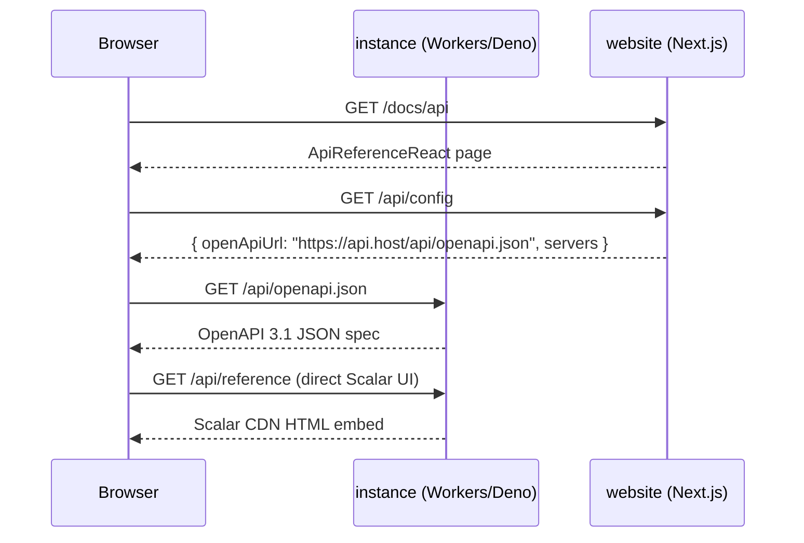

# AGENTS.md

Minimal Hono app with dual runtimes: **Cloudflare Workers** (Wrangler) and **Deno**.

## Speed doctrine (turbo)

TurboPanel is named for speed; keep it fast on every path.

- **Cache runtimes & deps.** Deno/Node/Caddy live under `/opt/turbopanel/runtimes/<tool>/current`; install only when the pinned version is missing. Don't re-download or re-`pnpm install` when nothing changed.
- **Idempotent fast-paths.** Bootstrap/install steps must short-circuit when already satisfied (the Ansible roles do; mirror that in scripts).
- **Avoid redundant work.** No polling loops or periodic git/`systemctl` forks unless essential (the version watcher and auto-update poll were removed for this reason).
- **Parallelize** independent I/O (e.g. `Promise.all` for per-daemon fan-out, as in the admin routes).
- **Push, don't poll** for cross-process signals where practical (WS messages over fallback timers).

## Platform model: Ansible owns installs

The **daemon is the constant** installed on every TurboPanel-managed host and is the only party that runs Ansible to install/update everything else (runtimes, users, the instance, UI, Caddy). The instance does not install itself. In co-located dev the daemon runs the `instance-dev-install` playbook (see `../daemon/AGENTS.md`) when `TURBOPANEL_DEV_INSTANCE=1`. Nothing auto-updates — updates are operator-driven (admin **Upgrade System** button or **Sync Dev Build**).

## Users, group & socket permissions

- **`turbopanel`** (UID/GID **9999**): the developer and daemon user; has passwordless sudo; owns the install tree and **all git operations** (`git pull`, Upgrade System fetch/reset).
- **`instance`** (UID **9998**): runs the instance, Caddy, and the dev UI. Primary group is **`turbopanel`** — it has **no group of its own** and **no sudo**. It **reads** platform checkouts via group membership; it must not own source files (that blocks 9999 from saving in the editor).
- Co-located dev checkouts (`platform/turbopanel`, `platform/ui`) are **`2770 turbopanel:turbopanel`**. Per-service instance-user runtime state lives in **gitignored** checkout dirs: **`turbopanel/.local`** (instance + Caddy), **`ui/.local`** (Expo), plus matching **`.config`** trees. The **daemon** (`turbopanel`, UID 9999) uses **`/opt/turbopanel`** as `HOME`. The ownership normalizer skips checkout `.cache`/`.config`/`.local` so instance-owned runtime files are not reclaimed to `turbopanel`.
- Git SSH uses `/opt/turbopanel/.ssh/github_ed25519` at mode **`0600`** only (SSH rejects `0640`). Upgrade runs `sudo -u turbopanel git`; never run git as `instance`.
- Manual pulls: `sudo -u turbopanel git -C … pull` (or pull as the `turbopanel` login user directly). After any mistaken `instance`-user git, run `/usr/local/bin/turbopanel-normalize-dev-checkout <path>`. **Upgrade System** runs `turbopanel-normalize-dev-checkout <path> --prepare-reset` before `git reset` (clears instance-owned `.config`/`.local`/`.cache` that block reset), then normalizes source ownership and `--ensure-runtime-dirs` after reset.
- `/run/turbopanel` is **`2770 turbopanel:turbopanel`** (group-writable + setgid) so the in-group `instance` user can bind the socket; new sockets stay in the `turbopanel` group. The instance hardens its socket to **`0660`** so the daemon (also group `turbopanel`) can connect.

## Documentation discipline

**Keep this file current.** When you learn something durable about how TurboPanel works — architecture, env vars, gotchas, cross-repo contracts, operational steps — add or update a note here in the same PR/session as the code change. Future agents read `AGENTS.md` first.

- Prefer extending an existing section over appending orphan bullets.
- Record **why** when the reason is non-obvious (e.g. a missing Debian package that breaks Ansible).
- If a fact belongs in another repo (`daemon`, `ui`), put the canonical detail there and add a short cross-reference here when the instance is involved.
- Do not record secrets, tokens, or machine-specific credentials.
- Remove or correct notes that prove wrong.

`README.md` is for humans getting started; `AGENTS.md` is for agents maintaining the system.

## Setup

- **Deno** — <https://docs.deno.com/runtime/getting_started/installation/>
- **pnpm** — <https://pnpm.io/installation>
- **Node.js** — required for cert generation and Caddy download (`scripts/*.mjs`)
- Run `./develop.sh` on a fresh VM (Debian/Ubuntu). It is a **thin wrapper**: it bootstraps the daemon orchestration runtime, flips the daemon into co-located dev mode (`TURBOPANEL_DEV_INSTANCE=1` in `../daemon/.env`), installs the daemon systemd unit, and tails the journals. The **daemon** then installs the instance/Caddy/UI via Ansible — `develop.sh` no longer launches `deno`/`caddy`/daemon processes itself. The dev playbook installs the React Native devtools shared-library stack via `instance-dev-prereqs` (see `../daemon/AGENTS.md`).
- `pnpm install` — installs Hono and Wrangler into `node_modules/` for Workers bundling
- Local Wrangler secrets live in `.dev.vars` (`TURBOPANEL_SECRET` / `TURBOPANEL_SECRETS`; gitignored — Tilt `sync-env.sh` writes from `dev/.env`)
- `pnpm dev` (wrangler) still runs the **Cloudflare Workers** path for full-stack testing — unchanged. **`wrangler.jsonc` `dev.ip` is `0.0.0.0`** so Docker Caddy (`host.docker.internal`) can reach the dev server; default localhost-only bind causes Caddy **502**s.
- `pnpm deploy:workers` — deploy to Cloudflare
- `pnpm cf-typegen` — regenerate `worker-configuration.d.ts`
- The Ansible `instance-certs` / `caddy` / `node-runtime` roles supersede the standalone `pnpm cert:generate` / `pnpm caddy:install` scripts for managed hosts (the scripts remain for manual use).

### Systemd (all dev services run as their users)

Installed and managed by the daemon via the `instance-launch` Ansible role:

| Unit | User | Notes |
|---|---|---|
| `turbopanel-instance.service` | `instance:turbopanel` | Deno instance on the Unix socket |
| `turbopanel-caddy.service` | `instance:turbopanel` | TLS + reverse proxy on `:8443` |
| `turbopanel-ui.service` | `instance:turbopanel` | Expo web dev server (`:8081`, dev only) |
| `turbopanel-daemon.service` | `turbopanel:turbopanel` | runs Ansible; has sudo |

The `turbopanel-ui.service` unit runs Expo inside a tmux session named `expo-ui` (session name is the `EXPO_TMUX_SESSION` constant in `src/expo-pty.ts`). The instance Deno process requires **`--allow-run=tmux`** for the developer Expo terminal WebSocket (polls `tmux capture-pane -e` snapshots; resizes the tmux window to match xterm cols/rows).

- `systemd/turbopanel-instance.service` in this repo is a **reference/manual-install fallback**; the canonical unit is templated by the `instance-launch` role in `../daemon`.
- Logs: `journalctl -u turbopanel-instance -u turbopanel-caddy -u turbopanel-ui -f`
- Co-located daemon: `../daemon/scripts/install-daemon-systemd.sh`

## Unix domain sockets

In Deno mode (development and production), the Hono instance listens on a **Unix domain socket** instead of a TCP port. Caddy terminates TLS and proxies `/api/*` and `/ws/*` to that socket.

### Directory layout

All TurboPanel runtime sockets live under **`/run/turbopanel/`** (on Linux, `/var/run` symlinks to `/run`). The directory is **`2770 turbopanel:turbopanel`** (setgid) so the `instance` user (in group `turbopanel`) can bind:

| Socket file | Service |
|---|---|
| `/run/turbopanel/turbopanel.sock` | Hono instance (bound by `instance`, mode `0660`, group `turbopanel`) |
| `/run/turbopanel/postgres/.s.PGSQL.5432` | PostgreSQL 18 (Docker bind-mount) |
| `/run/turbopanel/<name>.sock` | Reserved for future services |

### Environment variables

| Variable | Default | Purpose |
|---|---|---|
| `TURBOPANEL_SOCKET` | — | Full socket path override |
| `TURBOPANEL_SOCKET_DIR` | `/run/turbopanel` | Directory when using the default filename |
| `TURBOPANEL_SOCKET_DIAL` | `run/turbopanel/turbopanel.sock` | Caddy `unix//` dial path (no leading slash) |
| `TURBOPANEL_UI_MODE` | `static` | `dev` proxies to Expo; `static` serves exported UI |
| `TURBOPANEL_UI_ROOT` | `../ui/dist` | Directory of `expo export --platform web` output |
| `TURBOPANEL_UI_SERVICE` | `turbopanel-ui` | Name of the Expo systemd unit; default `turbopanel-ui`. Used by `POST /api/developer/v1/expo/restart`. |
| `CADDY_PORT` | `8443` | HTTPS listen port |
| `CADDY_TLS_CERT` | `./certs/self-signed.crt` | Server leaf certificate (signed by platform CA) |
| `CADDY_TLS_KEY` | `./certs/self-signed.key` | Server leaf private key |
| `TURBOPANEL_TLS_EXTRA_SANS` | — | Comma-separated DNS names for the server cert (e.g. `turbopanel.lan`) |

Path resolution lives in `src/server-paths.ts`.

## Database (Drizzle + Postgres.js)

The instance uses **Drizzle ORM** over **postgres.js** with `prepare: false` (required for Hyperdrive and transaction-pooling). Connection factories live in `src/db.ts`; schema in `src/db/schema.ts`; drizzle-kit config in `drizzle.config.ts`. **Read `src/db/AGENTS.md` before touching schema or the database** — no migrations yet; the dev server has live data.

| Runtime | Factory | When connected |
|---|---|---|
| Cloudflare Workers | `createWorkersDb(env.HYPERDRIVE)` | `HYPERDRIVE` binding present in `wrangler.jsonc` |
| Deno (self-hosted) | `createDenoDb()` | `TURBOPANEL_PG_*` env vars set by `instance-launch` |

Route handlers read the per-request client via `getDb(c)` (set by `createApp({ db })`). When no database is configured the app still starts; `getDb()` returns `undefined`.

### Self-hosted Postgres env (`TURBOPANEL_PG_*`)

Injected by `../daemon` `instance-launch` from the same defaults as the `postgres` role (`/etc/turbopanel/postgres/config.json` metadata). Password is read from `/etc/turbopanel/postgres/.pgpass` at unit install time.

| Variable | Value |
|---|---|
| `TURBOPANEL_PG_USER` | `turbopanel` |
| `TURBOPANEL_PG_DB` | `turbopanel` |
| `TURBOPANEL_PG_PORT` | `5432` |
| `TURBOPANEL_PG_PASSWORD` | from `/etc/turbopanel/postgres/.pgpass` |
| `TURBOPANEL_PG_SOCKET` | `/var/run/turbopanel/postgres/.s.PGSQL.5432` |

The instance always connects via Unix socket (`createDenoDb()` prefers `TURBOPANEL_PG_SOCKET` over `TURBOPANEL_PG_HOST`). Postgres in Docker always binds the socket volume; `postgres_expose_port` only adds optional TCP `127.0.0.1:5432` and is off in co-located dev. The Deno unit adds `--allow-read` and `--allow-write` for `postgres_socket_dir` (Deno requires write on the socket directory for Unix connects).

### Workers Hyperdrive

`wrangler.jsonc` declares a `HYPERDRIVE` binding stub (replace the placeholder id before deploy). Types: `worker-configuration.d.ts` (`HYPERDRIVE?: Hyperdrive`). Regenerate with `pnpm cf-typegen` after changing bindings.

**Local dev (`wrangler dev`):** do not commit `localConnectionString` in `wrangler.jsonc`. Tilt `sync-env.sh` writes `CLOUDFLARE_HYPERDRIVE_LOCAL_CONNECTION_STRING_HYPERDRIVE` to `instance/.env` (derived from `dev/.env` `POSTGRES_*`, or override in `dev/.env`). Wrangler loads `.env` into `process.env` before applying Hyperdrive bindings — the Worker connects directly to local Postgres (no Hyperdrive pooling/caching in this mode). **`TURBOPANEL_DATABASE_URL`** in the same file is for migrations/Drizzle/sync tooling and may use different credentials than the Hyperdrive runtime user in production.

The Workers DB client uses `prepare: false` on postgres.js (see **Database** above) because Hyperdrive sits in front of a connection pool and does not preserve per-session prepared-statement state.

**Unsupported PostgreSQL features** (do not rely on these on the Workers/Hyperdrive path):

- SQL-level prepared statements: `PREPARE`, `DISCARD`, `DEALLOCATE`, `EXECUTE`
- [Advisory locks](https://www.postgresql.org/docs/current/explicit-locking.html#ADVISORY-LOCKS)
- `LISTEN` / `NOTIFY`
- Any other modification to per-session state unless Cloudflare documents it as supported

### Tooling

- `pnpm install` — pulls `drizzle-orm`, `postgres`, `drizzle-kit`
- Do **not** run `drizzle-kit push`, `generate`, or `migrate` without explicit approval — see `src/db/AGENTS.md`

### Caddy dial format

Caddy uses `unix//<path>` where `<path>` has **no leading slash**:

```caddyfile
reverse_proxy unix//run/turbopanel/turbopanel.sock
```

`TURBOPANEL_SOCKET_DIAL` is passed into the `Caddyfile` placeholders.

### Development

The daemon's `runtime-sockets` role (and `scripts/ensure-socket-dir.mjs` for manual runs) ensures `/run/turbopanel` exists as `2770 turbopanel:turbopanel`, using passwordless `sudo` when needed. After bind, the instance hardens the socket file to `0660` (owner+group only) so the daemon can connect.

The instance Deno process runs with scoped permissions (see the `instance-launch` unit template): `--allow-env --allow-sys=networkInterfaces --allow-read=/run/turbopanel,<postgres socket dir>,<daemon dir>,<instance dir> --allow-write=/run/turbopanel --allow-run=git,systemctl,tar` (`tar` is needed for the dev-sync tarball). TCP dev Postgres adds `--allow-net=127.0.0.1:5432`.

### Production

The daemon's orchestration bootstrap runs the `socket-dirs-setup` Ansible playbook, which installs `/etc/tmpfiles.d/turbopanel.conf` and applies it with `systemd-tmpfiles --create`. The directory is recreated on boot automatically.

## Caddy (dev + production)

Caddy terminates TLS and routes traffic from a single HTTPS entrypoint:

- `/api/*` and `/ws/*` → Deno instance (`unix:///run/turbopanel/turbopanel.sock`)
- everything else → Expo dev server (**dev**) or static export (**production**)

`reverse_proxy` to the Unix socket sets `X-Real-IP {remote_host}` on `/api/*` and `/ws/*`. The instance uses that header to deduplicate daemon WebSocket reconnects (without it, every reconnect looked like a new fleet member behind the proxy).

### Development

Caddy/cert installs are handled by the daemon's `caddy` and `instance-certs` Ansible roles; `turbopanel-caddy.service` runs Caddy as `instance`.

- Entrypoint: `https://<host>:8443` (Caddy, defined in `Caddyfile`) — binds all interfaces; use `localhost` or the machine's LAN IP.
- Self-hosted TLS uses a **platform CA** (`certs/ca.crt` + `certs/ca.key`) that signs a **server leaf cert** (`certs/self-signed.crt` + `.key`) presented by Caddy (`auto_https off`, no Let's Encrypt). The CA is long-lived and can issue additional certificates later; agents fetch it from `GET /api/daemon/v1/instance/ca`. Trust `certs/ca.crt` in browsers/OS to avoid warnings.
- Override the resolved binary with `TURBOPANEL_CADDY` (and `TURBOPANEL_DENO` for Deno).

### Production (static UI)

Export the Expo web app, then run Caddy with the default `TURBOPANEL_UI_MODE=static`:

```bash
cd ../ui && pnpm export
cd ../turbopanel
TURBOPANEL_UI_ROOT=../ui/dist caddy run --config Caddyfile --adapter caddyfile
```

Caddy serves files from `TURBOPANEL_UI_ROOT` (default `../ui/dist`) and falls back to `/index.html` for client-side routes (SPA), matching the Cloudflare Workers asset routing in `ui/wrangler.jsonc`.

Set `CADDY_TLS_CERT` / `CADDY_TLS_KEY` only when overriding the default server leaf certificate paths.

## API / WS surfaces (versioned)

Three audiences, each with its own REST + WS namespace. Prefixes live in `src/surfaces.ts`; `GET /api/health` is the single deliberately-unversioned probe.

| Surface | REST | WS | Notes |
|---|---|---|---|
| Client (end-user UI) | `/api/client/v1/*` | `/ws/client/v1` | greenfield stubs |
| Developer (dev console) | `/api/developer/v1/*` | `/ws/developer/v1` (stub), `/ws/developer/v1/expo-pty` | fleet, diagnostics, shell, addresses, `expo/status`, `expo/restart`, `system/upgrade`, `instance/tunnel-token`, `daemon/(:id/)sync-dev` |
| Admin (admin UI) | `/api/admin/v1/*` | `/ws/admin/v1` | reserved for a future instance-admin surface |
| Daemon (agents) | `/api/daemon/v1/*` | `/ws/daemon/v1` | `version`, `instance/ca`; agents connect on the WS path |

- Route modules: `src/admin-routes.ts`, `src/daemon-api-routes.ts`, `src/client-routes.ts` (mounted in `createApp`); Deno-only routes `src/system-routes.ts`, `src/dev-sync.ts`, `src/tunnel-routes.ts`, and the version route are registered in `src/deno.ts`.
- The UI calls everything through `../ui/src/lib/instance-api.ts` (single choke point, prefixed `/api/admin/v1`).
- Hard cutover: daemon, UI, Caddy (`/ws/*`), and Workers routes (`wrangler.jsonc`) moved together. The external CDN node installer must fetch the CA from the new `/api/daemon/v1/instance/ca` path.

## Daemon hub (`/ws/daemon/v1`)

Server nodes register in `src/daemon-hub.ts` (keyed by `serverId` from the `server` table); the developer UI polls `/api/developer/v1/daemon/*`.

- Each socket gets an internal id (`daemon-1`, …) for routing; **display** uses `hostname` from the daemon `hello` message (UI falls back to `X-Real-IP`, then the internal id).
- On connect, resolve or create a `server` row (uuidv7 `serverId`), evict older sockets from the same `serverId`, `X-Real-IP`, or `hostname`; prune sockets with no inbound traffic (stale reconnect zombies). All connecting daemons auto-register; `organization_id` stays null until assigned in the developer **Servers** section (`PATCH /api/developer/v1/servers/:id`).
- Co-located daemons that dial the instance Unix socket directly (no Caddy hop) collapse to a single local slot and are tagged `__direct__` (`getColocatedDaemonId`) — see `daemon` `AGENTS.md` for socket vs URL mode.
- No `version` push / auto-update: the daemon never self-updates.

### Dev sync (push a daemon build without git)

`src/dev-sync.ts` tars the local `../daemon` checkout, base64-encodes it, and streams `dev-sync-begin` → `dev-sync-chunk*` → `dev-sync-end` over the daemon WS; the daemon unpacks, `deno cache`s, replies `dev-sync-result`, and restarts. Admin routes: `POST /api/admin/v1/daemon/:id/sync-dev` and `…/daemon/sync-dev` (all). UI: **Sync Dev Build** in the fleet section.

### Instance Cloudflare tunnel

`POST /api/admin/v1/instance/tunnel-token` (`src/tunnel-routes.ts`) sends a `tunnel-token` WS message to the co-located daemon, which writes `cloudflared/tunnels/instance.token` and (re)starts cloudflared. External agents then reach this instance via the tunnel → Caddy → socket. UI: **Save Tunnel Token** in the fleet section (empty token tears it down).

Correlated request/ack helpers (`awaitDaemonAck` / `recordDaemonAck`) back both dev-sync and tunnel-token.

## Authentication

The instance uses a **custom PAM-style auth model** built entirely on the **Web Crypto API** (`crypto.subtle`, `crypto.getRandomValues`). There is no dependency on Node.js crypto or `nodejs_compat` mode — the same primitives run on both Deno and Cloudflare Workers.

**No `nodejs_compat` mode.** Do not enable `nodejs_compat` in `wrangler.jsonc` for any auth-related reason. All cryptographic operations use the standard Web Crypto API only.

#### Password hashing

Credential-account passwords use **PBKDF2-HMAC-SHA256** via `crypto.subtle` (`src/auth/password.ts`). This is the strongest password-hashing primitive available in native Workers/Deno Web Crypto — Argon2 and scrypt are not exposed, and WASM Argon2 is heavier and awkward in Workers. Stored format: `$pbkdf2-sha256$<iterations>$<base64url-salt>$<base64url-hash>` (100k iterations for new hashes — Workers PBKDF2 cap; iteration count is embedded so older hashes still verify). Verification uses constant-time byte comparison. Do not use plain SHA-256 for passwords.

#### Session model

Sessions are **opaque DB-backed tokens** with a signed cookie:

- A 32-byte random token is generated and stored in the `session` table (`token`, `userId`, `expiresAt`, `ipAddress`, `userAgent`).
- The cookie value sent to the browser is `<token>.<HMAC-SHA256-signature>`, where the signature is computed over the raw token using the session secret.
- On every request the signature is verified first (constant-time); only then is the DB queried for the session row.
- Cookie name: `turbopanel.session_token` on HTTP, `__Secure-turbopanel.session_token` on HTTPS (resolved from the request URL in `src/auth/crypto.ts`).
- Cookie attributes: `HttpOnly; SameSite=Lax; Path=/; Max-Age=604800` (7 days). `Secure` is added automatically when the request URL is HTTPS.

#### Host PAM install gate (Deno only, install wizard)

On the **Deno runtime**, initial setup is gated by host PAM — **`root`** or any user in the **`sudo` / `wheel` / `admin`** groups. Host auth **never** receives a session or cookie. The instance process runs as **`instance`**; it runs **`pamtester login "$username" authenticate`** via **`sudo -n`** and a shell pipe (see `src/auth/credentials.ts`). **`pamtester`** must be installed on managed hosts (the daemon `agent-prereqs` role). Sudoers: **`instance`** gets `NOPASSWD: /usr/bin/pamtester login * authenticate` in `instance-launch` `upgrade-sudoers.yml`. The instance systemd unit must grant **`--allow-run=/bin/sh,sudo,/usr/bin/sudo,pamtester,/usr/bin/pamtester`**.

**Install flow:** `POST /api/client/v1/install/bootstrap` verifies host PAM and returns `{ ok: true }` only (no cookies). The UI keeps host username/password in the form and reveals superadmin fields client-side. `POST /api/client/v1/install` re-verifies host PAM, creates org (**Default Organization**) + team (**Default Team**) + **superadmin** user (`role: superadmin`, email + credential `account`), assigns the co-located daemon, and returns a signed session cookie for the superadmin only. Host accounts cannot sign in via `/auth/sign-in`. This path is **never active on Workers**.

Superadmin-only routes (`createRootOnlyMiddleware`, `resolveRootSession`) authorize by **`user.role === 'superadmin'`**, not PAM root.

#### Session secret configuration

Both runtimes read the same root secret env vars; `deriveSecretsConfig()` HKDF-derives purpose-specific keys (e.g. `session-signing`) from the root material.

| Variable | Behaviour when missing |
|---|---|
| `TURBOPANEL_SECRET` | Single **base64-encoded** root key; legacy fallback when `TURBOPANEL_SECRETS` is also set |
| `TURBOPANEL_SECRETS` | Versioned list `2:b64,1:b64` (each value base64); highest version is current signing key |

| Runtime | Source |
|---|---|
| Deno | `TURBOPANEL_SECRET` / `TURBOPANEL_SECRETS` env vars (`instance-launch` injects them on managed hosts) |
| Workers | Same names as Wrangler bindings / `.dev.vars` (Tilt `sync-env.sh` writes them from `dev/.env`) |

**Root secret must be base64.** Values are decoded with `atob()` before HKDF derivation — plain text will crash startup. Generate with `openssl rand -base64 32` (or any base64 encoder over ≥16 random bytes).

At least one of `TURBOPANEL_SECRET` / `TURBOPANEL_SECRETS` must be set in production. Workers always fail fast when both are missing. Deno co-located dev (`TURBOPANEL_UI_MODE` ≠ `static`) may use an ephemeral random key as a warning-only fallback.

Add a base64 `TURBOPANEL_SECRET` to `dev/.env` before running `pnpm dev` (Tilt syncs it to `instance/.dev.vars` — see `dev/.env.example`).

**CORS (Scalar / docs site):** when `TURBOPANEL_CORS_ORIGINS` is set (comma-separated browser origins), `src/cors.ts` reflects matching `Origin` headers on API responses. Tilt `sync-env.sh` defaults this to `http://localhost:{WEBSITE_PORT}` and `http://127.0.0.1:{WEBSITE_PORT}` so the marketing docs site can call the API through Caddy cross-origin.

#### Auth routes

Client auth lives under `CLIENT_API_PREFIX` (`/api/client/v1`):

| Method | Path | Purpose |
|---|---|---|
| `POST` | `/api/client/v1/auth/sign-in` | Verify DB user credentials, create session (rejects root; use install wizard) |
| `POST` | `/api/client/v1/auth/sign-out` | Delete session, clear cookie |
| `POST` | `/api/client/v1/auth/sign-up` | Deno only: create a regular user account when `IS_SIGNUP_ENABLED = '1'` in the `setting` table; no session returned — user must sign in |
| `GET` | `/api/client/v1/auth/session` | Return current user session or 401 |
| `GET` | `/api/client/v1/install/status` | Public (Deno): `{ needsInstall, isInstallMode, isSignupEnabled }` — `needsInstall` / `isInstallMode` true until org + superadmin exist; `isSignupEnabled` reflects the `IS_SIGNUP_ENABLED` setting |
| `POST` | `/api/client/v1/install/bootstrap` | Deno: verify host PAM (root or sudo user), no cookies |
| `POST` | `/api/client/v1/install` | Deno: host PAM + superadmin setup → superadmin session only |
| `GET` | `/api/client/v1/servers` | Session required: servers assigned to the user's organization, with live `connected` / `hostname` from the daemon hub |

**Install mode (Deno self-hosted):** `isInstanceInstalled()` is false on a fresh DB. The UI `/install` page first verifies host PAM (`POST /install/bootstrap`, client-side gate only), then collects superadmin email/password. Org/team names are fixed defaults. After install, sign-in uses superadmin email/password only. The co-located daemon's `server.organization_id` is assigned on install (and again when the unix-socket daemon connects, if still unset).

#### New files

| File | Purpose |
|---|---|
| `src/auth/crypto.ts` | Web Crypto primitives: session cookie signing |
| `src/auth/session-store.ts` | `createSession`, `getSession`, `deleteSession`; `SessionData` type (`role` included) |
| `src/auth/credentials.ts` | `verifyCredentials`, `verifyInstallHostCredentials`; PAM host install gate + DB credential users |
| `src/auth/password.ts` | PBKDF2-SHA256 hash/verify for credential accounts |
| `src/auth/http.ts` | `registerAuthRoutes` — sign-in / sign-out / session + install HTTP handlers |
| `src/auth/install-state.ts` | Install detection, validation, `completeInstanceInstall`, colocated server assignment |
| `src/auth/middleware.ts` | Session + superadmin middleware helpers |

## OpenAPI & Scalar

Hand-authored API docs served from the shared Hono app (Workers and Deno):

- **`GET /api/openapi.json`** — OpenAPI 3.1 JSON spec from `src/openapi.ts`; `servers[0].url` is the request origin (`new URL(c.req.url).origin`). Documents health, client/auth/install, and daemon CA routes. No auth required.
- **`GET /api/reference`** — CDN-based [Scalar](https://github.com/scalar/scalar) embed from `src/scalar-html.ts`, pointing at `/api/openapi.json`. No auth required.

The marketing site (`../website`) loads the same spec via its `/api/config` proxy for `/docs/api`; the instance also exposes Scalar directly for local/dev use.



## Layout

- `develop.sh` — thin dev wrapper: bootstraps the daemon, enables dev-instance mode, tails journals
- `src/app.ts` — shared Hono app (`/api/health`, `/api/openapi.json`, `/api/reference` + client/admin/daemon routers)
- `src/openapi.ts` — hand-authored OpenAPI 3.1 spec (`getOpenApiSpec`)
- `src/scalar-html.ts` — Scalar CDN embed HTML (`buildScalarHtml`)
- `src/surfaces.ts` — versioned API/WS prefix constants
- `src/admin-routes.ts` / `src/daemon-api-routes.ts` / `src/client-routes.ts` — per-surface REST routers
- `src/system-routes.ts` — developer `system/upgrade` + `system/upgrade-status` + `system/reset-dev` (Deno-only). Upgrade hard-resets instance + daemon to `origin/trunk` (blocked when platform checkouts are dirty). Reset-dev wipes Postgres, repushes `schema.ts`, and restarts the instance (fresh install wizard).
- `src/database-routes.ts` — developer `database/status` + `database/studio` (Deno-only). Connection test and on-demand Drizzle Studio at `/drizzle-studio/` via Caddy in dev mode.
- `src/expo-pty.ts` — Expo PTY: tmux session status check, output streaming, and key forwarding for the developer console.
- `src/dev-sync.ts` / `src/tunnel-routes.ts` — dev-sync + tunnel admin routes (Deno-only)
- `src/server-paths.ts` — Unix socket path resolution
- `src/daemon-hub.ts` — WebSocket connection registry, command/address/ack dispatch
- `src/deno-ws.ts` — `/ws/daemon/v1` handler, `/ws/developer/v1/expo-pty` PTY stream, and `/ws/{developer,client}/v1` stubs
- `src/db.ts` / `src/db/schema.ts` — Drizzle client factories + schema
- `src/developer-routes-core.ts` — developer REST routes safe for Workers (`workers.ts` registers this). Deno-only routes (Drizzle Studio, tmux Expo) stay in `src/developer-routes.ts`, registered from `deno.ts` only — never import Deno-only modules from `src/app.ts` or the Workers bundle will fail.
- `src/workers.ts` — Workers entry (`wrangler.jsonc` main); registers `developer-routes-core` once per isolate
- `src/deno.ts` — Deno entry (`deno.json` tasks)
- `src/auth/` — authentication module: Web Crypto primitives, session store, PAM credentials, HTTP handlers, and session middleware (see **Authentication** section above)
