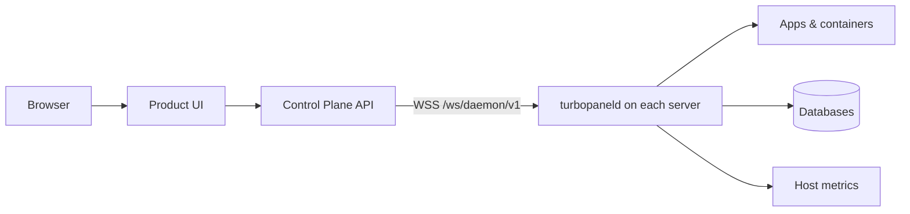

# TurboPanel

**Open-source control plane for deploying and operating apps, databases, and servers.**

**[Join the waitlist](https://turbopanel.io/pricing?utm_source=github-main-readme)** · **[Preview self-hosted docs](https://turbopanel.io/docs/deployment/self-hosted?utm_source=github-main-readme)** · **[Documentation](https://turbopanel.io/docs?utm_source=github-main-readme)**

> **Private alpha** — Neither TurboPanel High Availability nor self-hosted is publicly available yet. Foundation and fleet operations are furthest along; apps and deploy are actively improving. We're working toward a beta release — see the [roadmap](https://turbopanel.io/roadmap) and [releases](https://github.com/turbopanel/turbopanel/releases). Check the [compatibility matrix](https://turbopanel.io/docs/deployment/compatibility) before upgrading.

## What TurboPanel does

TurboPanel gives operators one console for multi-server fleets, application deploys, and day-to-day infrastructure work:

- **Multi-server fleet** — live online/offline status, OS details, batch updates, and per-server control (ping, hostname, reboot, timezone, NTP)
- **Host metrics** — CPU, memory, disk, and network charts with retention-aware ranges
- **Compose projects** — base compose documents, per-environment overlays, visual and YAML editors, deploy preview, and one-click deploy/stop
- **Managed engines** — provisioned Postgres (and growing engine catalog) with backups, users, databases, and lifecycle controls
- **Hostnames, TLS, and variables** — HTTP/TCP/UDP hostings, certificate library, scoped secrets, and environment injection
- **WireGuard meshes** — org-scoped VPNs with gateway/member roles and apply-to-fleet workflows
- **Same experience everywhere** — identical product surface on TurboPanel High Availability and self-hosted; only operational responsibility differs

## Choose how to run it

| | **TurboPanel High Availability** | **Self-hosted** |
| --- | --- | --- |
| **Who runs the control plane** | TurboPanel | You |
| **Product experience** | Full console + API | Full console + API |
| **Pricing** | Private alpha — [join the waitlist](https://turbopanel.io/pricing) | Private alpha — free, unlimited servers once available |
| **Best for** | Teams that want us to operate the panel | Teams that want full operational custody |

No artificial feature crippling — the split is **operational responsibility**, not capability.

## How it works

- The **control plane** (this repo) is the Hono API on Cloudflare Workers (managed) or Deno + Unix socket (self-hosted).
- The **daemon** ([turbopaneld](https://github.com/turbopanel/turbopaneld)) connects over authenticated WebSocket, runs Ansible locally, and executes deploy commands.
- The **UI** ([ui](https://github.com/turbopanel/ui)) is the signed-in console — served by Caddy (self-hosted) or Workers assets (managed).

Architecture detail: [turbopanel.io/docs/architecture](https://turbopanel.io/docs/architecture) · [Daemon cell](https://turbopanel.io/docs/architecture/daemon-cell)

## Get started

Neither path is publicly available yet — both are private alpha, working toward a beta release.

| Path | Link |
| --- | --- |
| **TurboPanel High Availability** | [Join the waitlist](https://turbopanel.io/pricing?utm_source=github-main-readme) |
| **Self-hosted** | [Preview self-hosted docs](https://turbopanel.io/docs/deployment/self-hosted?utm_source=github-main-readme) → [Control plane install](https://turbopanel.io/docs/deployment/control-plane) |

Add managed servers with the daemon installer: [Daemon setup](https://turbopanel.io/docs/deployment/daemon-setup).

## Documentation

Canonical docs live at **[turbopanel.io/docs](https://turbopanel.io/docs)** — getting started, deployment, API reference, and architecture.

## Community & support

| Need | Where |
| --- | --- |
| Questions, ideas, chat | [Discord](https://turbopanel.io/discord) |
| Bugs | Issue on the owning repo |

Full routing table: [SUPPORT.md](https://github.com/turbopanel/.github/blob/trunk/SUPPORT.md)

## Contributing

See [CONTRIBUTING.md](https://github.com/turbopanel/.github/blob/trunk/CONTRIBUTING.md). Contributor setup uses the [TurboPanel Development Environment](https://github.com/turbopanel/dev) — not a production install path.

## Security

Report vulnerabilities privately: [turbopanel.io/security](https://turbopanel.io/security) · [GitHub private reporting](https://github.com/turbopanel/turbopanel/security/advisories/new)

## License

TurboPanel is licensed under the [GNU Affero General Public License v3.0 only (AGPL-3.0-only)](./LICENSE).

Copyright (C) 2025 TurboPanel contributors
