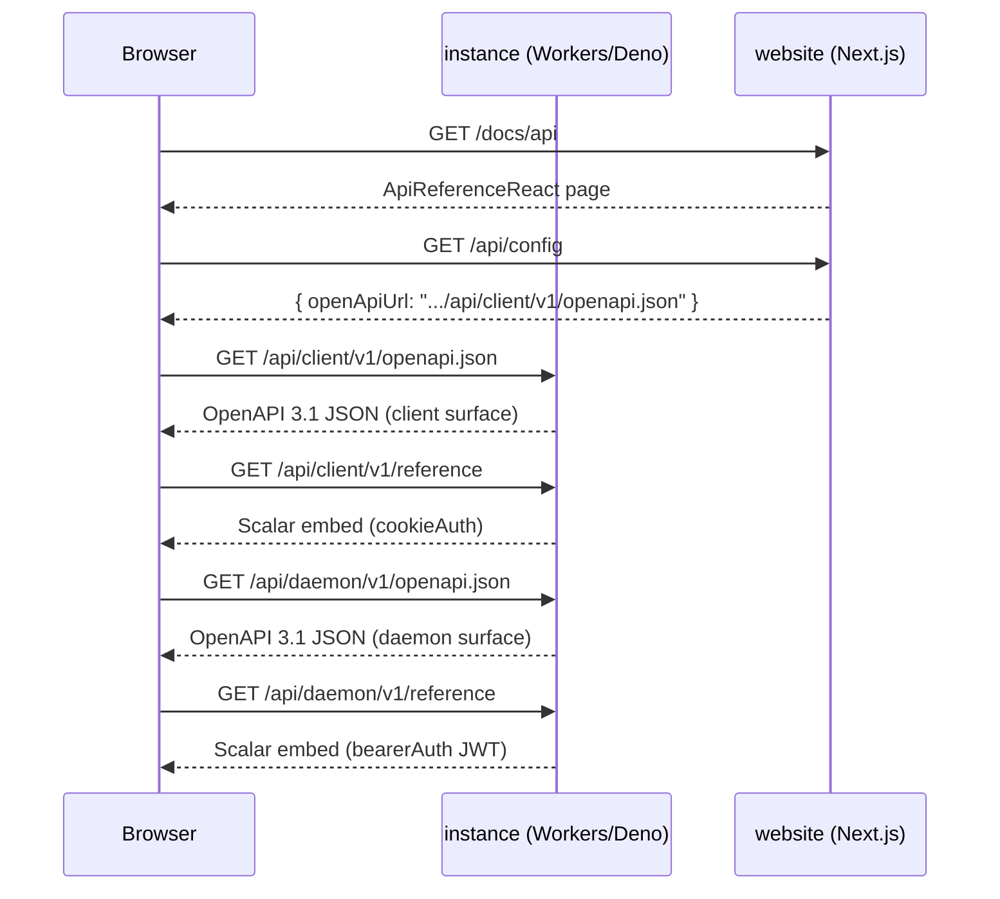

# OpenAPI & Scalar (`src/client/openapi`, `src/daemon/openapi`) — AGENTS.md

Repo-wide rules: `../../../AGENTS.md`. Hand-authored specs per surface.
Excluded from Sonar duplication (CPD) on purpose — see `scripts/AGENTS.md`.

Hand-authored API docs are split by surface and served from the client and
daemon routers (Workers and Deno):

| Endpoint                          | Surface | Auth scheme                   |
| --------------------------------- | ------- | ----------------------------- |
| `GET /api/client/v1/openapi.json` | Client  | `cookieAuth` (session cookie) |
| `GET /api/client/v1/reference`    | Client  | Scalar embed with cookie auth |
| `GET /api/daemon/v1/openapi.json` | Daemon  | `bearerAuth` (daemon JWT)     |
| `GET /api/daemon/v1/reference`    | Daemon  | Scalar embed with Bearer auth |

`servers[0].url` in each spec is the request origin
(`new URL(c.req.url).origin`). Client spec documents health,
client/auth/install, and resource routes. Daemon spec documents readiness,
platform CA, JWKS (`GET /api/daemon/v1/jwks.json`; `DaemonJwksResponse` in
`src/daemon/openapi/auth.ts`), the co-located daemon checkout version endpoint
(`GET /api/daemon/v1/version`), and the `/ws/daemon/v1` WebSocket upgrade —
daemon JWT credentials are sent in the HTTP `Authorization` header before
upgrade.

The marketing site (`../website`) loads client + daemon specs on `/docs/api` as
**separate Scalar documents** (cookie auth on Client, Bearer on Daemon — never
both schemes in one shared auth config). The instance also exposes Scalar
directly for local/dev use.

