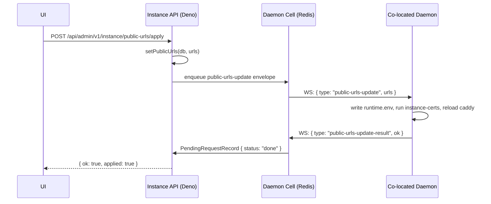

# Command Pipeline — AGENTS.md

Typed, Postgres-canonical commands with queue transport only (Cloudflare Queues
on Workers, RabbitMQ on Deno), plus the correlated developer/admin request flows
(dev-sync, instance tunnel-token, public-URL apply) that ride the same
enqueue-then-poll contract. Live delivery/correlation lives in the daemon cell.

Root context: `../../../AGENTS.md`. Daemon cell (delivery +
`createRequestAndWait`/`waitForRequest`): `../../daemon/cell/AGENTS.md`. Compose
documents: `../compose/AGENTS.md`.

## Command Pipeline

Commands are canonical in Postgres (`command` table). Queues are transport only
— Cloudflare Queues on Workers, RabbitMQ on Deno. The Daemon Cell is live
delivery, presence, and request correlation only.

> **Cost / hibernation:** the command consumer enqueues a `command-dispatch`
> envelope into the cell outbox, then **polls** `waitForRequest` from the
> worker/Deno process — it never blocks inside the Durable Object. Do not add
> timers, polling loops, or long-lived promises inside `DaemonCellObject`; do
> not hold Hyperdrive connections open across handler returns. Never build
> general command queues inside Durable Objects — Cloudflare Queues / RabbitMQ
> own durable transport; the cell owns only the live WS outbox + pending-request
> row. Cloudflare Workers (Durable Object) mode and self-hosted Deno/Redis mode
> must keep behavioral parity for every command feature. Production daemon
> commands must be typed handlers — never arbitrary shell strings.

| Status        | Meaning                                             |
| ------------- | --------------------------------------------------- |
| `queued`      | Record created, envelope enqueued                   |
| `dispatching` | Consumer received, checking presence                |
| `sent`        | Envelope enqueued into cell outbox                  |
| `acked`       | Daemon sent `command-ack` (non-terminal)            |
| `running`     | Daemon executing (future use)                       |
| `succeeded`   | Terminal — `command-outcome ok:true` received       |
| `failed`      | Terminal — offline, validation error, or `ok:false` |
| `timed_out`   | Terminal — no outcome within `expires_at`           |
| `cancelled`   | Terminal — operator-cancelled                       |

`status`, `created_at`, `updated_at`, `attempts`, `name`, `result_summary`,
`context`, `error_code`, `error_message`, and every granular lifecycle timestamp
(`queued_at`…`finished_at`, `expires_at`) are **real columns** on the `command`
row. `transitionCommand` `.set()`s them directly — a `CommandTransitionPatch`
(`status`, `result`, `error`, `errorCode`, `attempts`, and any explicit
lifecycle timestamp) maps one-to-one onto columns, auto-stamping the timestamp
that belongs to the new status; nothing merges into `metadata`.
`serializeCommandRecord` maps those columns onto the flat `CommandRecord`
(`result` ← `result_summary`, `error` ← `error_message`), normalizes
postgres.js timestamptz strings to ISO-8601, and **never exposes a
dispatch payload**. `metadata` survives only as the follow-up-chain blob
(`pendingStandbyApplies`, `followUpPromote`, `pendingTlsLeaf`, `desiredHash`),
read through `getCommandMetadata`. `context` is a small **non-secret**
identifier bag (`managedId`, `memberId`, `environmentId`, `generation`, …)
extracted from the payload by `context.ts` at enqueue time, so status/error
projections never need the payload. Organization is derived from the server —
there is no `organization_id` column on `command`. Do not store large logs or
streaming output in Postgres — `result` and `error` are bounded summaries only.

### Dispatch payload (`dispatch` table)

The daemon execution payload is **not** a `command` column. It lives in the
`dispatch` side table (`command_id` PK → `command.id` CASCADE, `payload`,
`created_at`, `expires_at`), so the permanent command history row is secret-free.

1. `createCommandRecord` writes the `command` row and its `dispatch` row in
   **one transaction**.
2. The consumer loads it **once** via `getCommandDispatchPayload`, immediately
   before building the `command-dispatch` envelope, and keeps it in memory for
   that attempt's side effects. A missing payload fails the command
   (`dispatch_payload_missing`) rather than dispatching an empty envelope.
3. `transitionCommand` finalizes the payload on **any** terminal transition —
   consumer outcome, enqueue failure, or expiry: `succeeded` deletes the row
   immediately; `failed` / `timed_out` / `cancelled` stamp
   `expires_at = now + COMMAND_DISPATCH_FAILURE_RETENTION_MS` (24h) for
   debugging. Cleanup is best effort and never fails the transition.
4. Expired rows are removed by `sweepExpiredCommandDispatch` on the **shared**
   maintenance tick (Workers offline-sweep cron; Deno `DAEMON_CELL_MAINTAIN_MS`
   timer), bounded by `COMMAND_DISPATCH_SWEEP_LIMIT` and reusing the already-open
   db — no new timer, no second connection.

`getCommandDispatchPayload` is the only sanctioned read of the payload; command
select lists stay explicit and must never be widened with a `dispatch` join.

`transitionCommand` also seals the command's **execution log** on any terminal
transition, through the module-scoped sink in
`src/lib/execution-logs/seal-on-terminal.ts` (terminal transitions fire from
isolates with no shared Hono context). Sealing compacts the streamed transcript
chunks into one gzipped object and is best effort under the same rule as
dispatch cleanup: **it never fails the transition**. Transcripts live entirely
in the execution-log store — there is no Postgres column for them. See
`src/lib/execution-logs/AGENTS.md`.

### Queue transport

- **Workers:** `TURBOPANEL_COMMAND_QUEUE` binding → per-env queue names in
  `wrangler.jsonc`: `live` uses `daemon-commands` / `daemon-commands-dlq`;
  `testing` uses `staging-daemon-commands` / `staging-daemon-commands-dlq`;
  local top-level worker uses `dev-daemon-commands` / `dev-daemon-commands-dlq`
  (max 3 retries). Declared under `queues.producers` and `queues.consumers`.
  Consumer handler: `queue(batch, env, ctx)` in `src/workers.ts`.
- **Deno:** `TURBOPANEL_AMQP_URL` (same URL as email queue, different topology).
  Exchange `turbopanel.commands`, queue `turbopanel.commands.dispatch`, routing
  key `command.dispatch`, DLX `turbopanel.commands.dlx` → DLQ
  `turbopanel.commands.dispatch.dlq`. Consumer: `startCommandConsumer()` in
  `src/lib/commands/deno-consumer.ts`, started in-process from `src/deno.ts`.
  **TODO:** extract to a dedicated `turbopanel-command-consumer.service` systemd
  unit in a future pass (mirrors the mailer pattern).
- Shared abstraction: `CommandQueue` interface in `src/lib/commands/queue.ts`;
  `getCommandQueue(c)` Hono accessor. Envelope schema in
  `src/lib/commands/envelope.ts` — small (ids + type + timestamps; no large
  payloads). The `CommandEnvelope` no longer carries `organizationId` — org is
  derived from the server at consume time.

### Client endpoints

| Method   | Path                                                       | Auth                         | Purpose                                                                                                                                                                                                                                                                                                                                                                                                                                                                                                                                                                                                                                                                                                                                                                                                                                                                                                                                                                                                                                                                                                                                                                                                                                                                                                                                                                                                                                                                                                                                                                                                                                                                                                                                                                                                                                                                       |
| -------- | ----------------------------------------------------------- | ---------------------------- | ----------------------------------------------------------------------------------------------------------------------------------------------------------------------------------------------------------------------------------------------------------------------------------------------------------------------------------------------------------------------------------------------------------------------------------------------------------------------------------------------------------------------------------------------------------------------------------------------------------------------------------------------------------------------------------------------------------------------------------------------------------------------------------------------------------------------------------------------------------------------------------------------------------------------------------------------------------------------------------------------------------------------------------------------------------------------------------------------------------------------------------------------------------------------------------------------------------------------------------------------------------------------------------------------------------------------------------------------------------------------------------------------------------------------------------------------------------------------------------------------------------------------------------------------------------------------------------------------------------------------------------------------------------------------------------------------------------------------------------------------------------------------------------------------------------------------------------------------------------------------------- |
| `POST`   | `/api/client/v1/servers/:id/commands/ping`                 | session + read               | Create `daemon.ping` command, enqueue                                                                                                                                                                                                                                                                                                                                                                                                                                                                                                                                                                                                                                                                                                                                                                                                                                                                                                                                                                                                                                                                                                                                                                                                                                                                                                                                                                                                                                                                                                                                                                                                                                                                                                                                                                                                                                         |
| `POST`   | `/api/client/v1/servers/:id/hostname`                      | session + manage             | Validate hostname, create `server.hostname.set` command, enqueue                                                                                                                                                                                                                                                                                                                                                                                                                                                                                                                                                                                                                                                                                                                                                                                                                                                                                                                                                                                                                                                                                                                                                                                                                                                                                                                                                                                                                                                                                                                                                                                                                                                                                                                                                                                                              |
| `POST`   | `/api/client/v1/servers/:id/timezone`                      | session + manage             | Validate IANA timezone, persist `server.options.timezone`, create `server.timezone.set`, enqueue                                                                                                                                                                                                                                                                                                                                                                                                                                                                                                                                                                                                                                                                                                                                                                                                                                                                                                                                                                                                                                                                                                                                                                                                                                                                                                                                                                                                                                                                                                                                                                                                                                                                                                                                                                              |
| `POST`   | `/api/client/v1/servers/:id/ntp`                           | session + manage             | Validate NTP payload, create `server.ntp.set` command, enqueue                                                                                                                                                                                                                                                                                                                                                                                                                                                                                                                                                                                                                                                                                                                                                                                                                                                                                                                                                                                                                                                                                                                                                                                                                                                                                                                                                                                                                                                                                                                                                                                                                                                                                                                                                                                                                |
| `POST`   | `/api/client/v1/organizations/:id/fabric/apply`            | session + manage             | Force-reconcile TurboFabric membership (`server.fabric.reconcile`) on every org relay; `{ enabled: false }` teardown is PUT disable. Returns `{ fabricId, interfaceName: 'tp0', results[] }` (optional per-result `unreachablePeers`)                                                                                                                                                                                                                                                                                                                                                                                                                                                                                                                                                                                                                                                                                                                                                                                                                                                                                                                                                                                                                                                                                                                                                                                                                                                                                                                                                                                                                                                                                                                                                                                                                                         |
| `PATCH`  | `/api/client/v1/organizations/:id/fabric/relays/:serverId` | session + manage             | Update relay role / advertised CIDRs / keepalive / endpoint pin / write-only PSK; then change-driven membership reconcile                                                                                                                                                                                                                                                                                                                                                                                                                                                                                                                                                                                                                                                                                                                                                                                                                                                                                                                                                                                                                                                                                                                                                                                                                                                                                                                                                                                                                                                                                                                                                                                                                                                                                                                                                     |
| `POST`   | `/api/client/v1/servers/:id/commands/reboot`               | session + manage             | Create `server.reboot` command, enqueue                                                                                                                                                                                                                                                                                                                                                                                                                                                                                                                                                                                                                                                                                                                                                                                                                                                                                                                                                                                                                                                                                                                                                                                                                                                                                                                                                                                                                                                                                                                                                                                                                                                                                                                                                                                                                                       |
| `POST`   | `/api/client/v1/environments/:id/deploy`                   | session + manage             | Merge project+env ComposeDocuments → plan `slot` rows → compile one runtime `compose.yaml` per participating server plus `.env` (non-secrets) and `secretPlan[]` (Compose standalone secret files). Multi-server TurboFabric deploys enqueue `server.fabric.reconcile` early (skipping already-converged relays) and **wait for membership convergence** (every participating relay has a public key **and** `appliedPayloadHash` matches the desired hash that includes peers, prefixes, and networks — after a key-filling command, follow-up peer payloads are enqueued and waited on too) **before** bumping `environment.generation`, replacing slots, or enqueueing `environment.deploy` (`422 fabric_reconcile_failed` / `409 fabric_reconcile_pending`). Compose `network(kind='compose')` / `subnet` rows created for the attempt are purged unless deployment-target writes succeed (command records and targets persist before queue delivery, so a mid-fan-out enqueue failure keeps spanning state and marks that server's target `failed`). Create `environment.deploy` on each (`409 server_placement_required` when no pin, default, or eligible host; **`422 turbofabric_required`** when the plan spans hosts without TurboFabric; **`422 variable_unresolved` / `variable_ref_invalid` / `variable_secret_interpolation`** for `{$…}` / `${SECRET}` failures; body `serverId` ignored). Optional body `noCache: true` is forwarded on the command payload so the daemon runs `docker compose build --no-cache --pull` before `up`. Response includes `commandId` (first) plus `commands[]`. Poll via existing command GET (Postgres only). **Service bindings** re-materialize as ordinary `variable` rows then auto-attach as secret files + `KEY_FILE` — they ride `variableMaterial[]` / `sealVariableMaterialForDaemon` with **no new command type**. |
| `GET`    | `/api/client/v1/environments/:id/deploy-preview`           | session + manage             | Same `prepareDeployCompose` path as deploy (idempotent allocation/registration); skips sealing; returns redacted compiled `compose.yaml` (`role: 'runtime'`, annotated with `x-turbopanel.placement`) plus optional `servers[]` (omitted for a single-server plan), `envFile` (non-secret values), and `secretPlan[]` (paths only).                                                                                                                                                                                                                                                                                                                                                                                                                                                                                                                                                                                                                                                                                                                                                                                                                                                                                                                                                                                                                                                                                                                                                                                                                                                                                                                                                                                                                                                                                                                                                                                                                       |
| `GET`    | `/api/client/v1/environments/:id/deployments`              | session + read               | **Deploy history — a `command` read, not a `deployment` read.** `deployment` is upsert-per-`(environment_id, server_id)` current state and is overwritten on every redeploy, so it can never list past attempts; the append-only source is the `command` table itself (`name = 'environment.deploy'`, scoped by the allowlisted `context->>'environmentId'`, backed by the partial expression index `idx_command_deploy_environment_created`). Newest-first, keyset-paginated with `?limit` (1–100, default 20) and `?before=<deployment id>`. `hasLog` is resolved store-side per id (same fan-out as `POST /commands/status`) — there is no Postgres column. Helpers: `src/lib/db/deployment-history.ts`. |
| `GET`    | `/api/client/v1/environments/:id/deployments/:deploymentId` | session + read               | `:deploymentId` **is a `command.id`** — the same id fetches the transcript from the existing command-log route. Returns the anchor attempt plus every `environment.deploy` command sharing its `context.generation` (the multi-server fan-out). `servers[]` joins **current** `deployment` state (`applied_generation` / `desired_generation` / `status`): no per-generation replica snapshot is persisted, so those figures describe convergence _now_, not at deploy time. `404` when the id is not an `environment.deploy` for this environment.                                                                                                                                                                                                                                                                                                                                                                                                                                                                                                                                                                                                                                                                                                                                                                                                                                                                                                                                                                                                                                                                                                                                                                                                                                                                                                                           |
| `POST`   | `/api/client/v1/environments/:id/lifecycle`                | session + manage             | Body `{ action: 'start' \| 'stop' \| 'restart' }`; fan-out `environment.lifecycle` to non-draining `deployment` rows, else the env pin / project default (`409 server_placement_required` when none). Non-destructive compose start/stop/restart. Poll via command GET.                                                                                                                                                                                                                                                                                                                                                                                                                                                                                                                                                                                                                                                                                                                                                                                                                                                                                                                                                                                                                                                                                                                                                                                                                                                                                                                                                                                                                                                                                                                                                                                                       |
| `POST`   | `/api/client/v1/environments/:id/stop`                      | session + manage             | Fan-out `environment.stop` to the same target set as lifecycle; payload may include `fabricNetworks[]` (`tpn_*` names) and `siteReleases[]` (`{ serviceId, username }`, the generic per-service release trees) because the instance drops the rows naming them after enqueue (host reclaim is best-effort). Daemon runs `compose down --volumes`, then removes those bridges and trees; returns `{ commandId, serverId, commands[] }`. Poll via command GET.                                                                                                                                                                                                                                                                                                                                                                                                                                                                                                                                                                                                                                                                                                                                                                                                                                                                                                                                                                                                                                                                                                                                                                                                                                                                                                                                                                                                                  |
| `POST`   | `/api/client/v1/servers/:id/system/:component/restart`     | session + `system:operate`   | Create `system.reconcile` with `action: 'restart'` for the server's system hosting-ingress component (`hosting-ingress` today); returns `{ commandId, status, serverId }`. Poll via command GET.                                                                                                                                                                                                                                                                                                                                                                                                                                                                                                                                                                                                                                                                                                                                                                                                                                                                                                                                                                                                                                                                                                                                                                                                                                                                                                                                                                                                                                                                                                                                                                                                                                                                              |
| `DELETE` | `/api/client/v1/projects/:id`                              | session + `organization:own` | Cascade-delete project children (`deleteProjectCascade`); **409** `project_has_running_services` when any non-stopped containers remain. Host reclaim rides along: teardown is **planned before** the cascade (payload comes from rows it deletes) and `environment.stop` is fanned out per environment/server **after** it commits, then `system.reconcile` `action: 'stop'` retires the shared HTTP Traefik on any server whose last hostname hosting just went away (`client/environments/teardown.ts`). Best effort — an unavailable queue is logged, never a delete failure.                                                                                                                                                                                                                                                                                                                                                                                                                                                                                                                                                                                                                                                                                                                                                                                                                                                                                                                                                                                                                                                                                                                                                                                                                                                                                                                                                                                                                                                                                                                                                                                                                                                                                                                                      |
| `GET`    | `/api/client/v1/servers/:id/commands/:commandId`           | session + read               | Poll status; ping includes latency breakdown                                                                                                                                                                                                                                                                                                                                                                                                                                                                                                                                                                                                                                                                                                                                                                                                                                                                                                                                                                                                                                                                                                                                                                                                                                                                                                                                                                                                                                                                                                                                                                                                                                                                                                                                                                                                                                  |
| `GET`    | `/api/client/v1/servers/:id/commands`                      | session + read               | List recent commands (optional)                                                                                                                                                                                                                                                                                                                                                                                                                                                                                                                                                                                                                                                                                                                                                                                                                                                                                                                                                                                                                                                                                                                                                                                                                                                                                                                                                                                                                                                                                                                                                                                                                                                                                                                                                                                                                                               |
| `POST`   | `/api/client/v1/commands/status`                            | session only                 | Batched lean status for many command ids (max 100, deduped). Visibility-filtered via `listVisible({ kind: 'server' })` — ids on servers the session cannot read are silently dropped, never 403'd. Never reads `dispatch`; no payload/result in the response. The UI's `useCommandsBatch` issues exactly one of these per poll tick.                                                                                                                                                                                                                                                                                                                                                                                                                                                                                                                                                                                                                                                                                                                                                                                                                                                                                                                                                                                                                                                                                                                                                                                                                                                                                                                                                                                                                                                                                                                                          |

Authz: ping/get require read (`assertCanReadOr403`); hostname, timezone, ntp,
and reboot require manage (`assertCanManageOr403`). `POST /commands/status` is
the exception: it authorizes the whole batch with one `listVisible` call and
intersects on `serverId` rather than making an authz round-trip per id. Daemon
authz must not leak into these session-authenticated routes.

Polling: the UI polls tracked commands through `useCommandsBatch`, which now
issues a single `POST /api/client/v1/commands/status` per tick instead of one
`GET .../commands/:commandId` per tracked id. The per-server detail route stays
for the single-command view that needs the ping latency breakdown.

### Consumer behavior

`processCommandEnvelope` in `src/lib/commands/consumer.ts` is the single source
that writes terminal `command` rows. The WS inbound path (`command-ack`,
`command-outcome`) only updates the hot `PendingRequestRecord` in the cell. For
MVP, `daemon.ping`, `server.hostname.set`, `server.timezone.set`,
`server.ntp.set`, `server.fabric.reconcile`, `server.tls.trust.reconcile`,
`server.reboot`,
`environment.deploy`, `environment.lifecycle`, `environment.stop`,
`managed.apply`, `managed.lifecycle`, `managed.destroy`, `managed.backup`,
`managed.restore`, `managed.promote`, `managed.ingress.reconcile`,
`managed.ha.reconcile`, `managed.ha.failover`, and
`system.reconcile` fail fast when the daemon is offline. For
`server.hostname.set` success, the consumer calls `touchServerMetadata` to
update the `server.hostname` column — the instance never updates hostname
speculatively. For `server.timezone.set` / `server.ntp.set` success, the
consumer writes observed timezone/NTP state onto the dedicated `server.timezone`
/ NTP columns so the read model refreshes before the next heartbeat. For
`server.fabric.reconcile` success with `enabled: true`, the consumer stamps
`relay.public_key` from the result (private key never leaves the host), records
`relay.metadata.appliedPayloadHash` / `appliedAt` / `observed` from the daemon
`peers[]`, and when that fills a previously-null key calls
`reconcileFabricMembership` so peers learn the new key without unbounded fan-out
(hash-gated). Stamp-match skips (`skipped: true`) still stamp the public key and
desired hash when the result includes a valid `publicKey` — returning early
solely because `skipped` is set would leave membership unconverged and
re-enqueue until timeout. Disable payloads (`{ enabled: false }`) skip the stamp
— they tear down `tp0`, routed bridges, `TP-FORWARD`, keys, and state. Reconcile
failures clear the applied hash so the next pass retries.

**TurboFabric gateway/member model:** relays are `role = 'gateway' | 'member'`.
Members always get a host `/32` route. Gateways also advertise `advertisedCidrs`
(datacenter LAN CIDRs); an empty gateway `advertisedCidrs` now resolves to the
derived **IPv4** subnets of that relay's datacenters (operator-set list wins
verbatim). Apply returns **422** `gateway_datacenter_required` /
`gateway_datacenter_cidr_required` when a gateway lacks a datacenter or that
datacenter has no subnet at all (`gateway_datacenter_cidr_required` now means
"that datacenter has no subnet at all"). `POST /organizations/:id/fabric/apply`
force-reconciles every relay; PUT disable tears down the mesh and reclaims
`network(kind='compose')` / `subnet` rows (compose-bridge CIDRs, not datacenter subnets). Overlay addresses auto-allocate from
`fabric.cidr`. For `environment.deploy` / `environment.stop` success, the
consumer reconciles canonical `container` rows via
`reconcileEnvironmentContainers` (`src/lib/db/container-records.ts`) from the
daemon's authoritative `containers[]` result (identity match by
`container_name`, else compose service / ordinal — including multi-instance
`web-N` clones). Stop returns `containers: []` so rows reset to `exited` with
null `container_id` (identity preserved for restart). When a reported compose
service has no `service` row yet (deploy before hostname config), reconcile
creates that service so container FKs can resolve; reconciliation failures are
logged and never revert the already-succeeded command.

`server.reboot` requires `organization:manage`, carries an empty payload, uses a
120s consumer timeout, has no `touchServerMetadata` side-effect, and is executed
daemon-side via `sudo systemctl reboot` (handler implemented in a separate
phase).

`environment.deploy` uses a 600s consumer timeout. Compose merge + Traefik label
injection + Docker/Caddy bootstrap run on the daemon
(`turbopaneld/src/instance/commands/deploy-environment.ts`). Optional payload
`noCache: true` (from UI cacheless redeploy) asks the daemon to run
`docker compose build --no-cache --pull` before `up`. On success the daemon may
also return best-effort per-container identity/status from `docker compose ps`;
the consumer reconciles those into `container` rows (ids/status only). **Cost:**
one cell outbox enqueue; UI polls Postgres command rows only — never Durable
Object reads for deploy status. Hosting Caddy (`:80`/`:443`) is distinct from
control-plane Caddy (`:8443`).

**`composeFiles[]` (compiled runtime file):** `environment.deploy` carries
`EnvironmentDeployComposeFile[]`. Deploys send a **single**
`{ filename: 'compose.yaml', role: 'runtime', source: 'inline', content }` entry
— that is the file the daemon writes under
`/var/lib/turbopanel/deployments/<projectId>/<environmentId>/` next to `.env`
(non-secrets, mode `0640`) and `deployment.json` (includes `secrets[]` plan, no
plaintext). `filename` must match `COMPOSE_FILE_NAME_RE`
(`/^[A-Za-z0-9._-]+\.ya?ml$/`, basename-only). Secret values never enter durable
YAML: `secretPlan[]` + `variableMaterial[]` (`tpdaemon` envelopes;
`sealVariableMaterialForDaemon` always reseals plaintext) materialize files
under `/run/turbopanel/deployments/<projectId>/<environmentId>/secrets/` (mode
`0600`). Build secrets use Compose `build.secrets`, not `build.args`. The
last-applied plan is also stored on `deployment.options.secretPlan` for boot
rehydrate (`POST /api/daemon/v1/deployments/secrets/rehydrate`). Optional
payload fields `generation`, `desiredHash`, `replicaCounts`, and `serverId`
identify the per-host snapshot.

**`command.context.releases[]`:** the Git-backed releases one
`environment.deploy` attempt published, written onto the permanent row at
enqueue time next to `replicaCounts` and for the same reason — `deployment` is
upsert-per-target and `dispatch.payload` is deleted at terminal state, so this
is the only durable record that release id `X` of service `web` ever existed.
Each entry is `{ composeServiceName, releaseId, sourceId, commitSha,
commitMessage?, commitAuthor?, rollbackToReleaseId? }`, all non-secret;
`normalizeContextReleases` drops the whole array rather than persisting a
partial one when a **required** field is missing, because a releases list with
holes would offer a rollback target that was never built — the display-only
commit subject/author are dropped individually instead. It is the read model
behind `lib/db/releases.ts` (`listServiceReleases`) and therefore behind `GET
/environments/:id/releases` and the `POST /environments/:id/rollback` gate.

Release ids are allocated **once per compose service per deploy**
(`createReleaseIdAllocator`, `client/environments/deploy-sources.ts`), before
the per-server prepare fan-out, and the same allocator is threaded through every
`prepareDeployCompose()` call in that deploy. So a service scheduled onto three
servers writes three `command` rows carrying the *same* release id, and
`listServiceReleases` folds them back into one environment-scoped record whose
status is the aggregate over all of them. Minting the id inside the per-host
prepare instead would make each host's release id different, and a rollback
naming one of them would fail the daemon's `promoteExistingRelease()`
missing-release check on every other host.

A rollback is **not** a new command type: it enqueues an ordinary
`environment.deploy` whose `sourceMaterial[]` entries carry
`rollbackToReleaseId`, so it bumps `generation` and inherits the supersede rule
like any other deploy. The rollback route only offers a release whose aggregate
status is `succeeded` **and** which is materialized on every server the
environment currently deploys to (`isReleaseMaterializedEverywhere`), and it
carries the release's recorded commit metadata forward so the rollback's own
release row names the commit going live rather than the branch placeholder.

**`EnvironmentDeployHosting.bindAddress`:** optional IPv4/IPv6 literal resolved
on the instance at deploy-prepare time (`resolveHostingBindAddress`) from
hosting `options.bind` (`public` / `datacenter` / `local`) plus optional
`hosting.ip_id`. Public with no pin omits the field (daemon emits no `bind`
directive — today's behavior). `local` → `127.0.0.1`. `datacenter` requires an
`ip` row with `scope = 'datacenter'` on the target server; when missing, deploy
validation fails with typed `DeployPrepareError`
`{ kind: 'datacenter_ip_required', serverId }` (**422**
`datacenter_ip_required`) before command dispatch — the daemon stays DB-free.

**`EnvironmentDeployPayload.listenerPorts`:** optional server-owner org
effective ProxySQL client listener ports echoed on every `environment.deploy`.
The daemon reserves the platform defaults (`15432` / `13306`) **and** these
overrides when checking tenant raw `tcp`/`udp` published-port claims — same
source as `managed.ingress.reconcile`.

**`EnvironmentDeployHosting.protocol` / `.ports` (raw TCP/UDP port hosting):**
`hosting.options.protocol` (`http` default/omitted, or `tcp`/`udp`,
`src/lib/hosting-options.ts` —
`HostingOptions.protocol`/`resolveHostingProtocol`) lets a Docker service
publish raw port(s) straight through a **per-service Traefik** instead of
routing hostnames through hosting Caddy — no hostname/TLS/path-prefix routing
for that hosting. `hosting.options.ports` (`HostingPortMapping[]`, capped at 10,
invalid/duplicate-published entries dropped rather than failing the document) is
`{ published, target }`; **required non-empty** when `protocol` is `tcp`/`udp` —
`hostings[].ports must not be empty for <protocol> protocol` (both
`deploy-validation.ts` and the daemon-side `contracts.ts`/`compose-labels.ts`
reject an empty list). `bind`/`ip_id` still apply identically to HTTP hostings
(resolved the same way into `bindAddress`), but
`hostnames`/`tlsId`/`pathPrefix`/`targetPort` are ignored for `tcp`/`udp`.
`resolveHostingEntry` in `deploy-routes.ts` branches on protocol
(`resolveHttpHostingEntry` vs `resolveTcpUdpHostingEntry`) when building the
deploy payload. Every service that publishes at least one `tcp`/`udp` port gets
an `ingressServices[]` entry (`EnvironmentDeployIngressService`: `serviceId`,
`composeServiceName`, `containerName === <serviceId>-in`) pre-allocated via
`ensureServiceIngressContainerAllocation` (same `(serviceId, 'ingress', 1)`
upsert as managed ingress). HTTP hostings never get an ingress container — they
stay on the shared loopback Traefik via Docker labels only. HTTP hostname
deploys also carry `hostingIngress` (`EnvironmentDeployIngressService` with
`composeServiceName: 'traefik'` and `containerName === <hosting-ingress
serviceId>-in`) so the daemon can write `<stateDir>/system/hosting-ingress.json`
before `ensureHostingIngress` on first tenant HTTP deploy — that is the
**platform** hosting-ingress UUID, not the workload service UUID, and not a
per-tenant Traefik. Deploy-preview
merges those ingress rows into `containers[]` with `role: 'ingress'`. See daemon
`src/deploy/AGENTS.md` → "Raw TCP/UDP port hosting" for the per-service Traefik
project / claim-file / conflict-detection mechanics — cross-service
published-port uniqueness is enforced **daemon-side** (the instance does not
track other services' claimed ports), so two deploys racing the same `tcp`/`udp`
port on the same server can both enqueue successfully and one command will fail
at apply time with a port-conflict error. `environment.stop` also passes
`ingressServices[]` (`{ serviceId }[]`) so the daemon can tear down those
per-service projects.

`environment.stop` uses a 120s consumer timeout. Daemon runs
`docker compose down --remove-orphans --volumes`, removes listed
`fabricNetworks[]` bridges (best-effort), removes the hosting Caddy site
snippet, reclaims listed `siteReleases[]` trees, deletes the deployment dir, and
`rm -rf`s the matching
`/run/turbopanel/deployments/<projectId>/<environmentId>/secrets` tree
(`turbopaneld/src/instance/commands/stop-environment.ts`).

**`siteReleases[]` (`{ serviceId, username }[]`) is generic host reclaim, not a
site detail.** It names `<principalHome>/sites/<serviceId>` — the
tree the Git release engine publishes into (`releases/`, `current`, `shared/`)
and the one the native-runtime phase will run out of. Like `fabricNetworks[]`,
it is resolved from `tenancy` rows **before** they can
go away (`client/environments/site-releases.ts`, shared by the explicit stop
route, the drained-server stop, and delete teardown), because the payload is the
only remaining copy by the time a delete-triggered stop reaches the host. The
resolver returns a **union**: the trees the current merged compose still
declares, plus the ones recorded in `deployment.options.siteReleases` by the
deploy that published them. Without the recorded half, a Git-backed service
removed from the compose would vanish from the current document and leave its
tree orphaned on the host. What each deploy _records_ stays current-only
(`resolveSourcedEnvironmentSiteReleases`), so the record cannot grow without
bound — a redeploy reclaims removed trees on the host itself, from
`deployment.json` `releases[]`. The tree is root-owned, so the daemon removes it
through its privileged runner; removal is best-effort per entry and never fails
the stop. Idempotent when the compose file is already gone. Used as the teardown
gate before project cascade delete. **Contrast with `environment.lifecycle`:**
stop is **destructive teardown** (`down --remove-orphans --volumes`, hosting
site + deployment dir + `/run` secrets removed, `containers: []` clears pins);
lifecycle is **non-destructive** (`compose start|stop|restart`,
files/volumes/deployment dir preserved, container rows keep their ids).
Lifecycle `start`/`restart` rehydrate missing `/run` secret files first.

`environment.lifecycle` uses a 120s consumer timeout. On success the consumer
reconciles the daemon's authoritative `compose ps -a` report through
`reconcileEnvironmentContainers` (live rows update pins rather than clearing
them). An omitted `containers` field means collection failed and nothing is
reconciled. Failures write nothing beyond the terminal command row.

`system.reconcile` uses a **300 s** consumer timeout (self-heal may pull the
Traefik image). Offline fail-fast applies. The component set is
`hosting-ingress | managed-ingress | managed-ha | database | queue | analytics` — each
`SystemReconcileComponent` carries a `role` (`'ingress'` for the shared
per-server Traefik and managed-ingress ProxySQL, `'turbopanel'` for managed-ha
Orchestrator, and the
co-located self-host database/queue/analytics services) and a per-component
`containerName`: `hosting-ingress` → `<serviceId>-in`, `managed-ingress` →
`<serviceId>-in`, `managed-ha` → `<serviceId>-ha`,
`database`/`queue`/`analytics` → bare `serviceId` (uuid
naming). `buildSystemReconcilePayload` resolves **every** system-workspace
environment pinned to the server in one query (component identity from
**`project.metadata.component`**, never `environment.metadata.component`) and
returns **one payload per environment** — a colocated server can carry both a
`hosting-ingress` environment and the `turbopanel` self-host environment side by
side, and `enqueueSystemReconcile` creates one `system.reconcile` command per
payload (or the single payload matching an explicit `environmentId`) because
`reconcileEnvironmentContainers` only prunes within one environment. On success
the consumer reconciles each command's reported `containers[]` against **that
command's payload** `environmentId` only — never a daemon-supplied one — and
passes the payload's expected `(serviceId, role, ordinal)` allocations so a
**partial** self-host report resets missing expected rows to `exited` / null
Docker id instead of deleting preallocated identity. An omitted `containers`
field skips reconcile; `containers: []` is an authoritative empty report
(ingress row settles to `exited` + null `container_id`). Failures/timeouts write
nothing beyond the terminal command row (no managed-style status projection).
**`database` / `queue` / `analytics` are inspect-only** — the daemon reports
their `docker compose ps` identity/status for inventory but never starts, stops,
or self-heals them (no `desired: 'absent'` path, no image pull); only
`hosting-ingress` self-heals via `ensureDocker`, and only when
`desired: 'present'`. Hosting-ingress **`desired: 'present'` is demand-driven**:
hosting enabled **and** (an HTTP hostname hosting on that server, or the ingress
row already observed after first start) — bare enroll / enable-hosting with an
empty pending `-in` inventory must not start Traefik. Tenant
`environment.deploy` starts shared Traefik only when that deploy carries HTTP
hostnames (see daemon `src/deploy/AGENTS.md`). Actions: `reconcile` (default
drift / enable), `restart` (operate), and **`stop`** (hosting-disable PATCH —
intentionally stops the shared hosting-ingress compose project; ordinary
`desired: 'absent'` + `action: 'reconcile'` stays report-only). Triggers:
hosting enable (`PATCH /servers/:id` → `reconcile`), hosting disable (`PATCH` →
`stop` scoped to hosting-ingress), operate restart
(`POST /servers/:id/system/:component/restart` — hosting-ingress only, see
`SYSTEM_OPERATE_COMPONENTS`), and a storage-free drift sweep (Workers
offline-sweep cron + Deno maintenance timer, including an immediate tick on
Deno boot) that enqueues for connected servers
where either the hosting-ingress row needs heal **because demand/observation
exists** (and is not running, missing a Docker id, or the server recently
reconnected), **or** a self-host `database`/`queue`/`analytics` system-role
container is not running or missing a Docker id, throttled to one enqueue per
**server** (not per environment — one sweep hit still fans out to every system
environment) per **5 minutes** via the `command` table itself
(`actorType: 'system'`, `actorId = serverId` for sweep-driven rows —
`command.actor_id` is a uuid with no FK). Install (`completeInstanceInstall`)
also enqueues from the request isolate when the colocated daemon is already
connected. Never enqueue from `onDaemonConnected` / Durable Object handlers.
See `../../client/system/hierarchy.ts` (provisioning)
and `../../client/system/reconcile.ts` (payload/sweep); production inventory
rationale lives in `../../../AGENTS.md` → "Self-host system inventory".

**Managed engine commands** (compose + config + credentials are generated by the
platform — never conflate with `environment.deploy` hosting ingress). Like
TurboFabric membership reconcile, **apply / lifecycle / destroy fan out one
command per managed cluster `replica` server**; each payload carries `memberId` /
`memberRole` / `memberOrdinal` / `readEligible` / `peers[]` (private endpoints
to other members). Exposure no longer ships an `ingress` identity on the payload
— shared ProxySQL is reconciled separately:

| Type                        | Timeout         | Success side-effect                                                                                                                                                                                                                                                                                                                                                                                                                                                                                                                                                                                                                                                                                                                                                                                                                                                                                                                                                                                                                                                     |
| --------------------------- | --------------- | ----------------------------------------------------------------------------------------------------------------------------------------------------------------------------------------------------------------------------------------------------------------------------------------------------------------------------------------------------------------------------------------------------------------------------------------------------------------------------------------------------------------------------------------------------------------------------------------------------------------------------------------------------------------------------------------------------------------------------------------------------------------------------------------------------------------------------------------------------------------------------------------------------------------------------------------------------------------------------------------------------------------------------------------------------------------------------------------------------------------------------------------------------------------------------------------------------------------------------------------------------------------------------------------------- |
| `managed.apply`             | 600 s           | Sets `managed.status = 'ready'`. When `memberRole` is `primary`, also pins `managed.server_id` and merges `metadata.host` / `metadata.port` (replica successes never re-home the primary pin). Reconciles `containers[]` for every member when reported. Optional `privateListener` / `replication` on multi-member clusters; `privateListener.transport` (`local` \| `datacenter` \| `fabric` \| `public`, omitted = not public) tags the resolved bind so a **`public`** listener is refused by the daemon without `orgTlsMaterial` and is firewall-scoped to known peers; result `member` health projects onto `replica`. Optional `tlsMaterial` / `orgTlsMaterial` for engine + ProxySQL TLS. Apply-prepare ensures the Organization CA leaf (with member SANs), replication principal, and per-member config. Minted engine-leaf tracking rides command `pendingTlsLeaf` metadata and is upserted onto `leaf` only on success (enqueue / terminal failure leaves the previous deployed expiry visible to the renewal sweep). **HTTP returns after the primary command is queued** — multi-member `pendingStandbyApplies` ride command `metadata` and the consumer enqueues standby applies only after primary success. After apply, the instance may enqueue **`managed.ingress.reconcile`**. |
| `managed.lifecycle`         | 120 s           | Projects daemon-observed `result.status` onto `managed.status` (`ready` / `stopped` / `failed`) — never infers status from the requested action. Optional `memberId` for fan-out; optional `engine` (postgres\|mysql\|mariadb) so the daemon resolves the correct runtime for member health (absent → postgres for in-flight older commands). Result may include `member` replication health for projection. Promote path fences via `stop` with **`followUpPromote` metadata** — consumer enqueues `managed.promote` only after fence success.                                                                                                                                                                                                                                                                                                                                                                                                                                                                                                                         |
| `managed.destroy`           | 300 s           | Always tears down host runtime (`compose -p <managedId> down` — the bare `managed` row UUID — plus leftover-container sweep) even when the state dir is missing; compose down failure is **not** success while labeled containers remain. Projects daemon-observed `result.status`, always returns `containers: []`, and reconciles pins clear. `deleteAfterDestroy` is stamped only on the **primary** member's command so the `managed` row is deleted once. Member DELETE uses **`deleteMemberAfterDestroy`**: the member stays visible (`applying`) until destroy succeeds (then deleted + optional `pendingPrimaryReapply`); destroy failure marks the member `failed` (retryable). Follow-up **`managed.ingress.reconcile`** drops destroyed clusters from ProxySQL desired state.                                                                                                                                                                                                                                                                                                                                                                                                                                                                                                                          |
| `managed.promote`           | 600 s           | Enqueued to a replica with `{ managedId, memberId, demoteMemberId?, engine? }`. Optional `engine` selects the promotion runtime (default postgres when omitted). Sets `managed.status = 'applying'`. Lag/health gate (or `{ force: true }` on a **failover** replica only). Read-class promotion uses the disaster-recovery HTTP route, not this command's class bypass. On success: flip roles from `result.promotedMemberId`, demote → `needs_resync`, re-point `managed.server_id`, set `ready`, then fan-out ingress + HA reconcile. Failure/timeout → `failed`.                                                                                                                                                                                                                                                                                                                                                                                                                                                                                                                            |
| `managed.backup`            | 1800 s (30 min) | `action: 'create'` success reads `managed.options`, appends a `ManagedBackupRecord` (`id`, `createdAt`, `sizeBytes`, `checksum`, `database?`, `path`) built from the result, drops any ids in `result.pruned`, caps the list, and writes back (read-modify-write; log-only on failure, never reverts the succeeded command). `action: 'delete'` success just removes that id from the list. **Does not** set `managed.status = 'failed'` on failure — a read-only backup failure must never mark a healthy engine failed (see asymmetry note below).                                                                                                                                                                                                                                                                                                                                                                                                                                                                                                                    |
| `managed.restore`           | 1800 s (30 min) | Success projects `managed.status = 'ready'` via `projectManagedObservedStatus` (the engine's data changed, so status is reasserted even though it was likely already `ready`). Failure/timeout **does** set `managed.status = 'failed'` — a failed restore leaves the engine's data in an uncertain state.                                                                                                                                                                                                                                                                                                                                                                                                                                                                                                                                                                                                                                                                                                                                                              |
| `managed.ingress.reconcile` | 300 s           | **Whole-server** ProxySQL desired state only — not per-managed-id. Payload: `serverId`, optional `bindAddresses`, `clusters[]` (each cluster: `managedId`, `engine`, `protocolPort` 15432\|13306 with legacy 5432\|3306 accepted for skew, writer/reader hostgroups, `backends[]`, `users[]` with passwords resealed for **this** server's daemon key), plus optional `orgTlsMaterial` scoped to the **server-owner organization** (the org that owns `server.organization_id` — may differ from a grant-placed project's org). Empty `clusters[]` (no TLS) tears the stack down. Daemon writes compose + full `proxysql.cnf`, materializes TLS under `configDir/proxysql/tls/`, restarts only when static listener section changes, otherwise admin-applies users/servers/rules. Success may reconcile the `managed-ingress` system container when reported. Success also commits `pendingTlsLeaf` metadata onto `leaf` `kind='ingress'` (mint no longer upserts at payload generation). **Never** embeds on `managed.apply`. Offline fail-fast. Failure does **not** flip individual `managed.status` (ingress is server-scoped infrastructure).                                                    |
| `managed.ha.reconcile`      | 300 s           | **Whole-server** Orchestrator desired state (mirror of ingress reconcile). Payload: `serverId`, `desired` present/absent, Raft peers/advertise, registered cluster aliases (managed UUIDs), `identity` (`serviceId` + `-ha` container). Ansible host-prep then daemon compose. Offline fail-fast. Failure does **not** flip individual `managed.status`.                                                                                                                                                                                                                                                                                                                                                                                                                                                                                                                                                                                                                                                                                                              |
| `managed.ha.failover`       | 600 s           | Per-cluster fence/recover step `{ managedId, sourceMemberId, targetMemberId, phase: 'drain' \| 'recover', … }`. Drain applies ProxySQL writer drain; recover calls Orchestrator recover-to after TurboPanel policy, then falls back to `managed.promote` if Orchestrator is absent or recover fails (`Recover: false` — TurboPanel still picks the candidate). `Future:` fail-closed HA lease. Consumer advances the `recovery` journal. Offline fail-fast.                                                                                                                                                                                                                                                                                                                                                                                                                                                                                                                                                                                                                                                                                                                                                                                              |

Managed failure/timeout paths (`failed` / `timed_out` on apply, lifecycle,
destroy, promote, or **restore**) set `managed.status = 'failed'` without
altering terminal `command` row semantics. **`managed.backup` is the deliberate
exception** — it is read-only against the engine, so a failed/timed-out backup
leaves `managed.status` untouched. **`managed.ingress.reconcile`** and
**`managed.ha.reconcile` / `managed.ha.failover` failure** also
leave per-engine `managed.status` untouched unless the recovery journal is
already promoting that cluster (then the consumer marks the journal `failed`). Other command types still write
nothing beyond the terminal `command` row on failure (same resiliency contract
as deploy/stop — never revert an already-succeeded command).

**Organization CA & org TLS library (`tls` table):** organization-scoped
certificates (`upload` / `lets_encrypt` / `self_signed` / `organization_ca`) in
`src/lib/tls/`. Canonical Platform CA vs Organization CA boundary:
`../tls/AGENTS.md`. At most one **active** `organization_ca` per org (partial
unique `uniq_tls_organization_active_ca` where `ca_state = 'active'`; rotate
retires the prior row (`ca_state='retired'`, `status` stays `'ready'`), inserts
generation N+1 as `ca_state='active'`, and records a `changeover` journal). Hosting may pin `hosting.tls_id` to a library
cert, or leave null for **basic self-signed** (Caddy `tls internal`). Library
certs — including Let's Encrypt — are never auto-selected; the operator must pin
them. Private keys are sealed `tpsecret` envelopes at rest — never returned on
client GET. Deploy and managed Organization-CA-signed leaves re-seal via
`resealSecretForDaemon` to `tpdaemon(serverId, keyId)` for the target server →
payload `tlsMaterial[]` / `orgTlsMaterial`; daemon decrypts via
`POST /api/daemon/v1/secrets/decrypt` and writes files under
`/etc/turbopanel/tls/<tlsId>/` or managed / ProxySQL `tls/` PEMs. Managed apply
ensure-or-creates the active Organization CA (mint when missing), issues a leaf,
and attaches `orgTlsMaterial` so the daemon materializes ProxySQL PEMs without a
separate TLS wizard (`caCertPem` is the active+retired trust bundle; ProxySQL
`ssl_ca` and Postgres `ssl_ca_file` accept multi-PEM). **Ingress reconcile scopes Organization CA/leaf to the
server-owner org** so multi-org clusters on one host share a single frontend
identity for that server. LE rows start `metadata.status: pending` (not
selectable until ready). CRUD: `/api/client/v1/tls`; Organization CA
ensure-or-create **`GET /tls/ca`** (`{ tls, trustBundlePem }`), rotate **`POST /tls/ca/rotate`**
(lease-guarded journal + fan-out of existing **`managed.apply`** /
**`managed.ingress.reconcile`** plus binding rematerialize — no new command type,
no `environment.deploy`; see `../tls/AGENTS.md`), status **`GET /tls/ca/rotation`**,
retire-gate **`POST /tls/ca/retire`** (revokes retired generations only after every
tracked command `succeeded` and binding rematerialize rows are not failed;
`PATCH /tls/:id` `revoke:true` cannot revoke an Organization CA), PEM-only
download **`GET /tls/ca/download`** (concatenated active+retired bundle). **TurboFabric apply** ships via
`POST /organizations/:id/fabric/apply` → `server.fabric.reconcile` (see consumer
paragraph above). **Platform CA rotation** ships via admin public-URL apply /
explicit rotate → `server.tls.trust.reconcile` (`{ bundlePem, fingerprint,
allowRemoval? }`) to every connected server over the existing WSS session.
**Site deploy:** compose
`serviceKind: site` services are stripped into
`sites[]` (nginx, Apache, and OpenLiteSpeed all supported) —
hosting `options.web.php` (`version` / `memoryLimit` / `maxExecutionTime`) and
`options.web.env` merge into the site payload (`webEnv` / `php` on each site);
all three engines run PHP: nginx/Apache apply vendors php-fpm (never mod_php)
and writes pool `php_admin_value` for memory/time limits, reached via
`fastcgi_pass` / `mod_proxy_fcgi`; OpenLiteSpeed apply vendors `lsphp` and gives
each vhost its own LSAPI processor under suEXEC, with the same limits as
`phpIniOverride` values. One PHP series per host across all three engines —
conflicting `version` hints fail the deploy. `web.env` is still Apache-only
(`SetEnv`). When a project principal is assigned to the service,
deploy-prepare pins `sites[].principal` (at most one — else
**422** `site_principal_ambiguous`); the daemon owns the site tree as
that user (engine group retains read) and runs the site's PHP workers — FPM pool
or LSAPI process — as the principal. **Git-backed releases:** compose services declaring
`x-turbopanel.source` are resolved into payload **`sourceMaterial[]`**
(`{ sourceId, composeServiceName, provider, cloneUrl, ref, commitSha,
subdirectory?, credential?, releaseId, principal?, build }`)
by `src/client/environments/deploy-sources.ts` — GitHub refs resolve to a commit
via the REST API using a freshly minted installation token, which is then sealed
as the daemon-recipient `credential` envelope and discarded (never persisted,
never in `cloneUrl`). The same sole-principal rule applies (**422**
`source_principal_ambiguous`); a ref that cannot be pinned is **422**
`source_ref_unresolved`. Each entry's `commitSha` folds into **`desiredHash`**
so an unchanged commit stays a no-op and a moved one is not. The daemon checks
out, builds, and atomically promotes `<principalHome>/sites/<serviceId>/current`
(`turbopaneld/src/deploy/release/`) — it does **not** yet change how the service
is served or supervised. Payload **`dockerExternalNetworks[]`** lists compose
external network host names that must already exist as org `network` rows
(`kind: docker`, `options.dockerNetworkName`); the daemon ensures them with
`docker network create` before compose up. Mixed container + site
deploys rely on daemon-side `host.docker.internal` +
`TURBOPANEL_SITE_*` env injection — not instance payload fields. See
`../compose/AGENTS.md` and daemon `src/deploy/AGENTS.md`. Future: swarm-style
replicas — seams only.

Future webhook-triggered operations — deploy service, rebuild app, rotate tunnel
token, update daemon, restart service, collect diagnostics, stream logs — reuse
the same `command` table, `CommandQueue` abstraction, and typed-handler model on
the daemon. No new queue infrastructure is needed.

`src/lib/commands/` is pure TypeScript (no Deno/Workers-only imports) so it is
importable from both runtimes and the in-process consumer:

- `types.ts` — `CommandType`, `CommandStatus`, `TERMINAL_COMMAND_STATUSES`
- `schemas.ts` — per-type payload/result validators (`parseCommandPayload`,
  `parseCommandResult`)
- `envelope.ts` — `CommandEnvelope`, `encodeCommandEnvelope`,
  `parseCommandEnvelope`
- `hostname.ts` — `isValidHostname`, `assertValidHostname` (RFC-1123 allowlist;
  canonical — daemon mirrors it)
- `ids.ts` — `newCorrelationId()`, `nowIso()`
- `queue.ts` — `CommandQueue` interface, `getCommandQueue`
- `command-amqp-topology.ts` — Deno AMQP topology constants +
  `assertCommandAmqpTopology`
- `deno-amqp-queue.ts` — Deno RabbitMQ producer
- `workers-queue.ts` — Workers Cloudflare Queues producer
- `noop-command-queue.ts` — fallback when broker/binding unavailable
- `context.ts` — `commandContextFromPayload` (allowlisted, non-secret
  identifiers copied onto `command.context`) + `normalizeReplicaCounts` (the
  one structured value on the allowlist: a `service -> positive integer` map,
  kept durable so deploy-history detail can report replica counts after the
  `dispatch` payload is deleted)
- `consumer.ts` — `processCommandEnvelope` (shared consumer logic)
- `deno-consumer.ts` — `startCommandConsumer` (Deno in-process AMQP consumer)

DB helpers: `src/lib/db/command-records.ts` — `createCommandRecord`,
`getCommandRecord`, `listServerCommands`, `transitionCommand` — all return the
flat `CommandRecord` (mapped from real columns; no payload). Dispatch-payload
helpers live beside them: `getCommandDispatchPayload`, `deleteCommandDispatch`,
`retainCommandDispatch`, `sweepExpiredCommandDispatch`.

### Dev sync (push a daemon build without git)

`src/developer/dev-sync.ts` tars the local `../turbopaneld` checkout,
base64-encodes it, and streams `dev-sync-begin` → `dev-sync-chunk*` →
`dev-sync-end` over the daemon WS; the daemon unpacks, `deno cache`s, replies
`dev-sync-result`, and restarts. Developer routes:
`POST /api/developer/v1/daemon/:id/sync-dev` and `…/daemon/sync-dev` (all). Dev
console: **Sync source to attached checkouts**. Managed remotes (no checkout)
skip source-sync; upgrade them with **Rebuild daemon and upgrade connected
servers** (`POST /api/developer/v1/daemon/update` after `deno task release:dev`
writes the overlay catalog). Co-located is skipped on both paths.

### Instance Cloudflare tunnel

`POST /api/developer/v1/instance/tunnel-token`
(`src/developer/tunnel-routes.ts`) sends a `tunnel-token` WS message to the
co-located daemon, which writes `cloudflared/tunnels/instance.token` and
(re)starts cloudflared. External remote daemons then reach this instance via the
tunnel → Caddy → socket. Dev console: **Save Tunnel Token** in the fleet section
(empty token tears it down).

Correlated outbound work uses `createRequestAndWait` / `waitForRequest` (see
**Enqueue-then-poll request contract** above) for dev-sync, tunnel-token,
public-urls apply, and managed logs (`managed-logs-request` /
`managed-logs-result` — logs stay off the command `result` column).

### Public URL apply

**Public URL apply**: `POST /api/admin/v1/instance/public-urls/apply` (Deno
only) sends a `public-urls-update` WS message to the co-located daemon with the
current URL list. The daemon writes `TURBOPANEL_PUBLIC_URLS` to
**`/etc/turbopanel/instance/runtime.env`** — never the checkout, re-runs the
`instance-certs` Ansible role (regenerating the leaf cert with updated SANs, CA
preserved), and reloads `turbopanel-caddy`. Replies with
`public-urls-update-result { ok, error? }`. On Workers, the endpoint returns 422
(cert apply not applicable). Timeout: 60 s.

### Webhook-triggered deploys

A verified GitHub webhook can enqueue `environment.deploy` without a session.
The surface lives at `GITHUB_WEBHOOK_PATH` (see `src/webhook/AGENTS.md`);
resolution lives in `src/client/repositories/webhook-trigger.ts`. Two properties
matter to this pipeline:

**One enqueue path, not two.** The trigger resolver ends in
`runEnvironmentDeployForActor`, a thin wrapper over the same
`runEnvironmentDeploy` the client route calls — same `persistDeployFanOut` →
`deliverDeployFanOut`, same generation bump, same deployment-target upsert. The
only difference is the actor: `actorType: 'system'` with the triggering
`source.id` as `actorId`, so `command.actor_type` / `actor_id` tell you a push
caused the deploy and which source it came from. `environment.stop` for drained
servers and the follow-up ingress reconcile carry the same actor.

**Rapid pushes rely on generation supersede — there is no new cancellation
logic.** Pushing three times in a minute enqueues three deploys. Each one bumps
`environment.generation` inside `persistDeployFanOut` and replaces the desired
task set, and the daemon already discards an older-generation apply when a newer
one has landed (see the generation rules above). That guarantee is a property of
going through `persistDeployFanOut`, which is exactly why the webhook path is
not allowed to fork its own enqueue: a second path would silently opt out of it.
Nothing tries to cancel a queued command, and nothing needs to.

Requested commits ride on `command.metadata.sourceSelection`
(`{ ref?,
commitSha?, sourceId? }`) **as well as** the payload's
`sourceMaterial[]` — `dispatch.payload` is deleted at terminal state, so the
attribution has to live somewhere durable. The same selection is handed to
`prepareDeployCompose`, which honors a supplied `commitSha` **for the binding
whose `sourceId` matches** and not a `ref`: every other binding's commit comes
from its own `x-turbopanel.source.branch` (else the source's default branch), so
a push to one repository never pins the other repositories an environment binds,
and `PREPARE_HONORS_SOURCE_SELECTION === false`. The manual equivalent, the
optional `ref` on `POST /environments/:id/deploy` for instances GitHub cannot
reach, is therefore still refused with `501 source_ref_unsupported` — accepting
it would build the declared branch under a ref the caller asked for.

`autoDeploy: 'checks_passed'` parks the pushed SHA on
`source.options.pendingChecks` and waits for a matching successful `check_suite`
— or a `check_run` whose own suite has concluded successfully, since a single
green job says nothing about the rest of the suite. It is overwritten (not
queued) by the next push, so the newest commit is the one that eventually
deploys. A push that deletes the branch carries no head SHA and triggers
nothing, for any `autoDeploy` mode.

**A lost delivery is a 5xx, not a skip.** If the command queue is unavailable or
the deploy pipeline answers 5xx, the webhook surface releases its delivery claim
and answers `503` so GitHub redelivers; a parked `checks_passed` SHA is restored
at the same time. Configuration dead ends (auto-deploy off, unwatched branch, no
placement) still answer 2xx — a retry would find them unchanged.

**Delivery dedupe.** `X-GitHub-Delivery` is claimed once in the `delivery` table
(`src/lib/db/webhook-delivery-records.ts`) before any side effect runs, so a
redelivery or manual replay answers `204` instead of enqueuing a second deploy.
Rows are pruned after `WEBHOOK_DELIVERY_RETENTION_MS` by the same maintenance
sweeps that drop expired `dispatch` payloads — the Deno process timer in
`src/deno-server.ts` and the Workers cron in `src/daemon/cell/offline-sweep.ts`.
