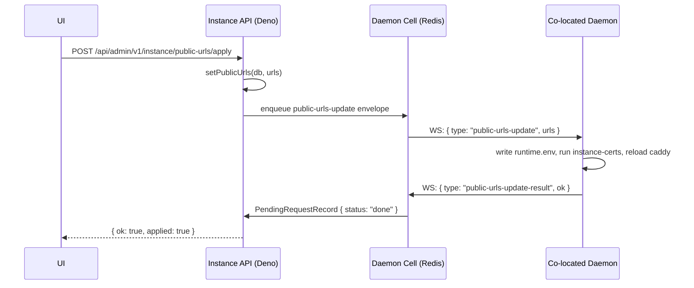

# Command Pipeline — AGENTS.md

Typed, Postgres-canonical commands with queue transport only (Cloudflare Queues on Workers, RabbitMQ on Deno), plus the correlated developer/admin request flows (dev-sync, instance tunnel-token, public-URL apply) that ride the same enqueue-then-poll contract. Live delivery/correlation lives in the daemon cell.

Root context: `../../../AGENTS.md`. Daemon cell (delivery + `createRequestAndWait`/`waitForRequest`): `../../daemon/cell/AGENTS.md`. Compose documents: `../compose/AGENTS.md`.

## Command Pipeline

Commands are canonical in Postgres (`command` table). Queues are transport only — Cloudflare Queues on Workers, RabbitMQ on Deno. The Daemon Cell is live delivery, presence, and request correlation only.

> **Cost / hibernation:** the command consumer enqueues a `command-dispatch` envelope into the cell outbox, then **polls** `waitForRequest` from the worker/Deno process — it never blocks inside the Durable Object. Do not add timers, polling loops, or long-lived promises inside `DaemonCellObject`; do not hold Hyperdrive connections open across handler returns. Never build general command queues inside Durable Objects — Cloudflare Queues / RabbitMQ own durable transport; the cell owns only the live WS outbox + pending-request row. Cloudflare Workers (Durable Object) mode and self-hosted Deno/Redis mode must keep behavioral parity for every command feature. Production daemon commands must be typed handlers — never arbitrary shell strings.

| Status | Meaning |
|---|---|
| `queued` | Record created, envelope enqueued |
| `dispatching` | Consumer received, checking presence |
| `sent` | Envelope enqueued into cell outbox |
| `acked` | Daemon sent `command-ack` (non-terminal) |
| `running` | Daemon executing (future use) |
| `succeeded` | Terminal — `command-outcome ok:true` received |
| `failed` | Terminal — offline, validation error, or `ok:false` |
| `timed_out` | Terminal — no outcome within `expires_at` |
| `cancelled` | Terminal — operator-cancelled |

`status`, `created_at`, `updated_at`, `attempts`, `name`, and `result` are real columns on the `command` row. Granular lifecycle timestamps (`queuedAt`…`finishedAt`, `expiresAt`) and `error` remain in `metadata`. `transitionCommand` writes the column fields and merges the rest into `metadata` atomically. `serializeCommandRecord` flattens both column and metadata fields into a flat `CommandRecord` for callers. Organization is derived from the server — there is no `organization_id` column on `command`. Do not store large logs or streaming output in Postgres — `result` and `error` are bounded summaries only.

### Queue transport

- **Workers:** `TURBOPANEL_COMMAND_QUEUE` binding → per-env queue names in `wrangler.jsonc`: `live` uses `daemon-commands` / `daemon-commands-dlq`; `testing` uses `staging-daemon-commands` / `staging-daemon-commands-dlq`; local top-level worker uses `dev-daemon-commands` / `dev-daemon-commands-dlq` (max 3 retries). Declared under `queues.producers` and `queues.consumers`. Consumer handler: `queue(batch, env, ctx)` in `src/workers.ts`.
- **Deno:** `TURBOPANEL_AMQP_URL` (same URL as email queue, different topology). Exchange `turbopanel.commands`, queue `turbopanel.commands.dispatch`, routing key `command.dispatch`, DLX `turbopanel.commands.dlx` → DLQ `turbopanel.commands.dispatch.dlq`. Consumer: `startCommandConsumer()` in `src/lib/commands/deno-consumer.ts`, started in-process from `src/deno.ts`. **TODO:** extract to a dedicated `turbopanel-command-consumer.service` systemd unit in a future pass (mirrors the mailer pattern).
- Shared abstraction: `CommandQueue` interface in `src/lib/commands/queue.ts`; `getCommandQueue(c)` Hono accessor. Envelope schema in `src/lib/commands/envelope.ts` — small (ids + type + timestamps; no large payloads). The `CommandEnvelope` no longer carries `organizationId` — org is derived from the server at consume time.

### Client endpoints

| Method | Path | Auth | Purpose |
|---|---|---|---|
| `POST` | `/api/client/v1/servers/:id/commands/ping` | session + read | Create `daemon.ping` command, enqueue |
| `POST` | `/api/client/v1/servers/:id/hostname` | session + manage | Validate hostname, create `server.hostname.set` command, enqueue |
| `POST` | `/api/client/v1/servers/:id/timezone` | session + manage | Validate IANA timezone, persist `server.options.timezone`, create `server.timezone.set`, enqueue |
| `POST` | `/api/client/v1/servers/:id/ntp` | session + manage | Validate NTP payload, create `server.ntp.set` command, enqueue |
| `POST` | `/api/client/v1/vpns/:id/apply` | session + manage (`organization:manage` on the VPN) | Build per-peer `server.wireguard.apply` payloads, fan out one command per peer server, return partial-friendly `{ results[] }` |
| `POST` | `/api/client/v1/servers/:id/commands/reboot` | session + manage | Create `server.reboot` command, enqueue |
| `POST` | `/api/client/v1/environments/:id/deploy` | session + manage | Merge project+env ComposeDocuments → runtime YAML; create `environment.deploy` on target `serverId`; persists `environment.metadata.serverId`. Poll via existing command GET (Postgres only). |
| `POST` | `/api/client/v1/environments/:id/stop` | session + manage | Create `environment.stop` on placement/`metadata.serverId`; daemon runs `compose down --volumes`, removes hosting site; returns `{ commandId, serverId }`. Poll via command GET. |
| `DELETE` | `/api/client/v1/projects/:id` | session + `organization:own` | Cascade-delete project children (`deleteProjectCascade`); **409** `project_has_running_services` when any non-stopped containers remain. |
| `GET` | `/api/client/v1/servers/:id/commands/:commandId` | session + read | Poll status; ping includes latency breakdown |
| `GET` | `/api/client/v1/servers/:id/commands` | session + read | List recent commands (optional) |

Authz: ping/get require read (`assertCanReadOr403`); hostname, timezone, ntp, and reboot require manage (`assertCanManageOr403`). Daemon authz must not leak into these session-authenticated routes.

### Consumer behavior

`processCommandEnvelope` in `src/lib/commands/consumer.ts` is the single source that writes terminal `command` rows. The WS inbound path (`command-ack`, `command-outcome`) only updates the hot `PendingRequestRecord` in the cell. For MVP, `daemon.ping`, `server.hostname.set`, `server.timezone.set`, `server.ntp.set`, `server.wireguard.apply`, `server.reboot`, `environment.deploy`, and `environment.stop` fail fast when the daemon is offline. For `server.hostname.set` success, the consumer calls `touchServerMetadata` to update `server.metadata.hostname` — the instance never updates hostname speculatively. For `server.timezone.set` / `server.ntp.set` success, the consumer merges observed timezone/NTP state into `server.metadata.timeSync` so the read model refreshes before the next heartbeat. For `server.wireguard.apply` success (300 s consumer timeout), the consumer writes the daemon-generated `publicKey` onto the matching `peer` row (`peer.public_key`, and `listen_port` when the column is still null and the result reports a port). Preshared keys and interface private keys never traverse the command result — only the public key is reconciled. Reconcile failures (including unique violations on `peer_vpn_public_key_unique`) are logged and never revert an already-succeeded command. Fan-out apply enqueues one command per peer server; partial enqueue failures surface per-peer in the apply response while successful peers remain queued for polling via `GET /servers/:id/commands/:commandId`. For `environment.deploy` / `environment.stop` success, the consumer reconciles canonical `container` rows via `reconcileEnvironmentContainers` (`src/lib/db/container-records.ts`) from the daemon's authoritative `containers[]` result (matched to the environment's services by compose service name). Stop always returns `containers: []` so pins clear. When a reported compose service has no `service` row yet (deploy before hostname config), reconcile creates that service so container FKs can resolve; reconciliation failures are logged and never revert the already-succeeded command.

`server.reboot` requires `organization:manage`, carries an empty payload, uses a 120s consumer timeout, has no `touchServerMetadata` side-effect, and is executed daemon-side via `sudo systemctl reboot` (handler implemented in a separate phase).

`environment.deploy` uses a 600s consumer timeout. Compose merge + Traefik label injection + Docker/Caddy bootstrap run on the daemon (`daemon/src/instance/commands/deploy-environment.ts`). On success the daemon may also return best-effort per-container identity/status from `docker compose ps`; the consumer reconciles those into `container` rows (ids/status only). **Cost:** one cell outbox enqueue; UI polls Postgres command rows only — never Durable Object reads for deploy status. Hosting-edge Caddy (`:80`/`:443`) is distinct from control-plane Caddy (`:8443`).

**`EnvironmentDeployHosting.bindAddress`:** optional IPv4/IPv6 literal resolved on the instance at deploy-prepare time (`resolveHostingBindAddress`) from hosting `options.bind` (`public` / `datacenter` / `local`) plus optional `hosting.ip_id`. Public with no pin omits the field (daemon emits no `bind` directive — today's behavior). `local` → `127.0.0.1`. `datacenter` requires an `ip` row with `scope = 'datacenter'` on the target server; when missing, deploy validation fails with typed `DeployPrepareError` `{ kind: 'datacenter_ip_required', serverId }` (**422** `datacenter_ip_required`) before command dispatch — the daemon stays DB-free.

**`EnvironmentDeployHosting.protocol` / `.ports` (raw TCP/UDP port hosting):** `hosting.options.protocol` (`http` default/omitted, or `tcp`/`udp`, `src/lib/hosting-options.ts` — `HostingOptions.protocol`/`resolveHostingProtocol`) lets a Docker service publish raw port(s) straight through Traefik instead of routing hostnames through hosting Caddy — no hostname/TLS/path-prefix routing for that hosting. `hosting.options.ports` (`HostingPortMapping[]`, capped at 10, invalid/duplicate-published entries dropped rather than failing the document) is `{ published, target }`; **required non-empty** when `protocol` is `tcp`/`udp` — `hostings[].ports must not be empty for <protocol> protocol` (both `deploy-validation.ts` and the daemon-side `contracts.ts`/`compose-labels.ts` reject an empty list). `bind`/`ip_id` still apply identically to HTTP hostings (resolved the same way into `bindAddress`), but `hostnames`/`tlsId`/`pathPrefix`/`targetPort` are ignored for `tcp`/`udp`. `resolveHostingEntry` in `deploy-routes.ts` branches on protocol (`resolveHttpHostingEntry` vs `resolveTcpUdpHostingEntry`) when building the deploy payload. See daemon `src/deploy/AGENTS.md` → "Raw TCP/UDP port hosting" for the Traefik entrypoint/state-persistence/conflict-detection mechanics — cross-environment published-port uniqueness is enforced **daemon-side** (the instance does not track other environments' claimed ports), so two environments racing to deploy the same `tcp`/`udp` port on the same server can both enqueue successfully and one command will fail at apply time with a port-conflict error.

`environment.stop` uses a 120s consumer timeout. Daemon runs `docker compose down --remove-orphans --volumes`, removes the hosting Caddy site snippet, and deletes the deployment dir (`daemon/src/instance/commands/stop-environment.ts`). Idempotent when the compose file is already gone. Used as the teardown gate before project cascade delete.

**Org TLS library (`tls` table):** organization-scoped certificates (`upload` / `lets_encrypt` / `self_signed`) in `src/lib/tls/`. Hosting may pin `hosting.tls_id` to a library cert, or leave null for **basic self-signed** (Caddy `tls internal`). Library certs — including Let's Encrypt — are never auto-selected; the operator must pin them. Private keys are sealed `tpsecret` envelopes at rest — never returned on client GET. Deploy re-seals via `resealSecretForDaemon` to `tpdaemon(serverId, keyId)` for the target server → payload `tlsMaterial[]`; daemon decrypts via `POST /api/daemon/v1/secrets/decrypt` and writes `/etc/turbopanel/tls/<tlsId>/`. LE rows start `metadata.status: pending` (not selectable until ready). CRUD: `/api/client/v1/tls`. **WireGuard mesh apply** ships via `POST /api/client/v1/vpns/:id/apply` → `server.wireguard.apply` (see consumer paragraph above). **Traditional-web deploy:** compose `serviceKind: traditional-web` services are stripped into `traditionalWebSites[]` (nginx, Apache, and OpenLiteSpeed all supported) — hosting `options.web.php` (`version` / `memoryLimit` / `maxExecutionTime`) and `options.web.env` merge into the site payload (`webEnv` / `php` on each site); Apache apply installs mod_php and writes `php_admin_value` for memory/time limits (OpenLiteSpeed is static-only — no PHP/env hints yet). Payload **`dockerExternalNetworks[]`** lists compose external network host names that must already exist as org `network` rows (`kind: docker`, `options.dockerNetworkName`); the daemon ensures them with `docker network create` before compose up. Mixed container + traditional-web deploys rely on daemon-side `host.docker.internal` + `TURBOPANEL_TRADITIONAL_WEB_*` env injection — not instance payload fields. See `../compose/AGENTS.md` and daemon `src/deploy/AGENTS.md`. Future: multi-server compose placement, swarm-style replicas — seams only.

Future webhook-triggered operations — deploy service, rebuild app, rotate tunnel token, update daemon, restart service, collect diagnostics, stream logs — reuse the same `command` table, `CommandQueue` abstraction, and typed-handler model on the daemon. No new queue infrastructure is needed.

`src/lib/commands/` is pure TypeScript (no Deno/Workers-only imports) so it is importable from both runtimes and the in-process consumer:

- `types.ts` — `CommandType`, `CommandStatus`, `TERMINAL_COMMAND_STATUSES`
- `schemas.ts` — per-type payload/result validators (`parseCommandPayload`, `parseCommandResult`)
- `envelope.ts` — `CommandEnvelope`, `encodeCommandEnvelope`, `parseCommandEnvelope`
- `hostname.ts` — `isValidHostname`, `assertValidHostname` (RFC-1123 allowlist; canonical — daemon mirrors it)
- `ids.ts` — `newCorrelationId()`, `nowIso()`
- `queue.ts` — `CommandQueue` interface, `getCommandQueue`
- `command-amqp-topology.ts` — Deno AMQP topology constants + `assertCommandAmqpTopology`
- `deno-amqp-queue.ts` — Deno RabbitMQ producer
- `workers-queue.ts` — Workers Cloudflare Queues producer
- `noop-command-queue.ts` — fallback when broker/binding unavailable
- `consumer.ts` — `processCommandEnvelope` (shared consumer logic)
- `deno-consumer.ts` — `startCommandConsumer` (Deno in-process AMQP consumer)

DB helpers: `src/lib/db/command-records.ts` — `createCommandRecord`, `getCommandRecord`, `listServerCommands`, `transitionCommand` — all return the flat `CommandRecord` (flattened from both real columns and the `metadata` jsonb blob).
### Dev sync (push a daemon build without git)

`src/developer/dev-sync.ts` tars the local `../daemon` checkout, base64-encodes it, and streams `dev-sync-begin` → `dev-sync-chunk*` → `dev-sync-end` over the daemon WS; the daemon unpacks, `deno cache`s, replies `dev-sync-result`, and restarts. Developer routes: `POST /api/developer/v1/daemon/:id/sync-dev` and `…/daemon/sync-dev` (all). Dev console: **Sync Dev Build** in the fleet section.

### Instance Cloudflare tunnel

`POST /api/developer/v1/instance/tunnel-token` (`src/developer/tunnel-routes.ts`) sends a `tunnel-token` WS message to the co-located daemon, which writes `cloudflared/tunnels/instance.token` and (re)starts cloudflared. External remote daemons then reach this instance via the tunnel → Caddy → socket. Dev console: **Save Tunnel Token** in the fleet section (empty token tears it down).

Correlated outbound work uses `createRequestAndWait` / `waitForRequest` (see **Enqueue-then-poll request contract** above) for dev-sync, tunnel-token, and public-urls apply.

### Public URL apply

**Public URL apply**: `POST /api/admin/v1/instance/public-urls/apply` (Deno only) sends a `public-urls-update` WS message to the co-located daemon with the current URL list. The daemon writes `TURBOPANEL_PUBLIC_URLS` to **`/etc/turbopanel/instance/runtime.env`** — never the checkout, re-runs the `instance-certs` Ansible role (regenerating the leaf cert with updated SANs, CA preserved), and reloads `turbopanel-caddy`. Replies with `public-urls-update-result { ok, error? }`. On Workers, the endpoint returns 422 (cert apply not applicable). Timeout: 60 s.

