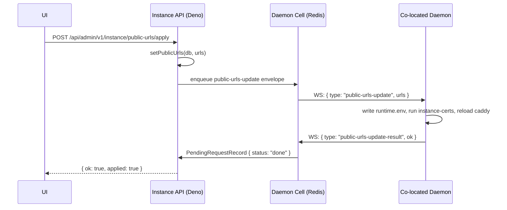

# Command Pipeline — AGENTS.md

Typed, Postgres-canonical commands with queue transport only (Cloudflare Queues
on Workers, RabbitMQ on Deno), plus the correlated developer/admin request flows
(dev-sync, instance tunnel-token, public-URL apply) that ride the same
enqueue-then-poll contract. Live delivery/correlation lives in the daemon cell.

Root context: `../../../AGENTS.md`. Daemon cell (delivery +
`createRequestAndWait`/`waitForRequest`): `../../daemon/cell/AGENTS.md`. Compose
documents: `../compose/AGENTS.md`.

## Command Pipeline

Commands are canonical in Postgres (`command` table). Queues are transport only
— Cloudflare Queues on Workers, RabbitMQ on Deno. The Daemon Cell is live
delivery, presence, and request correlation only.

> **Cost / hibernation:** the command consumer enqueues a `command-dispatch`
> envelope into the cell outbox, then **polls** `waitForRequest` from the
> worker/Deno process — it never blocks inside the Durable Object. Do not add
> timers, polling loops, or long-lived promises inside `DaemonCellObject`; do
> not hold Hyperdrive connections open across handler returns. Never build
> general command queues inside Durable Objects — Cloudflare Queues / RabbitMQ
> own durable transport; the cell owns only the live WS outbox + pending-request
> row. Cloudflare Workers (Durable Object) mode and self-hosted Deno/Redis mode
> must keep behavioral parity for every command feature. Production daemon
> commands must be typed handlers — never arbitrary shell strings.

| Status        | Meaning                                             |
| ------------- | --------------------------------------------------- |
| `queued`      | Record created, envelope enqueued                   |
| `dispatching` | Consumer received, checking presence                |
| `sent`        | Envelope enqueued into cell outbox                  |
| `acked`       | Daemon sent `command-ack` (non-terminal)            |
| `running`     | Daemon executing (future use)                       |
| `succeeded`   | Terminal — `command-outcome ok:true` received       |
| `failed`      | Terminal — offline, validation error, or `ok:false` |
| `timed_out`   | Terminal — no outcome within `expires_at`           |
| `cancelled`   | Terminal — operator-cancelled                       |

`status`, `created_at`, `updated_at`, `attempts`, `name`, `result_summary`,
`context`, `error_code`, `error_message`, and every granular lifecycle timestamp
(`queued_at`…`finished_at`, `expires_at`) are **real columns** on the `command`
row. `transitionCommand` `.set()`s them directly — a `CommandTransitionPatch`
(`status`, `result`, `error`, `errorCode`, `attempts`, and any explicit
lifecycle timestamp) maps one-to-one onto columns, auto-stamping the timestamp
that belongs to the new status; nothing merges into `metadata`.
`serializeCommandRecord` maps those columns onto the flat `CommandRecord`
(`result` ← `result_summary`, `error` ← `error_message`), normalizes
postgres.js timestamptz strings to ISO-8601, and **never exposes a
dispatch payload**. `metadata` survives only as the follow-up-chain blob
(`pendingStandbyApplies`, `managedDestroyGate`, `followUpPromote`,
`pendingTlsLeaf`, `desiredHash`),
read through `getCommandMetadata`. `context` is a small **non-secret**
identifier bag (`managedId`, `memberId`, `environmentId`, `generation`, …)
extracted from the payload by `context.ts` at enqueue time, so status/error
projections never need the payload. Organization is derived from the server —
there is no `organization_id` column on `command`. Do not store large logs or
streaming output in Postgres — `result` and `error` are bounded summaries only.

### Dispatch payload (`dispatch` table)

The daemon execution payload is **not** a `command` column. It lives in the
`dispatch` side table (`command_id` PK → `command.id` CASCADE, `payload`,
`created_at`, `expires_at`), so the permanent command history row is secret-free.

1. `createCommandRecord` writes the `command` row and its `dispatch` row in
   **one transaction**.
2. The consumer loads it **once** via `getCommandDispatchPayload`, immediately
   before building the `command-dispatch` envelope, and keeps it in memory for
   that attempt's side effects. A missing payload fails the command
   (`dispatch_payload_missing`) rather than dispatching an empty envelope.
3. `transitionCommand` finalizes the payload on **any** terminal transition —
   consumer outcome, enqueue failure, or expiry: `succeeded` deletes the row
   immediately; `failed` / `timed_out` / `cancelled` stamp
   `expires_at = now + COMMAND_DISPATCH_FAILURE_RETENTION_MS` (24h) for
   debugging. Cleanup is best effort and never fails the transition.
4. Expired rows are removed by `sweepExpiredCommandDispatch` on the **shared**
   maintenance tick (Workers offline-sweep cron; Deno `DAEMON_CELL_MAINTAIN_MS`
   timer), bounded by `COMMAND_DISPATCH_SWEEP_LIMIT` and reusing the already-open
   db — no new timer, no second connection.

`getCommandDispatchPayload` is the only sanctioned read of the payload; command
select lists stay explicit and must never be widened with a `dispatch` join.

`transitionCommand` also seals the command's **execution log** on any terminal
transition, through the module-scoped sink in
`src/lib/execution-logs/seal-on-terminal.ts` (terminal transitions fire from
isolates with no shared Hono context). Sealing compacts the streamed transcript
chunks into one gzipped object and is best effort under the same rule as
dispatch cleanup: **it never fails the transition**. Transcripts live entirely
in the execution-log store — there is no Postgres column for them. See
`src/lib/execution-logs/AGENTS.md`.

### Queue transport

- **Workers:** `TURBOPANEL_COMMAND_QUEUE` binding → per-env queue names in
  `wrangler.jsonc`: `live` uses `daemon-commands` / `daemon-commands-dlq`;
  `testing` uses `staging-daemon-commands` / `staging-daemon-commands-dlq`;
  local top-level worker uses `dev-daemon-commands` / `dev-daemon-commands-dlq`
  (max 3 retries). Declared under `queues.producers` and `queues.consumers`.
  Consumer handler: `queue(batch, env, ctx)` in `src/workers.ts`.
- **Deno:** `TURBOPANEL_AMQP_URL` (same URL as email queue, different topology).
  Exchange `turbopanel.commands`, queue `turbopanel.commands.dispatch`, routing
  key `command.dispatch`, DLX `turbopanel.commands.dlx` → DLQ
  `turbopanel.commands.dispatch.dlq`. Consumer: `startCommandConsumer()` in
  `src/lib/commands/deno-consumer.ts`, started in-process from `src/deno.ts`.
  **TODO:** extract to a dedicated `turbopanel-command-consumer.service` systemd
  unit in a future pass (mirrors the mailer pattern).
- Shared abstraction: `CommandQueue` interface in `src/lib/commands/queue.ts`;
  `getCommandQueue(c)` Hono accessor. Envelope schema in
  `src/lib/commands/envelope.ts` — small (ids + type + timestamps; no large
  payloads). The `CommandEnvelope` no longer carries `organizationId` — org is
  derived from the server at consume time.

### Client endpoints

The full per-route table (method, path, auth, purpose for every
command-creating client endpoint) lives in
[`client-endpoints.md`](./client-endpoints.md) — keep it current when adding
or changing command routes. Rule of thumb: command creation requires a session
plus the org-level permission noted there; every route creates a `command` row
and enqueues via the queue transport above.

### Consumer behavior

`processCommandEnvelope` in `src/lib/commands/consumer.ts` is the single source
that writes terminal `command` rows. The WS inbound path (`command-ack`,
`command-outcome`) only updates the hot `PendingRequestRecord` in the cell. For
MVP, `daemon.ping`, `server.hostname.set`, `server.timezone.set`,
`server.ntp.set`, `server.fabric.reconcile`, `server.tls.trust.reconcile`,
`server.reboot`,
`environment.deploy`, `environment.lifecycle`, `environment.stop`,
`managed.apply`, `managed.lifecycle`, `managed.destroy`, `managed.backup`,
`managed.restore`, `managed.promote`, `managed.ingress.reconcile`,
`managed.ha.reconcile`, `managed.ha.failover`, and
`system.reconcile` fail fast when the daemon is offline. For
`server.hostname.set` success, the consumer calls `touchServerMetadata` to
update the `server.hostname` column — the instance never updates hostname
speculatively. For `server.timezone.set` / `server.ntp.set` success, the
consumer writes observed timezone/NTP state onto the dedicated `server.timezone`
/ NTP columns so the read model refreshes before the next heartbeat. For
`server.fabric.reconcile` success with `enabled: true`, the consumer stamps
`relay.public_key` from the result (private key never leaves the host), records
`relay.metadata.appliedPayloadHash` / `appliedAt` / `observed` from the daemon
`peers[]`, and when that fills a previously-null key calls
`reconcileFabricMembership` so peers learn the new key without unbounded fan-out
(hash-gated). Stamp-match skips (`skipped: true`) still stamp the public key and
desired hash when the result includes a valid `publicKey` — returning early
solely because `skipped` is set would leave membership unconverged and
re-enqueue until timeout. Disable payloads (`{ enabled: false }`) skip the stamp
— they tear down `tp0`, routed bridges, `TP-FORWARD`, keys, and state. Reconcile
failures clear the applied hash so the next pass retries.

Per-command-type payload and result contracts (TurboFabric membership,
`environment.deploy` compose files / releases / hosting / raw ports / sites,
managed engines + HA, org TLS, system reconcile) are maintained in
[`payload-contracts.md`](./payload-contracts.md) — **update it when a command
payload or result shape changes.**

### Dev sync (push a daemon build without git)

`src/developer/dev-sync.ts` tars the local `../turbopaneld` checkout,
base64-encodes it, and streams `dev-sync-begin` → `dev-sync-chunk*` →
`dev-sync-end` over the daemon WS; the daemon unpacks, `deno cache`s, replies
`dev-sync-result`, and restarts. Developer routes:
`POST /api/developer/v1/daemon/:id/sync-dev` and `…/daemon/sync-dev` (all). Dev
console: **Sync source to attached checkouts**. Managed remotes (no checkout)
skip source-sync; upgrade them with **Rebuild daemon and upgrade connected
servers** (`POST /api/developer/v1/daemon/update` after `deno task release:dev`
writes the overlay catalog). Co-located is skipped on both paths.

### Instance Cloudflare tunnel

`POST /api/developer/v1/instance/tunnel-token`
(`src/developer/tunnel-routes.ts`) sends a `tunnel-token` WS message to the
co-located daemon, which writes `cloudflared/tunnels/instance.token` and
(re)starts cloudflared. External remote daemons then reach this instance via the
tunnel → Caddy → socket. Dev console: **Save Tunnel Token** in the fleet section
(empty token tears it down).

Correlated outbound work uses `createRequestAndWait` / `waitForRequest` (see
**Enqueue-then-poll request contract** above) for dev-sync, tunnel-token,
public-urls apply, and managed logs (`managed-logs-request` /
`managed-logs-result` — logs stay off the command `result` column).

### Public URL apply

**Public URL apply**: `POST /api/admin/v1/instance/public-urls/apply` (Deno
only) sends a `public-urls-update` WS message to the co-located daemon with the
current URL list. The daemon writes `TURBOPANEL_PUBLIC_URLS` to
**`/etc/turbopanel/instance/runtime.env`** — never the checkout, re-runs the
`instance-certs` Ansible role (regenerating the leaf cert with updated SANs, CA
preserved), and reloads `turbopanel-caddy`. Replies with
`public-urls-update-result { ok, error? }`. On Workers, the endpoint returns 422
(cert apply not applicable). Timeout: 60 s.

### Multi-command sequencing lives in metadata, never in a route

When step B must not start until step A's **side effects** have landed, the
route enqueues A, records B on A's `command.metadata`, and returns. The consumer
enqueues B from A's success path. An HTTP handler never polls for a command to
finish: a request that waits ties up a worker for minutes, dies with the client
connection, and turns a daemon that is merely slow into a failed API call.

Two instances today, same shape:

| Metadata key            | Gate                                        | Released by                                                |
| ----------------------- | ------------------------------------------- | ---------------------------------------------------------- |
| `pendingStandbyApplies` | one predecessor (the primary `managed.apply`) | `enqueuePendingStandbyApplies` — standby basebackup needs primary replication set up first |
| `managedDestroyGate`    | **all** sibling replica `managed.destroy`s   | `enqueuePendingManagedDestroys` — the primary's `deleteAfterDestroy` removes the `managed` row the replicas' side effects are keyed on |

The destroy gate is an AND across siblings, so two extra rules apply:

- **Stamp at insert time.** The gate carries a `gateId` plus the replica
  *member* ids, not command ids, because it must be written with the very first
  `createCommandRecord` — a gate stamped after the fan-out could be missed by a
  replica that finished in between. Siblings are found by
  `metadata->'managedDestroyGate'->>'gateId'`, reading `command` only (the
  `dispatch` payload is already gone once a command succeeds).
- **Elect one enqueuer.** Every replica reaches the follow-up and may see a
  satisfied gate at the same instant. `claimCommandMetadataFlag` takes a
  conditional-UPDATE claim on the lowest-id sibling, so exactly one wins and a
  redelivered command cannot double-enqueue.

A replica that fails, expires, or never enqueues simply never opens the gate:
the primary gets no command row and the `managed` row survives for a retry — or
for `?force=true`, which skips the gate deliberately because a member host may
be unreachable.

### Webhook-triggered deploys

A verified GitHub webhook can enqueue `environment.deploy` without a session.
The surface lives at `GITHUB_WEBHOOK_PATH` (see `src/webhook/AGENTS.md`);
resolution lives in `src/client/repositories/webhook-trigger.ts`. Two properties
matter to this pipeline:

**One enqueue path, not two.** The trigger resolver ends in
`runEnvironmentDeployForActor`, a thin wrapper over the same
`runEnvironmentDeploy` the client route calls — same `persistDeployFanOut` →
`deliverDeployFanOut`, same generation bump, same deployment-target upsert. The
only difference is the actor: `actorType: 'system'` with the triggering
`source.id` as `actorId`, so `command.actor_type` / `actor_id` tell you a push
caused the deploy and which source it came from. `environment.stop` for drained
servers and the follow-up ingress reconcile carry the same actor.

**Rapid pushes rely on generation supersede — there is no new cancellation
logic.** Pushing three times in a minute enqueues three deploys. Each one bumps
`environment.generation` inside `persistDeployFanOut` and replaces the desired
task set, and the daemon already discards an older-generation apply when a newer
one has landed (see the generation rules above). That guarantee is a property of
going through `persistDeployFanOut`, which is exactly why the webhook path is
not allowed to fork its own enqueue: a second path would silently opt out of it.
Nothing tries to cancel a queued command, and nothing needs to.

Requested commits ride on `command.metadata.sourceSelection`
(`{ ref?,
commitSha?, sourceId? }`) **as well as** the payload's
`sourceMaterial[]` — `dispatch.payload` is deleted at terminal state, so the
attribution has to live somewhere durable. The same selection is handed to
`prepareDeployCompose`, which honors a supplied `commitSha` **for the binding
whose `sourceId` matches** and not a `ref`: every other binding's commit comes
from its own `x-turbopanel.source.branch` (else the source's default branch), so
a push to one repository never pins the other repositories an environment binds,
and `PREPARE_HONORS_SOURCE_SELECTION === false`. The manual equivalent, the
optional `ref` on `POST /environments/:id/deploy` for instances GitHub cannot
reach, is therefore still refused with `501 source_ref_unsupported` — accepting
it would build the declared branch under a ref the caller asked for.

`autoDeploy: 'checks_passed'` parks the pushed SHA on
`source.options.pendingChecks` and waits for a matching successful `check_suite`
— or a `check_run` whose own suite has concluded successfully, since a single
green job says nothing about the rest of the suite. It is overwritten (not
queued) by the next push, so the newest commit is the one that eventually
deploys. A push that deletes the branch carries no head SHA and triggers
nothing, for any `autoDeploy` mode.

**A lost delivery is a 5xx, not a skip.** If the command queue is unavailable or
the deploy pipeline answers 5xx, the webhook surface releases its delivery claim
and answers `503` so GitHub redelivers; a parked `checks_passed` SHA is restored
at the same time. Configuration dead ends (auto-deploy off, unwatched branch, no
placement) still answer 2xx — a retry would find them unchanged.

**Delivery dedupe.** `X-GitHub-Delivery` is claimed once in the `delivery` table
(`src/lib/db/webhook-delivery-records.ts`) before any side effect runs, so a
redelivery or manual replay answers `204` instead of enqueuing a second deploy.
Rows are pruned after `WEBHOOK_DELIVERY_RETENTION_MS` by the same maintenance
sweeps that drop expired `dispatch` payloads — the Deno process timer in
`src/deno-server.ts` and the Workers cron in `src/daemon/cell/offline-sweep.ts`.
